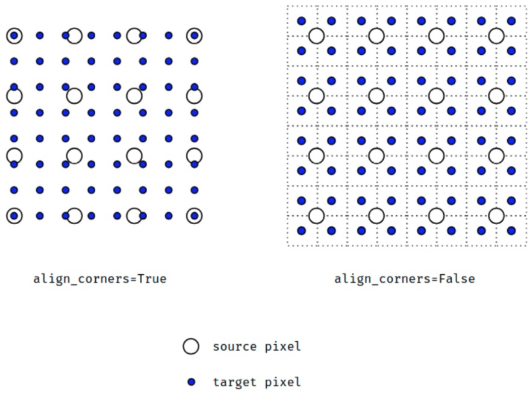

# torch.nn.functional.interpolate

有关插值(interpolate)算法理论部分可参考【basics】/【Entries】interpolate.md

```python
def interpolate(input, size=None, scale_factor=None, mode='nearest', align_corners=None):
    r"""
    根据给定 size 或 scale_factor，上采样或下采样输入数据input.
    
    当前支持 temporal, spatial 和 volumetric 输入数据的上采样，其shape 分别为：3-D, 4-D 和 5-D.
    输入数据的形式为：mini-batch x channels x [optional depth] x [optional height] x width.

    上采样算法有：nearest, linear(3D-only), bilinear(4D-only), trilinear(5D-only).
    
    参数:
    - input (Tensor): input tensor
    - size (int or Tuple[int] or Tuple[int, int] or Tuple[int, int, int]):输出的 spatial 尺寸.
    - scale_factor (float or Tuple[float]): spatial 尺寸的缩放因子.
    - mode (string): 上采样算法:nearest, linear, bilinear, trilinear, area. 默认为 nearest.
    - align_corners (bool, optional): 如果 align_corners=True，则对齐 input 和 output 的角点像素(corner pixels)，保持在角点像素的值. 只会对 mode=linear, bilinear 和 trilinear 有作用. 默认是 False.
    """
    from numbers import Integral
    from .modules.utils import _ntuple

    def _check_size_scale_factor(dim):
        if size is None and scale_factor is None:
            raise ValueError('either size or scale_factor should be defined')
        if size is not None and scale_factor is not None:
            raise ValueError('only one of size or scale_factor should be defined')
        if scale_factor is not None and isinstance(scale_factor, tuple)\
                and len(scale_factor) != dim:
            raise ValueError('scale_factor shape must match input shape. '
                             'Input is {}D, scale_factor size is {}'.format(dim, len(scale_factor)))

    def _output_size(dim):
        _check_size_scale_factor(dim)
        if size is not None:
            return size
        scale_factors = _ntuple(dim)(scale_factor)
        # math.floor might return float in py2.7
        return [int(math.floor(input.size(i + 2) * scale_factors[i])) for i in range(dim)]

    if mode in ('nearest', 'area'):
        if align_corners is not None:
            raise ValueError("align_corners option can only be set with the "
                             "interpolating modes: linear | bilinear | trilinear")
    else:
        if align_corners is None:
            warnings.warn("Default upsampling behavior when mode={} is changed "
                          "to align_corners=False since 0.4.0. Please specify "
                          "align_corners=True if the old behavior is desired. "
                          "See the documentation of nn.Upsample for details.".format(mode))
            align_corners = False

    if input.dim() == 3 and mode == 'nearest':
        return torch._C._nn.upsample_nearest1d(input, _output_size(1))
    elif input.dim() == 4 and mode == 'nearest':
        return torch._C._nn.upsample_nearest2d(input, _output_size(2))
    elif input.dim() == 5 and mode == 'nearest':
        return torch._C._nn.upsample_nearest3d(input, _output_size(3))
    elif input.dim() == 3 and mode == 'area':
        return adaptive_avg_pool1d(input, _output_size(1))
    elif input.dim() == 4 and mode == 'area':
        return adaptive_avg_pool2d(input, _output_size(2))
    elif input.dim() == 5 and mode == 'area':
        return adaptive_avg_pool3d(input, _output_size(3))
    elif input.dim() == 3 and mode == 'linear':
        return torch._C._nn.upsample_linear1d(input, _output_size(1), align_corners)
    elif input.dim() == 3 and mode == 'bilinear':
        raise NotImplementedError("Got 3D input, but bilinear mode needs 4D input")
    elif input.dim() == 3 and mode == 'trilinear':
        raise NotImplementedError("Got 3D input, but trilinear mode needs 5D input")
    elif input.dim() == 4 and mode == 'linear':
        raise NotImplementedError("Got 4D input, but linear mode needs 3D input")
    elif input.dim() == 4 and mode == 'bilinear':
        return torch._C._nn.upsample_bilinear2d(input, _output_size(2), align_corners)
    elif input.dim() == 4 and mode == 'trilinear':
        raise NotImplementedError("Got 4D input, but trilinear mode needs 5D input")
    elif input.dim() == 5 and mode == 'linear':
        raise NotImplementedError("Got 5D input, but linear mode needs 3D input")
    elif input.dim() == 5 and mode == 'bilinear':
        raise NotImplementedError("Got 5D input, but bilinear mode needs 4D input")
    elif input.dim() == 5 and mode == 'trilinear':
        return torch._C._nn.upsample_trilinear3d(input, _output_size(3), align_corners)
    else:
        raise NotImplementedError("Input Error: Only 3D, 4D and 5D input Tensors supported"
                                  " (got {}D) for the modes: nearest | linear | bilinear | trilinear"
                                  " (got {})".format(input.dim(), mode))
```
**函数功能：**\
根据给定的size或scale_factor参数来对输入进行下/上采样, \
使用的插值算法取决于参数mode的设置, \
支持目前的 temporal(1D,如向量数据), spatial(2D,如jpg、png等图像数据)和 volumetric(3D,如点云数据) 类型的采样数据作为输入，输入数据的格式为 minibatch x channels x [optional depth] x [optional height] x width，具体为：\
对于一个temporal输入，期待着3D张量的输入，即minibatch x channels x width \
对于一个空间spatial输入，期待着4D张量的输入，即minibatch x channels x height x width \
对于体积volumetric输入，则期待着5D张量的输入，即minibatch x channels x depth x height x width \
可用于重置大小的mode有：最近邻、线性(3D-only),、双线性, 双三次(bicubic,4D-only)和三线性(trilinear,5D-only)插值算法和area算法 \

**参数：** \
**input** (Tensor) – 输入张量 \
**size** (int or Tuple[int] or Tuple[int, int] or Tuple[int, int, int]) –输出大小. 
> **注意：** 如果 size 等于 input 尺寸，则 interpolate 的 output 等于 input. 比如说：input.shape = 28x28, F.interpolate(input, (28, 28)) 的输出的数值实际上是等于input中的数值的。

**scale_factor** (float or Tuple[float]) – 指定输出为输入的多少倍数。如果输入为tuple，其也要制定为tuple类型 \
**mode** (str) – 可使用的上采样算法，有'nearest', 'linear', 'bilinear', 'bicubic' , 'trilinear'和'area'. 默认使用'nearest' \
**align_corners** (bool, optional) –几何上，我们认为输入和输出的像素是正方形，而不是点。如果设置为True，则输入和输出张量由其角像素的中心点对齐，从而保留角像素处的值。如果设置为False，则输入和输出张量由它们的角像素的角点对齐，插值使用边界外值的边值填充;当scale_factor保持不变时，使该操作独立于输入大小。仅当使用的算法为'linear', 'bilinear', 'bilinear'or 'trilinear'时可以使用。默认设置为False

下面是 align_corners 等于 True 和 False 时的区别：\
 \
上面的图是source pixel为4*4上采样为target pixel为8*8的两种情况，这就是对齐和不对齐的差别，会对齐左上角元素，即设置为align_corners = True时输入的左上角元素是一定等于输出的左上角元素。


> **注意：** \
> 使用mode='bicubic'时，可能会导致overshoot问题，即它可以为图像生成负值或大于255的值。如果你想在显示图像时减少overshoot问题，可以显式地调用result.clamp(min=0,max=255)。
> 
> When using the CUDA backend, this operation may induce nondeterministic behaviour in be backward that is not easily switched off. Please see the notes on Reproducibility for background.


Pytorch 另外还有upsample实现方式，但现在已经不推荐使用。
```
upsample
torch.nn.functional.upsample(input, size=None, scale_factor=None, mode='nearest', align_corners=None)
torch.nn.functional.upsample_nearest(input, size=None, scale_factor=None)
torch.nn.functional.upsample_bilinear(input, size=None, scale_factor=None)
```
因为这些现在都建议使用上面的interpolate方法实现，所以就不解释了. \
更加复杂的例子可见：[pytorch 不使用转置卷积来实现上采样](https://www.cnblogs.com/wanghui-garcia/p/11400866.html)


**代码示例：** \
```python
import torch
import torch.nn.functional as F


input = torch.arange(1, 10, dtype=torch.float32).view(1, 1, 3, 3)
print(input)
'''
tensor([[[[1., 2., 3.],
          [4., 5., 6.],
          [7., 8., 9.]]]])
'''


x = F.interpolate(input, scale_factor=1.5, mode='nearest')
print(x)
'''
tensor([[[[1., 1., 2., 3.],
          [1., 1., 2., 3.],
          [4., 4., 5., 6.],
'''


x = F.interpolate(input, scale_factor=2, mode='nearest')
print(x)
'''
tensor([[[[1., 1., 2., 2., 3., 3.],
          [1., 1., 2., 2., 3., 3.],
          [4., 4., 5., 5., 6., 6.],
          [4., 4., 5., 5., 6., 6.],
          [7., 7., 8., 8., 9., 9.],
          [7., 7., 8., 8., 9., 9.]]]])
'''


x = F.interpolate(input, scale_factor=2, mode='bilinear')
print(x)
'''
tensor([[[[1.0000, 1.2500, 1.7500, 2.2500, 2.7500, 3.0000],
          [1.7500, 2.0000, 2.5000, 3.0000, 3.5000, 3.7500],
          [3.2500, 3.5000, 4.0000, 4.5000, 5.0000, 5.2500],
          [4.7500, 5.0000, 5.5000, 6.0000, 6.5000, 6.7500],
          [6.2500, 6.5000, 7.0000, 7.5000, 8.0000, 8.2500],
          [7.0000, 7.2500, 7.7500, 8.2500, 8.7500, 9.0000]]]])
'''


x = F.interpolate(input, scale_factor=2, mode='bilinear', align_corners=True)
print(x)
'''
tensor([[[[1.0000, 1.4000, 1.8000, 2.2000, 2.6000, 3.0000],
          [2.2000, 2.6000, 3.0000, 3.4000, 3.8000, 4.2000],
          [3.4000, 3.8000, 4.2000, 4.6000, 5.0000, 5.4000],
          [4.6000, 5.0000, 5.4000, 5.8000, 6.2000, 6.6000],
          [5.8000, 6.2000, 6.6000, 7.0000, 7.4000, 7.8000],
          [7.0000, 7.4000, 7.8000, 8.2000, 8.6000, 9.0000]]]])
'''
```


# torch.nn.functional.grid_sample

```python
def grid_sample(input, grid, mode='bilinear', padding_mode='zeros', align_corners=None):
    # type: (Tensor, Tensor, str, str, Optional[bool]) -> Tensor
    r"""Given an :attr:`input` and a flow-field :attr:`grid`, computes the
    ``output`` using :attr:`input` values and pixel locations from :attr:`grid`.

    Currently, only spatial (4-D) and volumetric (5-D) :attr:`input` are
    supported.

    In the spatial (4-D) case, for :attr:`input` with shape
    :math:`(N, C, H_\text{in}, W_\text{in})` and :attr:`grid` with shape
    :math:`(N, H_\text{out}, W_\text{out}, 2)`, the output will have shape
    :math:`(N, C, H_\text{out}, W_\text{out})`.

    For each output location ``output[n, :, h, w]``, the size-2 vector
    ``grid[n, h, w]`` specifies :attr:`input` pixel locations ``x`` and ``y``,
    which are used to interpolate the output value ``output[n, :, h, w]``.
    In the case of 5D inputs, ``grid[n, d, h, w]`` specifies the
    ``x``, ``y``, ``z`` pixel locations for interpolating
    ``output[n, :, d, h, w]``. :attr:`mode` argument specifies ``nearest`` or
    ``bilinear`` interpolation method to sample the input pixels.

    :attr:`grid` specifies the sampling pixel locations normalized by the
    :attr:`input` spatial dimensions. Therefore, it should have most values in
    the range of ``[-1, 1]``. For example, values ``x = -1, y = -1`` is the
    left-top pixel of :attr:`input`, and values  ``x = 1, y = 1`` is the
    right-bottom pixel of :attr:`input`.

    If :attr:`grid` has values outside the range of ``[-1, 1]``, the corresponding
    outputs are handled as defined by :attr:`padding_mode`. Options are

        * ``padding_mode="zeros"``: use ``0`` for out-of-bound grid locations,
        * ``padding_mode="border"``: use border values for out-of-bound grid locations,
        * ``padding_mode="reflection"``: use values at locations reflected by
          the border for out-of-bound grid locations. For location far away
          from the border, it will keep being reflected until becoming in bound,
          e.g., (normalized) pixel location ``x = -3.5`` reflects by border ``-1``
          and becomes ``x' = 1.5``, then reflects by border ``1`` and becomes
          ``x'' = -0.5``.

    .. note::
        This function is often used in conjunction with :func:`affine_grid`
        to build `Spatial Transformer Networks`_ .
    .. include:: cuda_deterministic_backward.rst

    Args:
        input (Tensor): input of shape :math:`(N, C, H_\text{in}, W_\text{in})` (4-D case)
                        or :math:`(N, C, D_\text{in}, H_\text{in}, W_\text{in})` (5-D case)
        grid (Tensor): flow-field of shape :math:`(N, H_\text{out}, W_\text{out}, 2)` (4-D case)
                       or :math:`(N, D_\text{out}, H_\text{out}, W_\text{out}, 3)` (5-D case)
        mode (str): interpolation mode to calculate output values
            ``'bilinear'`` | ``'nearest'``. Default: ``'bilinear'``
        padding_mode (str): padding mode for outside grid values
            ``'zeros'`` | ``'border'`` | ``'reflection'``. Default: ``'zeros'``
        align_corners (bool, optional): Geometrically, we consider the pixels of the
            input  as squares rather than points.
            If set to ``True``, the extrema (``-1`` and ``1``) are considered as referring
            to the center points of the input's corner pixels. If set to ``False``, they
            are instead considered as referring to the corner points of the input's corner
            pixels, making the sampling more resolution agnostic.
            This option parallels the ``align_corners`` option in
            :func:`interpolate`, and so whichever option is used here
            should also be used there to resize the input image before grid sampling.
            Default: ``False``

    Returns:
        output (Tensor): output Tensor

    .. _`Spatial Transformer Networks`:
        https://arxiv.org/abs/1506.02025

    .. warning::
        When ``align_corners = True``, the grid positions depend on the pixel
        size relative to the input image size, and so the locations sampled by
        :func:`grid_sample` will differ for the same input given at different
        resolutions (that is, after being upsampled or downsampled).
        The default behavior up to version 1.2.0 was ``align_corners = True``.
        Since then, the default behavior has been changed to ``align_corners = False``,
        in order to bring it in line with the default for :func:`interpolate`.
    """
    if mode != 'bilinear' and mode != 'nearest':
        raise ValueError("nn.functional.grid_sample(): expected mode to be "
                         "'bilinear' or 'nearest', but got: '{}'".format(mode))
    if padding_mode != 'zeros' and padding_mode != 'border' and padding_mode != 'reflection':
        raise ValueError("nn.functional.grid_sample(): expected padding_mode "
                         "to be 'zeros', 'border', or 'reflection', "
                         "but got: '{}'".format(padding_mode))

    if mode == 'bilinear':
        mode_enum = 0
    else:  # mode == 'nearest'
        mode_enum = 1

    if padding_mode == 'zeros':
        padding_mode_enum = 0
    elif padding_mode == 'border':
        padding_mode_enum = 1
    else:  # padding_mode == 'reflection'
        padding_mode_enum = 2

    if align_corners is None:
        warnings.warn("Default grid_sample and affine_grid behavior has changed "
                      "to align_corners=False since 1.3.0. Please specify "
                      "align_corners=True if the old behavior is desired. "
                      "See the documentation of grid_sample for details.")
        align_corners = False

    return torch.grid_sampler(input, grid, mode_enum, padding_mode_enum, align_corners)
```

在官方文档里面关于该函数的作用是这样描述的：\
> Given an input and a flow-field grid, computes the output using input values and pixel locations from grid.

简单来说就是，提供一个input的Tensor以及一个对应的flow-field网格(比如光流，体素流等)，然后根据grid中每个位置提供的坐标信息(这里指input中pixel的坐标)，将input中对应位置的像素值填充到grid指定的位置，得到最终的输出。

关于input、grid以及output的尺寸如下所示：（input也可以是5D的Tensor，这里我们只考虑4D的情况）
$$
input: (N, C, H_{in}, W_{in}) \\
grid: (N, H_{out}, W_{out}, 2) \\
output: (N, C, H_{out}, W_{out})
$$

**举个伪代码例子吧：**
```python
# 假设 input.shape = (28, 28, 3), grid.shape = (28, 28, 2)

for i in range(grid中的所有网格点):
    (x, y) = grid[i]  # 依次从grid中取出坐标点，注意这个坐标点常常是浮点数，所以才需要后面的插值
    pixel = input(x, y)  # 从input中指定的位置取出像素值，严格的说应该是算出像素值，因为这些坐标值常常是浮点数，所以要用到插值算法
    output[i] = pixel  # 将从input中取出的像素赋值到输出位置。
```

这里的input和output就是输入的图片，或者是网络中的feature map。关键的处理过程在于grid，grid的最后一维的大小为2，即表示input中pixel的位置信息 $(x, \; y)$ ,这里一般会将x和y的取值范围归一化到 $[-1, \; 1]$ 之间，$(-1, \; 1)$ 表示 input 左上角的像素的坐标，$(-1, \; 1)$ 表示 input 右下角的像素的坐标，对于超出这个范围的坐标 $[x, \; y]$，函数将会根据参数 padding_mode 的设定进行不同的处理。

- padding_mode='zeros': 对于越界的位置在网格中采用 pixel value = 0 进行填充。
- padding_mode='border': 对于越界的位置在网格中采用边界的 pixel value 进行填充。
- padding_mode='reflection': 对于越界的位置在网格中采用关于边界的对称值进行填充。

- mode='bilinear': 定义了在 input 中指定位置的 pixel-value 中进行插值的方法，为什么需要插值呢？因为前面我们说了，grid 中表示的位置信息x和y的取值范围在 $[-1, \; 1]$ 之间，这就意味着我们要根据一个浮点型的坐标值在 input 中对 pixel-value 进行采样，mode 有 nearest 和 bilinear 两种模式。nearest 就是直接采用与 $(x, \; y)$ 距离最近处的像素值来填充 grid，而 bilinear 则是采用双线性插值的方法来进行填充，总之其与nearest的区别就是 nearest 只考虑最近点的 pixel-value，而 bilinear 则采用 $(x, \; y)$ 周围的四个 pixel-value 进行加权平均值来填充 grid。

> 有关插值(interpolate)算法理论部分可参考 “【basics】/【Entries】interpolate.md”


# torch.nn.functional.pad

```python
def pad(input, pad, mode='constant', value=0):
    # type: (Tensor, List[int], str, float) -> Tensor
    r"""Pads tensor.

    Padding size:
        The padding size by which to pad some dimensions of :attr:`input`
        are described starting from the last dimension and moving forward.
        :math:`\left\lfloor\frac{\text{len(pad)}}{2}\right\rfloor` dimensions
        of ``input`` will be padded.
        For example, to pad only the last dimension of the input tensor, then
        :attr:`pad` has the form
        :math:`(\text{padding\_left}, \text{padding\_right})`;
        to pad the last 2 dimensions of the input tensor, then use
        :math:`(\text{padding\_left}, \text{padding\_right},`
        :math:`\text{padding\_top}, \text{padding\_bottom})`;
        to pad the last 3 dimensions, use
        :math:`(\text{padding\_left}, \text{padding\_right},`
        :math:`\text{padding\_top}, \text{padding\_bottom}`
        :math:`\text{padding\_front}, \text{padding\_back})`.

    Padding mode:
        See :class:`torch.nn.ConstantPad2d`, :class:`torch.nn.ReflectionPad2d`, and
        :class:`torch.nn.ReplicationPad2d` for concrete examples on how each of the
        padding modes works. Constant padding is implemented for arbitrary dimensions.
        Replicate padding is implemented for padding the last 3 dimensions of 5D input
        tensor, or the last 2 dimensions of 4D input tensor, or the last dimension of
        3D input tensor. Reflect padding is only implemented for padding the last 2
        dimensions of 4D input tensor, or the last dimension of 3D input tensor.

    .. include:: cuda_deterministic_backward.rst

    Args:
        input (Tensor): N-dimensional tensor
        pad (tuple): m-elements tuple, where
            :math:`\frac{m}{2} \leq` input dimensions and :math:`m` is even.
        mode: ``'constant'``, ``'reflect'``, ``'replicate'`` or ``'circular'``.
            Default: ``'constant'``
        value: fill value for ``'constant'`` padding. Default: ``0``

    Examples::

        >>> t4d = torch.empty(3, 3, 4, 2)
        >>> p1d = (1, 1) # pad last dim by 1 on each side
        >>> out = F.pad(t4d, p1d, "constant", 0)  # effectively zero padding
        >>> print(out.data.size())
        torch.Size([3, 3, 4, 4])
        >>> p2d = (1, 1, 2, 2) # pad last dim by (1, 1) and 2nd to last by (2, 2)
        >>> out = F.pad(t4d, p2d, "constant", 0)
        >>> print(out.data.size())
        torch.Size([3, 3, 8, 4])
        >>> t4d = torch.empty(3, 3, 4, 2)
        >>> p3d = (0, 1, 2, 1, 3, 3) # pad by (0, 1), (2, 1), and (3, 3)
        >>> out = F.pad(t4d, p3d, "constant", 0)
        >>> print(out.data.size())
        torch.Size([3, 9, 7, 3])

    """
    assert len(pad) % 2 == 0, 'Padding length must be divisible by 2'
    assert len(pad) // 2 <= input.dim(), 'Padding length too large'
    if mode == 'constant':
        return _VF.constant_pad_nd(input, pad, value)
    else:
        assert value == 0, 'Padding mode "{}"" doesn\'t take in value argument'.format(mode)
        if input.dim() == 3:
            assert len(pad) == 2, '3D tensors expect 2 values for padding'
            if mode == 'reflect':
                return torch._C._nn.reflection_pad1d(input, pad)
            elif mode == 'replicate':
                return torch._C._nn.replication_pad1d(input, pad)
            elif mode == 'circular':
                return _pad_circular(input, pad)
            else:
                raise NotImplementedError

        elif input.dim() == 4:
            assert len(pad) == 4, '4D tensors expect 4 values for padding'
            if mode == 'reflect':
                return torch._C._nn.reflection_pad2d(input, pad)
            elif mode == 'replicate':
                return torch._C._nn.replication_pad2d(input, pad)
            elif mode == 'circular':
                return _pad_circular(input, pad)
            else:
                raise NotImplementedError

        elif input.dim() == 5:
            assert len(pad) == 6, '5D tensors expect 6 values for padding'
            if mode == 'reflect':
                raise NotImplementedError
            elif mode == 'replicate':
                return torch._C._nn.replication_pad3d(input, pad)
            elif mode == 'circular':
                return _pad_circular(input, pad)
            else:
                raise NotImplementedError
        else:
            raise NotImplementedError("Only 3D, 4D, 5D padding with non-constant padding are supported for now")
```

**函数功能：** \
顾名思义，就是用来扩充张量数据的边界的.

**参数说明：** \

- input : 输入张量
- pad： 指定padding的维度和数目，形式是元组。
- mode: 填充模式，不一样的模式，填充的值也不一样，
- value： 仅当mode为‘constant’时有效，意思是填充的值是常亮，且值为value


**代码示例：** \

```python
import torch
import torch.nn.functional as F


if __name__ == '__main__':
    input = torch.arange(1, 10, dtype=torch.float32).view(1, 1, 3, 3)
    print(input, input.shape)
    '''
tensor([[[[1., 2., 3.],
          [4., 5., 6.],
          [7., 8., 9.]]]]) torch.Size([1, 1, 3, 3])
    '''


    # 第一个1：表示在tensor左边补1列0；第二个1，表示在tensor右边补1列0
    x = F.pad(input, [1, 1])
    print(x, x.shape)
    '''
tensor([[[[0., 1., 2., 3., 0.],
          [0., 4., 5., 6., 0.],
          [0., 7., 8., 9., 0.]]]]) torch.Size([1, 1, 3, 5])
    '''


    # 第一个1：表示在tensor左边补1列0；第二个1，表示在tensor右边补1列0
    # 第三个1：表示在tensor上边补1行0；第四个1，表示在tensor下边补1行0
    x = F.pad(input, [1, 1, 1, 1])
    print(x, x.shape)
    '''
tensor([[[[0., 0., 0., 0., 0.],
          [0., 1., 2., 3., 0.],
          [0., 4., 5., 6., 0.],
          [0., 7., 8., 9., 0.],
          [0., 0., 0., 0., 0.]]]]) torch.Size([1, 1, 5, 5])
    '''


    x = F.pad(input, [1, 1, 1, 1, 1, 1])
    print(x, x.shape)
    '''
tensor([[[[0., 0., 0., 0., 0.],
          [0., 0., 0., 0., 0.],
          [0., 0., 0., 0., 0.],
          [0., 0., 0., 0., 0.],
          [0., 0., 0., 0., 0.]],

         [[0., 0., 0., 0., 0.],
          [0., 1., 2., 3., 0.],
          [0., 4., 5., 6., 0.],
          [0., 7., 8., 9., 0.],
          [0., 0., 0., 0., 0.]],

         [[0., 0., 0., 0., 0.],
          [0., 0., 0., 0., 0.],
          [0., 0., 0., 0., 0.],
          [0., 0., 0., 0., 0.],
          [0., 0., 0., 0., 0.]]]]) torch.Size([1, 3, 5, 5])
    '''


    x = F.pad(input, [1, 1, 1, 1, 1, 1, 1, 1])
    print(x, x.shape)
    '''
    print 结果太长了，不贴了。
    x.shape = torch.Size([3, 3, 5, 5])  # 在input的b维度两边补0
    '''


    # 超出 input 维度范围了，提示出错：AssertionError: Padding length too large
    x = F.pad(input, [1, 1, 1, 1, 1, 1, 1, 1, 1, 1])
    print(x, x.shape)


    # len(pad) 必须是偶数，提示出错：AssertionError: Padding length must be divisible by 2
    x = F.pad(input, [1, 1, 1])
    print(x, x.shape)
'''

```