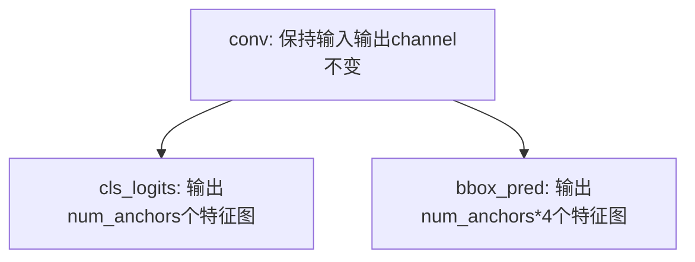

本节主要讲述FasterRCNN的PyTorch实现代码主要流程。
<!-- more -->

下面先看看数据集定义以及训练主函数代码，后面会依次讲解训练过程中的数据读取、FasterRCNN的前向计算过程。

# 数据集以及训练主函数代码
**dataset.py**:
```python
# -*- coding: utf-8 -*-
"""
# @file name  : dataset.py
# @author     : yts3221@126.com
# @date       : 2019-08-21 10:08:00
# @brief      : 各数据集的Dataset定义
"""

import os
import random
from PIL import Image
import torch
from torch.utils.data import Dataset

random.seed(1)

class PennFudanDataset(object):
    def __init__(self, data_dir, transforms):

        self.data_dir = data_dir
        self.transforms = transforms
        self.img_dir = os.path.join(data_dir, "PNGImages")
        self.txt_dir = os.path.join(data_dir, "Annotation")
        self.names = [name[:-4] for name in list(filter(lambda x: x.endswith(".png"), os.listdir(self.img_dir)))]

    def __getitem__(self, index):
        """
        返回img和target
        :param idx:
        :return:
        """

        name = self.names[index]
        path_img = os.path.join(self.img_dir, name + ".png")
        path_txt = os.path.join(self.txt_dir, name + ".txt")

        # load img
        img = Image.open(path_img).convert("RGB")

        # load boxes and label
        f = open(path_txt, "r")
        import re
        points = [re.findall(r"\d+", line) for line in f.readlines() if "Xmin" in line]
        boxes_list = list()
        for point in points:
            box = [int(p) for p in point]
            boxes_list.append(box[-4:])
        boxes = torch.tensor(boxes_list, dtype=torch.float)
        labels = torch.ones((boxes.shape[0],), dtype=torch.long)

        # iscrowd = torch.zeros((num_objs,), dtype=torch.int64)
        target = {}
        target["boxes"] = boxes
        target["labels"] = labels
        # target["iscrowd"] = iscrowd

        if self.transforms is not None:
            img, target = self.transforms(img, target)

        return img, target

    def __len__(self):
        if len(self.names) == 0:
            raise Exception("\ndata_dir:{} is a empty dir! Please checkout your path to images!".format(data_dir))
        return len(self.names)
```

**obj_detect_fasterrcnn**：
```python
# -*- coding: utf-8 -*-
"""
# @file name  : fasterrcnn_train.py
# @author     : TingsongYu https://github.com/TingsongYu
# @date       : 2019-11-30
# @brief      : 训练faster rcnn
"""

import os
import time
import torch.nn as nn
import torch
import random
import numpy as np
import torchvision.transforms as transforms
import torchvision
from PIL import Image
import torch.nn.functional as F
from tools.my_dataset import PennFudanDataset
from tools.common_tools import set_seed
from torch.utils.data import DataLoader
from matplotlib import pyplot as plt
from torchvision.models.detection.faster_rcnn import FastRCNNPredictor
from torchvision.transforms import functional as F

set_seed(1)  # 设置随机种子

BASE_DIR = "/home/xiajun/res/person"
device = torch.device("cuda" if torch.cuda.is_available() else "cpu")

# classes_coco
COCO_INSTANCE_CATEGORY_NAMES = [
    '__background__', 'person', 'bicycle', 'car', 'motorcycle', 'airplane', 'bus',
    'train', 'truck', 'boat', 'traffic light', 'fire hydrant', 'N/A', 'stop sign',
    'parking meter', 'bench', 'bird', 'cat', 'dog', 'horse', 'sheep', 'cow',
    'elephant', 'bear', 'zebra', 'giraffe', 'N/A', 'backpack', 'umbrella', 'N/A', 'N/A',
    'handbag', 'tie', 'suitcase', 'frisbee', 'skis', 'snowboard', 'sports ball',
    'kite', 'baseball bat', 'baseball glove', 'skateboard', 'surfboard', 'tennis racket',
    'bottle', 'N/A', 'wine glass', 'cup', 'fork', 'knife', 'spoon', 'bowl',
    'banana', 'apple', 'sandwich', 'orange', 'broccoli', 'carrot', 'hot dog', 'pizza',
    'donut', 'cake', 'chair', 'couch', 'potted plant', 'bed', 'N/A', 'dining table',
    'N/A', 'N/A', 'toilet', 'N/A', 'tv', 'laptop', 'mouse', 'remote', 'keyboard', 'cell phone',
    'microwave', 'oven', 'toaster', 'sink', 'refrigerator', 'N/A', 'book',
    'clock', 'vase', 'scissors', 'teddy bear', 'hair drier', 'toothbrush'
]


def vis_bbox(img, output, classes, max_vis=40, prob_thres=0.4):
    fig, ax = plt.subplots(figsize=(12, 12))
    ax.imshow(img, aspect='equal')

    out_boxes = output_dict["boxes"].cpu()
    out_scores = output_dict["scores"].cpu()
    out_labels = output_dict["labels"].cpu()

    num_boxes = out_boxes.shape[0]
    for idx in range(0, min(num_boxes, max_vis)):

        score = out_scores[idx].numpy()
        bbox = out_boxes[idx].numpy()
        class_name = classes[out_labels[idx]]

        if score < prob_thres:
            continue

        ax.add_patch(plt.Rectangle((bbox[0], bbox[1]), bbox[2] - bbox[0], bbox[3] - bbox[1], fill=False,
                                   edgecolor='red', linewidth=3.5))
        ax.text(bbox[0], bbox[1] - 2, '{:s} {:.3f}'.format(class_name, score), bbox=dict(facecolor='blue', alpha=0.5),
                fontsize=14, color='white')
    plt.show()
    plt.close()


class Compose(object):
    def __init__(self, transforms):
        self.transforms = transforms

    def __call__(self, image, target):
        for t in self.transforms:
            image, target = t(image, target)
        return image, target


class RandomHorizontalFlip(object):
    def __init__(self, prob):
        self.prob = prob

    def __call__(self, image, target):
        if random.random() < self.prob:
            height, width = image.shape[-2:]
            image = image.flip(-1)
            bbox = target["boxes"]
            bbox[:, [0, 2]] = width - bbox[:, [2, 0]]
            target["boxes"] = bbox
        return image, target


class ToTensor(object):
    def __call__(self, image, target):
        image = F.to_tensor(image)
        return image, target


if __name__ == "__main__":

    # config
    LR = 0.001
    num_classes = 2
    batch_size = 2
    start_epoch, max_epoch = 0, 30
    train_dir = os.path.join(BASE_DIR, "PennFudanPed")
    train_transform = Compose([ToTensor(), RandomHorizontalFlip(0.5)])

    # step 1: data
    train_set = PennFudanDataset(data_dir=train_dir, transforms=train_transform)


    # 收集batch data的函数
    def collate_fn(batch):
        return tuple(zip(*batch))


    train_loader = DataLoader(train_set, batch_size=batch_size, collate_fn=collate_fn)

    # step 2: model
    model = torchvision.models.detection.fasterrcnn_resnet50_fpn(pretrained=True)
    in_features = model.roi_heads.box_predictor.cls_score.in_features
    model.roi_heads.box_predictor = FastRCNNPredictor(in_features,
                                                      num_classes)  # replace the pre-trained head with a new one

    model.to(device)

    # step 3: loss
    # in lib/python3.6/site-packages/torchvision/models/detection/roi_heads.py
    # def fastrcnn_loss(class_logits, box_regression, labels, regression_targets)

    # step 4: optimizer scheduler
    params = [p for p in model.parameters() if p.requires_grad]
    optimizer = torch.optim.SGD(params, lr=LR, momentum=0.9, weight_decay=0.0005)
    lr_scheduler = torch.optim.lr_scheduler.StepLR(optimizer, step_size=10, gamma=0.1)

    # step 5: Iteration

    for epoch in range(start_epoch, max_epoch):

        model.train()
        for iter, (images, targets) in enumerate(train_loader):
            images = list(image.to(device) for image in images)
            targets = [{k: v.to(device) for k, v in t.items()} for t in targets]

            # if torch.cuda.is_available():
            #     images, targets = images.to(device), targets.to(device)

            loss_dict = model(images, targets)  # images is list; targets is [ dict["boxes":**, "labels":**], dict[] ]

            losses = sum(loss for loss in loss_dict.values())

            print("Training:Epoch[{:0>3}/{:0>3}] Iteration[{:0>3}/{:0>3}] Loss: {:.4f} ".format(
                epoch, max_epoch, iter + 1, len(train_loader), losses.item()))

            optimizer.zero_grad()
            losses.backward()
            optimizer.step()

        lr_scheduler.step()

    # test
    model.eval()

    # config
    vis_num = 5
    vis_dir = os.path.join(BASE_DIR, "PennFudanPed", "PNGImages")
    img_names = list(filter(lambda x: x.endswith(".png"), os.listdir(vis_dir)))
    random.shuffle(img_names)
    preprocess = transforms.Compose([transforms.ToTensor(), ])

    for i in range(0, vis_num):

        path_img = os.path.join(vis_dir, img_names[i])
        # preprocess
        input_image = Image.open(path_img).convert("RGB")
        img_chw = preprocess(input_image)

        # to device
        if torch.cuda.is_available():
            img_chw = img_chw.to('cuda')
            model.to('cuda')

        # forward
        input_list = [img_chw]
        with torch.no_grad():
            tic = time.time()
            print("input img tensor shape:{}".format(input_list[0].shape))
            output_list = model(input_list)
            output_dict = output_list[0]
            print("pass: {:.3f}s".format(time.time() - tic))

        # visualization
        vis_bbox(input_image, output_dict, COCO_INSTANCE_CATEGORY_NAMES, max_vis=20,
                 prob_thres=0.5)  # for 2 epoch for nms
```

---------------------------------------------------
下面开始讲FasterRCNN相关的代码。

# 模型定义
torchvision.models.detection.faster_rcnn.py
```python
def fasterrcnn_resnet50_fpn(pretrained=False, progress=True,
                            num_classes=91, pretrained_backbone=True, **kwargs):
    if pretrained:
        # no need to download the backbone if pretrained is set
        pretrained_backbone = False
    backbone = resnet_fpn_backbone('resnet50', pretrained_backbone)
    model = FasterRCNN(backbone, num_classes, **kwargs)
    if pretrained:
        state_dict = load_state_dict_from_url(model_urls['fasterrcnn_resnet50_fpn_coco'],
                                              progress=progress)
        model.load_state_dict(state_dict)
    return model
```

fasterrcnn_resnet50_fpn 中首先得到一个带有fpn的backbone，这个后面细说，TODO.

然后使用刚刚定义的backbone再建一个FasterRCNN实例，FasterRCNN继承自GeneralizedRCNN，FasterRCNN只有`__init__`函数，它会调用父类的 `forward`


```python
class FasterRCNN(GeneralizedRCNN):
    def __init__(self, backbone, num_classes=None,
                 # transform parameters
                 min_size=800, max_size=1333,
                 image_mean=None, image_std=None,
                 # RPN parameters
                 rpn_anchor_generator=None, rpn_head=None,
                 rpn_pre_nms_top_n_train=2000, rpn_pre_nms_top_n_test=1000,
                 rpn_post_nms_top_n_train=2000, rpn_post_nms_top_n_test=1000,
                 rpn_nms_thresh=0.7,
                 rpn_fg_iou_thresh=0.7, rpn_bg_iou_thresh=0.3,
                 rpn_batch_size_per_image=256, rpn_positive_fraction=0.5,
                 # Box parameters
                 box_roi_pool=None, box_head=None, box_predictor=None,
                 box_score_thresh=0.05, box_nms_thresh=0.5, box_detections_per_img=100,
                 box_fg_iou_thresh=0.5, box_bg_iou_thresh=0.5,
                 box_batch_size_per_image=512, box_positive_fraction=0.25,
                 bbox_reg_weights=None):

        if not hasattr(backbone, "out_channels"):
            raise ValueError(
                "backbone should contain an attribute out_channels "
                "specifying the number of output channels (assumed to be the "
                "same for all the levels)")

        assert isinstance(rpn_anchor_generator, (AnchorGenerator, type(None)))
        assert isinstance(box_roi_pool, (MultiScaleRoIAlign, type(None)))

        if num_classes is not None:
            if box_predictor is not None:
                raise ValueError("num_classes should be None when box_predictor is specified")
        else:
            if box_predictor is None:
                raise ValueError("num_classes should not be None when box_predictor "
                                 "is not specified")

        out_channels = backbone.out_channels

        if rpn_anchor_generator is None:
            anchor_sizes = ((32,), (64,), (128,), (256,), (512,))
            aspect_ratios = ((0.5, 1.0, 2.0),) * len(anchor_sizes)
            rpn_anchor_generator = AnchorGenerator(
                anchor_sizes, aspect_ratios
            )
        if rpn_head is None:
            rpn_head = RPNHead(
                out_channels, rpn_anchor_generator.num_anchors_per_location()[0]
            )

        rpn_pre_nms_top_n = dict(training=rpn_pre_nms_top_n_train, testing=rpn_pre_nms_top_n_test)
        rpn_post_nms_top_n = dict(training=rpn_post_nms_top_n_train, testing=rpn_post_nms_top_n_test)

        rpn = RegionProposalNetwork(
            rpn_anchor_generator, rpn_head,
            rpn_fg_iou_thresh, rpn_bg_iou_thresh,
            rpn_batch_size_per_image, rpn_positive_fraction,
            rpn_pre_nms_top_n, rpn_post_nms_top_n, rpn_nms_thresh)

        if box_roi_pool is None:
            box_roi_pool = MultiScaleRoIAlign(
                featmap_names=[0, 1, 2, 3],
                output_size=7,
                sampling_ratio=2)

        if box_head is None:
            resolution = box_roi_pool.output_size[0]
            representation_size = 1024
            box_head = TwoMLPHead(
                out_channels * resolution ** 2,
                representation_size)

        if box_predictor is None:
            representation_size = 1024
            box_predictor = FastRCNNPredictor(
                representation_size,
                num_classes)

        roi_heads = RoIHeads(
            # Box
            box_roi_pool, box_head, box_predictor,
            box_fg_iou_thresh, box_bg_iou_thresh,
            box_batch_size_per_image, box_positive_fraction,
            bbox_reg_weights,
            box_score_thresh, box_nms_thresh, box_detections_per_img)

        if image_mean is None:
            image_mean = [0.485, 0.456, 0.406]
        if image_std is None:
            image_std = [0.229, 0.224, 0.225]
        transform = GeneralizedRCNNTransform(min_size, max_size, image_mean, image_std)

        super(FasterRCNN, self).__init__(backbone, rpn, roi_heads, transform)
```


# 数据准备

`for iter, (images, targets) in enumerate(train_loader):`

## 从 Dataset 取样本
DataLoader 的迭代器在内部每次会从 PennFudanDataset 取出一个样本（一个 batch 会取 batch_size 次）

```python
class PennFudanDataset(object):
    def __init__(self, data_dir, transforms):
        ...

    def __getitem__(self, index):
        img = Image.open(path_img).convert("RGB")

        target = {}
        target["boxes"] = boxes
        target["labels"] = labels

        if self.transforms is not None:
            img, target = self.transforms(img, target)

        return img, target
```

## Dataset 每次会返回一个 tuple：
```python
# 第一张图片所对应的 tensor 和 bboxes、labels
(
    tensor([...]),  # 一个 shape 为[c, h, w]的张量

    {
        'boxes': tensor([[355., 135., 490., 389.], [158., 123., 303., 421.]]),  # shape 为 [n, 4] 的 bboxes
        'labels': tensor([1, 1]) # shape 为 [n, ] 的 labels
    }
)
```

## DataLoader 将这些 tuple 组成一个 list
当 DataLoader 取完 batch_size 个样本后，将这些 tuple 组成一个 list

在目标检测中，由于每张图片大小不一样，所以没法用 shape 为 [b, c, h, w] 的4维tensor来表示一个batch的数据了。
以batch_size=2为例，在目标检测中，一个batch的数据形式如下：
```python
[
    # 第一张图片所对应的 tensor 和 bboxes、labels
    (
        tensor([...]),  # 一个 shape 为[c, h, w]的张量

        {
            'boxes': tensor([[355., 135., 490., 389.], [158., 123., 303., 421.]]),  # shape 为 [n, 4] 的 bboxes
            'labels': tensor([1, 1])  # shape 为 [n, ] 的 labels
        }
    ),

    # 第二张图片所对应的 tensor 和 bboxes、labels
    (
        tensor([...]),  # 一个 shape 为[c, h, w]的张量

        {
            'boxes': tensor([[355., 135., 490., 389.], [158., 123., 303., 421.]]), 
            'labels': tensor([1, 1])
        }
    ),
]
```

## DataLoader 调用用户自定义的 `collate_fn` 将这个 list 重组成如下形式：
```
(
    # 这一个tuple对应的是images
    (
        tensor([...]),
        tensor([...])
    ),

    # 这一个tuple对应的是targets
    (
        {
            'boxes': tensor([[355., 135., 490., 389.], [158., 123., 303., 421.]]), 
            'labels': tensor([1, 1])
        },
        {
            'boxes': tensor([[ 15.,  29., 124., 325.], [169.,  27., 266., 329.]]), 
            'labels': tensor([1, 1])
        }
    )
)
```
至此，数据还是在 CPU 上

## 现在可以将这些数据搬运到 GPU 上了
```python
for iter, (images, targets) in enumerate(train_loader):
    images = list(image.to(device) for image in images)
    targets = [{k: v.to(device) for k, v in t.items()} for t in targets]
```


# 开始网络前向计算

执行 `model(images, target)` 进入 FasterRCNN 的 forward 函数（这里实际上是 GeneralizedRCNN 的 forward 函数），\
在 GeneralizedRCNN 的 forward 函数中，首先是要对传入的images和targets做transform操作。

## 对images和targets做transform操作
先贴出这段的全局代码，后面再依次详细介绍。
```python
class GeneralizedRCNNTransform(nn.Module):
    """
    Performs input / target transformation before feeding the data to a GeneralizedRCNN
    model.

    The transformations it perform are:
        - input normalization (mean subtraction and std division)
        - input / target resizing to match min_size / max_size

    It returns a ImageList for the inputs, and a List[Dict[Tensor]] for the targets
    """

    def __init__(self, min_size, max_size, image_mean, image_std):
        super(GeneralizedRCNNTransform, self).__init__()
        if not isinstance(min_size, (list, tuple)):
            min_size = (min_size,)
        self.min_size = min_size
        self.max_size = max_size
        self.image_mean = image_mean
        self.image_std = image_std

    def forward(self, images, targets=None):
        images = [img for img in images]
        for i in range(len(images)):
            image = images[i]
            target = targets[i] if targets is not None else targets
            if image.dim() != 3:
                raise ValueError("images is expected to be a list of 3d tensors "
                                 "of shape [C, H, W], got {}".format(image.shape))
            image = self.normalize(image)
            image, target = self.resize(image, target)
            images[i] = image
            if targets is not None:
                targets[i] = target

        image_sizes = [img.shape[-2:] for img in images]
        images = self.batch_images(images)
        image_list = ImageList(images, image_sizes)
        return image_list, targets
```

### 在for循环中对每张image和其对应的target做normalize和resize操作

#### 依次对images中的每张image做normalize操作
依次对images中的每张image(其实是一个tensor)做normalize操作.

torchvision.models.detection.transform.py
```python
class GeneralizedRCNNTransform(nn.Module):
    def normalize(self, image):
        dtype, device = image.dtype, image.device
        mean = torch.as_tensor(self.image_mean, dtype=dtype, device=device)
        std = torch.as_tensor(self.image_std, dtype=dtype, device=device)
        return (image - mean[:, None, None]) / std[:, None, None]
```
计算公式如下：
$$
\begin{aligned}
    image\_mean &= [0.485, 0.456, 0.406] \\
    image\_std &= [0.229, 0.224, 0.225] \\
image[i, ...] &= \frac{image[i, ...] - mean[i]}{std[i]}, \qquad i \in \{ 0, 1, 2 \}
\end{aligned}
$$
上面 image_mean 和 image_std 的值是默认的值，当然用户也可以自己定义。


#### 依次对images和targets做resize操作
本小节的完整代码如下：
torchvision.models.detection.transform.py
```python
class GeneralizedRCNNTransform(nn.Module):
    def resize(self, image, target):
        if self.training:
            random_size = random.choice(self.min_size)
        else:
            # FIXME assume for now that testing uses the largest scale
            random_size = self.min_size[-1]
        scale_factor = 根据 random_size 和 image 尺寸生成合适的缩放比例

        # 开始缩放图片，保持 image 长宽比不变
        image = torch.nn.functional.interpolate(
            image[None], scale_factor=scale_factor, mode='bilinear', align_corners=False)[0]

        if target is None:
            return image, target

        bbox = target["boxes"]
        bbox = resize_boxes(bbox, (h, w), image.shape[-2:])
        target["boxes"] = bbox

        if "masks" in target:
            mask = target["masks"]
            mask = misc_nn_ops.interpolate(mask[None].float(), scale_factor=scale_factor)[0].byte()
            target["masks"] = mask

        if "keypoints" in target:
            keypoints = target["keypoints"]
            keypoints = resize_keypoints(keypoints, (h, w), image.shape[-2:])
            target["keypoints"] = keypoints
        return image, target
```

##### 将每张图片(tensor)缩放到一个随机选中的尺度
在训练阶段，是先从 `self.min_size`(一个`tuple`) 中随机选择一个尺寸，然后将图片(tensor)保持宽高比不变缩放到这个选中的尺寸。


##### 将图片对应的 ground_turth 也要缩放到这个尺度
torchvision.models.detection.transform.py
对于目标检测任务来说，图片被缩放了，ground_turth 肯定也得跟着缩放
```python
def resize_boxes(boxes, original_size, new_size):
    ratios = tuple(float(s) / float(s_orig) for s, s_orig in zip(new_size, original_size))
    ratio_height, ratio_width = ratios
    xmin, ymin, xmax, ymax = boxes.unbind(1)
    xmin = xmin * ratio_width
    xmax = xmax * ratio_width
    ymin = ymin * ratio_height
    ymax = ymax * ratio_height
    return torch.stack((xmin, ymin, xmax, ymax), dim=1)
```

##### 如果有masks或者keypoints，也要做相应的缩放
略 ……


### 提取images中每个tensor的尺寸并存入一个局部变量 image_sizes 中
```python
image_sizes = [img.shape[-2:] for img in images]
```

### 将list形式的images重组为一个4维tensor
torchvision.models.detection.transform.py
```python
class GeneralizedRCNNTransform(nn.Module):
    def batch_images(self, images, size_divisible=32):
        # concatenate
        max_size = tuple(max(s) for s in zip(*[img.shape for img in images]))

        stride = size_divisible
        max_size = list(max_size)
        max_size[1] = int(math.ceil(float(max_size[1]) / stride) * stride)
        max_size[2] = int(math.ceil(float(max_size[2]) / stride) * stride)
        max_size = tuple(max_size)

        batch_shape = (len(images),) + max_size
        batched_imgs = images[0].new(*batch_shape).zero_()
        for img, pad_img in zip(images, batched_imgs):
            pad_img[: img.shape[0], : img.shape[1], : img.shape[2]].copy_(img)

        return batched_imgs
```
将images中的每个tensor(3维)通过pading操作重组为一个4维的tensor.


### 将此时的images(此时已是4维tensor)和image_sizes都用 ImageList 封装一下
```python
class ImageList(object):
    """
    Structure that holds a list of images (of possibly
    varying sizes) as a single tensor.
    This works by padding the images to the same size,
    and storing in a field the original sizes of each image
    """
    def __init__(self, tensors, image_sizes):
        self.tensors = tensors
        self.image_sizes = image_sizes

    def to(self, *args, **kwargs):
        cast_tensor = self.tensors.to(*args, **kwargs)
        return ImageList(cast_tensor, self.image_sizes)
```


### transform forward 返回 image_list 和 targets
如题...

### transform 总结
我们现在小结下上面的 transform 操作，该操作传入两个参数images和targets，且它们都是list，\
在 transform 中首先会进入一个for循环，在for循环中对每个image做normalize操作，然后再做resize操作，当然和其对应的target也要resize(在resize操作会将它们保持宽高比地resize到一个随机选中的尺寸)。\
for循环出来后得到的还是images和targets，且这时候它们还是list. \
提取images中每个tensor的尺寸并存入一个局部变量 image_sizes 中. \
将images中的每个tensor(3维)通过pading操作重组为一个4维的tensor. \
将此时的images(此时已是4维tensor)和image_sizes都用 ImageList 封装一下得到一个 image_list. \
forward 返回 (image_list, targets)


## backbone
```python
features = self.backbone(images.tensors)
```

将 images.tensors(4维tensor) 传入 backbone 得到一个有序字典 features（features 是一个 OrderedDict，有序字典）

```python
print(features.keys())
odict_keys([0, 1, 2, 3, 'pool'])
```

## rpn
```python
proposals, proposal_losses = self.rpn(images, features, targets)
```


### 执行 RPNHead 操作

**调用代码**：
```python
features = list(features.values())
objectness, pred_bbox_deltas = self.head(features)


# output:
for i, (obj, box) in enumerate(zip(objectness, pred_bbox_deltas)):
    print(i, obj.shape, box.shape)
    
0 torch.Size([2, 3, 200, 232]) torch.Size([2, 12, 200, 232])
1 torch.Size([2, 3, 100, 116]) torch.Size([2, 12, 100, 116])
2 torch.Size([2, 3, 50, 58]) torch.Size([2, 12, 50, 58])
3 torch.Size([2, 3, 25, 29]) torch.Size([2, 12, 25, 29])
4 torch.Size([2, 3, 13, 15]) torch.Size([2, 12, 13, 15])

num_anchors = 3         # anchors数量
num_point_of_bboxes = num_anchors * 4 = 12  # 1个anchor有4个坐标值，那么3个anchor就有12个坐标值。
```
features 是一个含有5个feature map的特征金字塔，经过`self.head` RPNHead 操作后返回的是5个对应的目标feature map和5个预测bbox偏移量。


**定义代码**：
```python
class RPNHead(nn.Module):
    """
    Adds a simple RPN Head with classification and regression heads

    Arguments:
        in_channels (int): number of channels of the input feature
        num_anchors (int): number of anchors to be predicted
    """

    def __init__(self, in_channels, num_anchors):
        super(RPNHead, self).__init__()
        self.conv = nn.Conv2d(
            in_channels, in_channels, kernel_size=3, stride=1, padding=1
        )
        self.cls_logits = nn.Conv2d(in_channels, num_anchors, kernel_size=1, stride=1)
        self.bbox_pred = nn.Conv2d(
            in_channels, num_anchors * 4, kernel_size=1, stride=1
        )

        for l in self.children():
            torch.nn.init.normal_(l.weight, std=0.01)
            torch.nn.init.constant_(l.bias, 0)

    def forward(self, x):
        logits = []
        bbox_reg = []
        for feature in x:
            t = F.relu(self.conv(feature))
            logits.append(self.cls_logits(t))
            bbox_reg.append(self.bbox_pred(t))
        return logits, bbox_reg
```

通过forward可以知道，RPNHead就是将输入的金字塔特征依次做如下的操作：




### 生成 anchors
**调用代码**：
```python
anchors = self.anchor_generator(images, features)


# output:
for i, anchor in enumerate(anchors):
    print(i, anchor.shape)
    
0 torch.Size([185460, 4])
1 torch.Size([185460, 4])
```

生成 anchors 的具体方法没有细看，下面先贴出代码:

**定义代码**：
```python
class AnchorGenerator(nn.Module):
    def __init__(
        self,
        sizes=(128, 256, 512),
        aspect_ratios=(0.5, 1.0, 2.0),
    ):
        super(AnchorGenerator, self).__init__()

        if not isinstance(sizes[0], (list, tuple)):
            # TODO change this
            sizes = tuple((s,) for s in sizes)
        if not isinstance(aspect_ratios[0], (list, tuple)):
            aspect_ratios = (aspect_ratios,) * len(sizes)

        assert len(sizes) == len(aspect_ratios)

        self.sizes = sizes
        self.aspect_ratios = aspect_ratios
        self.cell_anchors = None
        self._cache = {}

    ...

    def forward(self, image_list, feature_maps):
        grid_sizes = tuple([feature_map.shape[-2:] for feature_map in feature_maps])
        image_size = image_list.tensors.shape[-2:]
        strides = tuple((image_size[0] / g[0], image_size[1] / g[1]) for g in grid_sizes)
        self.set_cell_anchors(feature_maps[0].device)
        anchors_over_all_feature_maps = self.cached_grid_anchors(grid_sizes, strides)
        anchors = []
        for i, (image_height, image_width) in enumerate(image_list.image_sizes):
            anchors_in_image = []
            for anchors_per_feature_map in anchors_over_all_feature_maps:
                anchors_in_image.append(anchors_per_feature_map)
            anchors.append(anchors_in_image)
        anchors = [torch.cat(anchors_per_image) for anchors_per_image in anchors]
        return anchors
```


### 生成 proposal

**调用代码**：
```python
objectness, pred_bbox_deltas = concat_box_prediction_layers(objectness, pred_bbox_deltas)  # concat目标feature_map和bbox偏移量

# output:
print(objectness.shape, pred_bbox_deltas.shape)
torch.Size([370920, 1]) torch.Size([370920, 4])

# --------------------------------------

proposals = self.box_coder.decode(pred_bbox_deltas.detach(), anchors)  # 将bbox偏移量转化为图像坐标系中的实际坐标
proposals = proposals.view(num_images, -1, 4)


# output:
print(proposals.shape)
torch.Size([2, 185460, 4])
```


### 过滤 proposal
```python
boxes, scores = self.filter_proposals(proposals, objectness, images.image_sizes, num_anchors_per_level)


# output:
for i, (box, sco) in enumerate(zip(boxes, scores)):
    print(i, box.shape, sco.shape)    
    
0 torch.Size([2000, 4]) torch.Size([2000])
1 torch.Size([2000, 4]) torch.Size([2000])
```


### compute loss
如果是训练阶段则需要计算loss，但如果是测试阶段则 RPN 直接返回上面filter_proposals生成的2000个proposal框即可。

**step1**: 在正式计算 loss 之前，首先要生成 ground_truth，这里是根据 anchors 生成匹配的 ground_truth。
```python
if self.training:
    labels, matched_gt_boxes = self.assign_targets_to_anchors(anchors, targets)
    regression_targets = self.box_coder.encode(matched_gt_boxes, anchors)


# output 1:
for i, (label, gtbox) in enumerate(zip(labels, matched_gt_boxes)):
    print(i, label.shape, gtbox.shape)  
    
0 torch.Size([185460]) torch.Size([185460, 4])
1 torch.Size([185460]) torch.Size([185460, 4])

# output 2:
for i, label in enumerate(labels):
    print('{}, number of background bbox: {}'.format(i, (label.numpy() == 0).sum()))
    print('{}, number of background bbox: {}'.format(i, (label.numpy() == 1).sum()))            
    
0, number of background bbox: 185060
0, number of background bbox: 12
1, number of background bbox: 185124
1, number of background bbox: 4

# output 3:
for target in regression_targets:
    print(target.shape)
    
torch.Size([185460, 4])
torch.Size([185460, 4])
```


**step2**: 计算loss
通过前面的 filter_proposals 后还剩下 2000 个 proposal 框，但是在计算 loss 的时候并不是将这 2000 个框全部都用上的，而是只使用了其中的一部分。

具体的 loss 计算分为两个部分，分别是“bbox 回归 loss”和“目标框分类 loss”，具体流程看下面代码注释吧。

```python
class RegionProposalNetwork(torch.nn.Module):
    def compute_loss(self, objectness, pred_bbox_deltas, labels, regression_targets):
        """
        Arguments:
            objectness (Tensor)
            pred_bbox_deltas (Tensor)
            labels (List[Tensor])
            regression_targets (List[Tensor])

        Returns:
            objectness_loss (Tensor)
            box_loss (Tensor
        """

        """output:
        > print(labels.shape)
        > torch.Size([370920])
        此时一共有37w多个标签，对应这37w多个目标。
        下面开始做正负样本均衡：
        """
        sampled_pos_inds, sampled_neg_inds = self.fg_bg_sampler(labels)
        sampled_pos_inds = torch.nonzero(torch.cat(sampled_pos_inds, dim=0)).squeeze(1)
        sampled_neg_inds = torch.nonzero(torch.cat(sampled_neg_inds, dim=0)).squeeze(1)
        """output:
        > print(sampled_neg_inds.shape, sampled_pos_inds.shape)
        > torch.Size([496]) torch.Size([16])
        做完正负样本均衡后，负样本还剩496个，正样本还剩16个
        """

        sampled_inds = torch.cat([sampled_pos_inds, sampled_neg_inds], dim=0)
        """output:
        > print(sampled_inds.shape)
        > torch.Size([512])
        将正负样本标签合并到一起。
        """

        objectness = objectness.flatten()

        labels = torch.cat(labels, dim=0)
        regression_targets = torch.cat(regression_targets, dim=0)
        """output:
        > print(labels.shape, regression_targets.shape)
        > torch.Size([370920]) torch.Size([370920, 4])
        """

        # bbox 回归
        box_loss = F.l1_loss(
            pred_bbox_deltas[sampled_pos_inds],  # 预测的 bbox
            regression_targets[sampled_pos_inds],  # 要回归的目标bbox，即真实bbox
            reduction="sum",  # F.l1_loss本身是逐元素计算，但是reduction设置成“sum”后表示返回求和值。
        ) / (sampled_inds.numel())  # 取平均

        # 计算交叉熵
        objectness_loss = F.binary_cross_entropy_with_logits(
            objectness[sampled_inds], labels[sampled_inds]
        )

        return objectness_loss, box_loss
```

l1_loss 计算公式：$l_n = \vert x_n - y_n \vert$


## ROI 对齐
TODO

## 对检测到的目标框做一些postprocess(后续处理)
```python
class GeneralizedRCNNTransform(nn.Module):
    def postprocess(self, result, image_shapes, original_image_sizes):
        if self.training:
            return result
        for i, (pred, im_s, o_im_s) in enumerate(zip(result, image_shapes, original_image_sizes)):
            boxes = pred["boxes"]
            boxes = resize_boxes(boxes, im_s, o_im_s)
            result[i]["boxes"] = boxes
            if "masks" in pred:
                masks = pred["masks"]
                masks = paste_masks_in_image(masks, boxes, o_im_s)
                result[i]["masks"] = masks
            if "keypoints" in pred:
                keypoints = pred["keypoints"]
                keypoints = resize_keypoints(keypoints, im_s, o_im_s)
                result[i]["keypoints"] = keypoints
        return result
```


## return

如果是训练阶段，则返回训练 losses 字典
```python
losses = {}
losses.update(detector_losses)
losses.update(proposal_losses)


# output:
print(losses)
{'loss_box_reg': tensor(0.1985, grad_fn=<DivBackward0>),
 'loss_classifier': tensor(1.0829, grad_fn=<NllLossBackward>),
 'loss_objectness': tensor(0.0291, grad_fn=<BinaryCrossEntropyWithLogitsBackward>),
 'loss_rpn_box_reg': tensor(0.0046, grad_fn=<DivBackward0>)}
```


# 参考文献
[1] torchvision.models.detection
[2] DeepShare.net > PyTorch框架班

