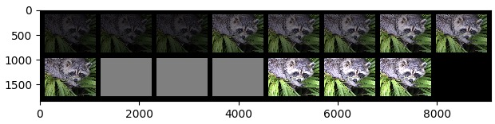

about make_grid experiment.
<!--more-->

# make_grid

目标目录：from torchvision.utils import make_grid

```python
def make_grid(tensor, nrow=8, padding=2,
              normalize=False, range=None, scale_each=False, pad_value=0):
    """Make a grid of images.

    Args:
        tensor (Tensor or list): 4D mini-batch Tensor of shape (B x C x H x W)
            or a list of images all of the same size.
        nrow (int, optional): Number of images displayed in each row of the grid.
            The final grid size is ``(B / nrow, nrow)``. Default: ``8``.
        padding (int, optional): amount of padding. Default: ``2``.
        normalize (bool, optional): If True, shift the image to the range (0, 1),
            by the min and max values specified by :attr:`range`. Default: ``False``.
        range (tuple, optional): tuple (min, max) where min and max are numbers,
            then these numbers are used to normalize the image. By default, min and max
            are computed from the tensor.
        scale_each (bool, optional): If ``True``, scale each image in the batch of
            images separately rather than the (min, max) over all images. Default: ``False``.
        pad_value (float, optional): Value for the padded pixels. Default: ``0``.

    Example:
        See this notebook `here <https://gist.github.com/anonymous/bf16430f7750c023141c562f3e9f2a91>`_

    """
```
**参数说明：** \
- **tensor**: shape 为 (B x C x H x W) 张量
- **nrow**: grid列数，即tensor 会被分为 B/nrow 行，nrow 列，例如 B=15，nrow=4, 则tensor会被分为B/nrow=3.7行(取整为4行)，4列
- **padding**: grid 间的padding尺寸
- **normalize**: 
- **range**: 
- **scale_each**: 
- **pad_value**: padding 像素值，默认为0


## 关于 make_grid 的 tenosr 拼接维度以及nrow参数的实验
```python
import torch
import torchvision.transforms as transforms
from torchvision.utils import make_grid
import matplotlib.pyplot as plt
import numpy as np
import scipy.misc


def show(img):
    npimg = img.numpy()
    plt.imshow(np.transpose(npimg, (1, 2, 0)), interpolation='nearest')
    plt.show()


if __name__ == '__main__':
    lena = scipy.misc.face()
    img = transforms.ToTensor()(lena)
    print('\n原始的 img.shape: \n', img.shape)

    img = torch.unsqueeze(img, dim=0)
    print('\n补充batch维度后的 img.shape: \n', img.shape)

    img = torch.cat((img, img, img), 0)
    print('\n拼成batch_size为3后的 img.shape: \n', img.shape)

    # 多制造几组tensor, 每组tensor再调整下亮度，用于区分不同的组的数据
    imglist = [img * 0.2, img * 0.5, img * 0.8, img.clone().fill_(1) * 0.5, img * 1.2]

    # 将多组tensor在batch维度上去拼接：
    tensor1 = torch.cat(imglist, 0)
    print('\n将各tensor在batch维度拼接后的 tensor.shape: \n', tensor1.shape)
    tensor1 = make_grid(tensor1, nrow=8, padding=100)
    print('\nmake_grid 后的 tensor.shape: \n', tensor1.shape)

    show(tensor1)


    # 将多组tensor在height维度上去拼接:
    tensor2 = torch.cat(imglist, -2)
    print('\n将各tensor在height维度拼接后的 tensor.shape: \n', tensor2.shape)
    tensor2 = make_grid(tensor2, nrow=8, padding=100)
    print('\nmake_grid 后的 tensor.shape: \n', tensor2.shape)

    show(tensor2)


# output: 
原始的 img.shape: 
 torch.Size([3, 768, 1024])

补充batch维度后的 img.shape: 
 torch.Size([1, 3, 768, 1024])

拼成batch_size为3后的 img.shape: 
 torch.Size([3, 3, 768, 1024])

将各tensor在batch维度拼接后的 tensor.shape: 
 torch.Size([15, 3, 768, 1024])

make_grid 后的 tensor.shape: 
 torch.Size([3, 1836, 9092])

将各tensor在height维度拼接后的 tensor.shape: 
 torch.Size([3, 3, 3840, 1024])

make_grid 后的 tensor.shape: 
 torch.Size([3, 4040, 3472])
```
将各tensor在batch维度拼接后的grid图像：\



将各tensor在height维度拼接后的grid图像: \


## 关于 make_grid 的 normalize、range、scale_each 等参数的实验
```python
import torch
import torchvision.transforms as transforms
from torchvision.utils import make_grid
import matplotlib.pyplot as plt
import numpy as np
import scipy.misc


if __name__ == '__main__':
    lena = scipy.misc.face()
    img = transforms.ToTensor()(lena)

    # 多制造几组tensor, 每组tensor再调整下亮度，用于区分不同的组的数据
    imglist = [img * 0.2, img * 0.5, img * 0.8, img.clone().fill_(1) * 0.5, img * 1.2]

    tensor1 = make_grid(imglist, padding=100, nrow=3)
    show(tensor1)

    tensor2 = make_grid(imglist, padding=100, nrow=3, normalize=True)
    show(tensor2)

    tensor3 = make_grid(imglist, padding=100, nrow=3, normalize=True, range=(0, 1))
    show(tensor3)

    tensor4 = make_grid(imglist, padding=100, nrow=3, normalize=True, range=(0, 0.5))
    show(tensor4)

    tensor5 = make_grid(imglist, padding=100, nrow=3, normalize=True, scale_each=True)
    show(tensor5)

    tensor6 = make_grid(imglist, padding=100, nrow=3, normalize=True, range=(0, 0.5), scale_each=True)
    show(tensor6)
```
上述6个show中的其中一个：\


