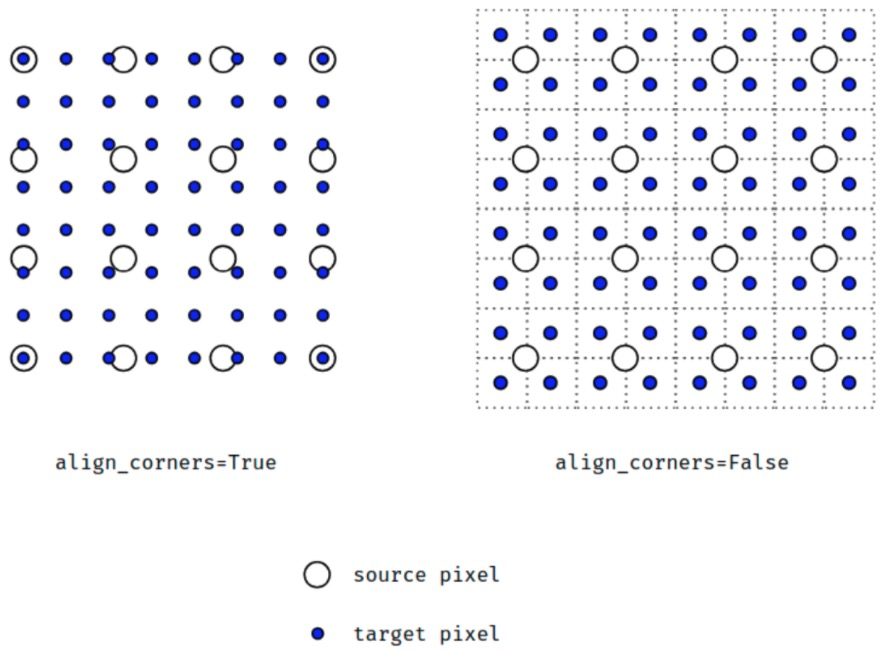

-----------------
此部分来自文献[1]
插值（Interpolation），有时也称为“重置样本”，是在不生成像素的情况下增加图像像素大小的一种方法，在周围像素色彩的基础上用数学公式计算丢失像素的色彩。简单地点，插值是根据中心像素点的颜色参数模拟出周边像素值的方法，是数码相机特有的放大数码照片的软件手段。 
　　一、认识插值的算法

　　“插值”最初是电脑术语，后来引用到数码图像上来。图像放大时，像素也相应地增加，但这些增加的像素从何而来？这时插值就派上用场了：插值就是在不生成像素的情况下增加图像像素大小的一种方法，在周围像素色彩的基础上用数学公式计算丢失像素的色彩（也有的有些相机使用插值，人为地增加图像的分辨率）。所以在放大图像时，图像看上去会比较平滑、干净。但必须注意的是插值并不能增加图像信息。以图1为原图（见图1），以下是经过不同插值算法处理的图片。


　　1.最近像素插值算法
　　最近像素插值算法（Nearest Neighbour Interpolation）是最简单的一种插值算法，当图片放大时，缺少的像素通过直接使用与之最接近的原有的像素的颜色生成，也就是说照搬旁边的像素，这样做的结果是产生了明显可见的锯齿（见图2）。

　　2.双线性插值算法
　　双线性插值算法（Bilinear Interpolation）输出的图像的每个像素都是原图中四个像素（2×2）运算的结果，这种算法极大地消除了锯齿现象（见图3）。

　　3.双三次插值算法
　　双三次插值算法（Bicubic Interpolation）是上一种算法的改进算法，它输出图像的每个像素都是原图16个像素（16×16）运算的结果（见图4）。这种算法是一种很常见的算法，普遍用在图像编辑软件、打印机驱动和数码相机上。

　　4.分形算法
　　分形算法（Fractal Interpolation）是Altamira Group提出的一种算法，这种算法得到的图像跟其他算法相比更清晰、锐利（见图5）。

　　现在有许多数码相机厂商将插值算法用在了数码相机上，并将通过算法得到的分辨率值大肆宣传，固然他们的算法比双三次插值算法等算法先进很多，但是事实是图像的细节不能凭空造出来的。因为插值分辨率是数码相机通过自身的内置软件来增加图像的像素，从而达到增大分辨率的效果。

　　二、插值的影响

　　使用数码变焦拍出来的照片不清晰，这是数码变焦最遭人垢病的地方，事实上，这只是一种片面的说法。
　　数码变焦对照片清晰度的影响有多大，取决于数码相机在变焦时，CCD是否进行了插值运算。在使用高像素的情况下，如果采用数码变焦进行拍摄，则此时CCD并不会有任何插值运算，数码变焦对最终得到的数码照片的清晰度的影响将会因此而变得极其有限。举个例子，一台CCD像素为520万、最大分辨率为2560×1920的数码相机，如果采用2×的数码变焦来进行拍摄的话，那么成像过程中只会有一半CCD在工作。换句话说，数码相机并不会使用类似“在一个像素点周围添加八个像素点”的插值算法进行成像，而是通过降低分辨率的方法，即1280×960这个分辨率指标来进行成像。对于一般的数码照片来说，1280×960这个分辨率指标已经足够优秀了，它与2560×1920分辨率的差别将会因为没有插值运算的参与而变得可以接受。不过这种现象只限于某些比较高级的数码相机，对于那些千元以下的定焦数码相机来说，使用数码变焦就意味着必然的插值运算，牺牲分辨率的后果使得照片拍摄者只能有两个选择：要么得到一张模糊不清的“全尺寸”照片、要么得到一张质量可以保证但分辨率只有类似320×240这样的“迷你”画片。

插值算法的拓展介绍

Inverse Distance to a Power（反距离加权插值法） 
Kriging（克里金插值法） 
Minimum Curvature（最小曲率） 
Modified Shepard's Method（改进谢别德法） 
Natural Neighbor（自然邻点插值法） 
Nearest Neighbor（最近邻点插值法） 
Polynomial Regression（多元回归法） 
Radial Basis Function（径向基函数法） 
Triangulation with Linear Interpolation（线性插值三角网法） 
Moving Average（移动平均法） 
Local Polynomial（局部多项式法） 
下面简单说明不同算法的特点。

1、距离倒数乘方法     
距离倒数乘方格网化方法是一个加权平均插值法，可以进行确切的或者圆滑的方式插值。方次参数控制着权系数如何随着离开一个格网结点距离的增加而下降。对于一个较大的方次，较近的数据点被给定一个较高的权重份额，对于一个较小的方次，权重比较均匀地分配给各数据点。 计算一个格网结点时给予一个特定数据点的权值与指定方次的从结点到观测点的该结点被赋予距离倒数成比例。当计算一个格网结点时，配给的权重是一个分数，所有权重的总和等于1.0。当一个观测点与一个格网结点重合时，该观测点被给予一个实际为 1.0 的权重，所有其它观测点被给予一个几乎为 0.0 的权重。换言之，该结点被赋给与观测点一致的值。这就是一个准确插值。 距离倒数法的特征之一是要在格网区域内产生围绕观测点位置的"牛眼"。用距离倒数格网化时可以指定一个圆滑参数。大于零的圆滑参数保证，对于一个特定的结点，没有哪个观测点被赋予全部的权值，即使观测点与该结点重合也是如此。圆滑参数通过修匀已被插值的格网来降低"牛眼"影响。

2、克里金法    
克里金法是一种在许多领域都很有用的地质统计格网化方法。克里金法试图那样表示隐含在你的数据中的趋势，例如，高点会是沿一个脊连接，而不是被牛眼形等值线所孤立。 克里金法中包含了几个因子：变化图模型，漂移类型 和矿块效应。

3、最小曲率法 
最小曲率法广泛用于地球科学。用最小曲率法生成的插值面类似于一个通过各个数据值的，具有最小弯曲量的长条形薄弹性片。最小曲率法，试图在尽可能严格地尊重数据的同时，生成尽可能圆滑的曲面。 使用最小曲率法时要涉及到两个参数：最大残差参数和最大循环次数参数来控制最小曲率的收敛标准。

4、多元回归法 
多元回归被用来确定你的数据的大规模的趋势和图案。你可以用几个选项来确定你需要的趋势面类型。多元回归实际上不是插值器，因为它并不试图预测未知的 Z 值。它实际上是一个趋势面分析作图程序。 使用多元回归法时要涉及到曲面定义和指定XY的最高方次设置，曲面定义是选择采用的数据的多项式类型，这些类型分别是简单平面、双线性鞍、二次曲面、三次曲面和用户定义的多项式。参数设置是指定多项式方程中 X 和 Y组元的最高方次 。

5、径向基本函数法 
径向基本函数法是多个数据插值方法的组合。根据适应你的数据和生成一个圆滑曲面的能力，其中的复二次函数被许多人认为是最好的方法。所有径向基本函数法都是准确的插值器，它们都要为尊重你的数据而努力。为了试图生成一个更圆滑的曲面，对所有这些方法你都可以引入一个圆滑系数。你可以指定的函数类似于克里金中的变化图。当对一个格网结点插值时，这些个函数给数据点规定了一套最佳权重。

6、谢别德法 
谢别德法使用距离倒数加权的最小二乘方的方法。因此，它与距离倒数乘方插值器相似，但它利用了局部最小二乘方来消除或减少所生成等值线的"牛眼"外观。谢别德法可以是一个准确或圆滑插值器。 在用谢别德法作为格网化方法时要涉及到圆滑参数的设置。圆滑参数是使谢别德法能够象一个圆滑插值器那样工作。当你增加圆滑参数的值时，圆滑的效果越好。

7、三角网/线形插值法 
三角网插值器是一种严密的插值器，它的工作路线与手工绘制等值线相近。这种方法是通过在数据点之间连线以建立起若干个三角形来工作的。原始数据点的连结方法是这样：所有三角形的边都不能与另外的三角形相交。其结果构成了一张覆盖格网范围的，由三角形拼接起来的网。 每一个三角形定义了一个覆盖该三角形内格网结点的面。三角形的倾斜和标高由定义这个三角形的三个原始数据点确定。给定三角形内的全部结点都要受到该三角形的表面的限制。因为原始数据点被用来定义各个三角形，所以你的数据是很受到尊重的。

8.自然邻点插值法 
自然邻点插值法(NaturalNeighbor)是Surfer7.0才有的网格化新方法。自然邻点插值法广泛应用于一些研究领域中。其基本原理是对于一组泰森(Thiessen)多边形,当在数据集中加入一个新的数据点(目标)时,就会修改这些泰森多边形,而使用邻点的权重平均值将决定待插点的权重,待插点的权重和目标泰森多边形成比例[9]。实际上,在这些多边形中,有一些多边形的尺寸将缩小,并且没有一个多边形的大小会增加。同时,自然邻点插值法在数据点凸起的位置并不外推等值线(如泰森多边形的轮廓线)。

9.最近邻点插值法 
最近邻点插值法(NearestNeighbor)又称泰森多边形方法,泰森多边形(Thiesen,又叫Dirichlet或Voronoi多边形)分析法是荷兰气象学家A.H.Thiessen提出的一种分析方法。最初用于从离散分布气象站的降雨量数据中计算平均降雨量,现在GIS和地理分析中经常采用泰森多边形进行快速的赋值[2]。实际上,最近邻点插值的一个隐含的假设条件是任一网格点p(x,y)的属性值都使用距它最近的位置点的属性值,用每一个网格节点的最邻点值作为待的节点值[3]。当数据已经是均匀间隔分布,要先将数据转换为SURFER的网格文件,可以应用最近邻点插值法;或者在一个文件中,数据紧密完整,只有少数点没有取值,可用最近邻点插值法来填充无值的数据点。有时需要排除网格文件中的无值数据的区域,在搜索椭圆(SearchEllipse)设置一个值,对无数据区域赋予该网格文件里的空白值。设置的搜索半径的大小要小于该网格文件数据值之间的距离,所有的无数据网格节点都被赋予空白值。在使用最近邻点插值网格化法,将一个规则间隔的XYZ数据转换为一个网格文件时,可设置网格间隔和XYZ数据的数据点之间的间距相等。最近邻点插值网格化法没有选项,它是均质且无变化的,对均匀间隔的数据进行插值很有用,同时,它对填充无值数据的区域很有效。


## torch.nn.functional.interpolate


```python
def interpolate(input, size=None, scale_factor=None, mode='nearest', align_corners=None):
    r"""
    根据给定 size 或 scale_factor，上采样或下采样输入数据input.
    
    当前支持 temporal, spatial 和 volumetric 输入数据的上采样，其shape 分别为：3-D, 4-D 和 5-D.
    输入数据的形式为：mini-batch x channels x [optional depth] x [optional height] x width.

    上采样算法有：nearest, linear(3D-only), bilinear(4D-only), trilinear(5D-only).
    
    参数:
    - input (Tensor): input tensor
    - size (int or Tuple[int] or Tuple[int, int] or Tuple[int, int, int]):输出的 spatial 尺寸.
    - scale_factor (float or Tuple[float]): spatial 尺寸的缩放因子.
    - mode (string): 上采样算法:nearest, linear, bilinear, trilinear, area. 默认为 nearest.
    - align_corners (bool, optional): 如果 align_corners=True，则对齐 input 和 output 的角点像素(corner pixels)，保持在角点像素的值. 只会对 mode=linear, bilinear 和 trilinear 有作用. 默认是 False.
    """
    from numbers import Integral
    from .modules.utils import _ntuple

    def _check_size_scale_factor(dim):
        if size is None and scale_factor is None:
            raise ValueError('either size or scale_factor should be defined')
        if size is not None and scale_factor is not None:
            raise ValueError('only one of size or scale_factor should be defined')
        if scale_factor is not None and isinstance(scale_factor, tuple)\
                and len(scale_factor) != dim:
            raise ValueError('scale_factor shape must match input shape. '
                             'Input is {}D, scale_factor size is {}'.format(dim, len(scale_factor)))

    def _output_size(dim):
        _check_size_scale_factor(dim)
        if size is not None:
            return size
        scale_factors = _ntuple(dim)(scale_factor)
        # math.floor might return float in py2.7
        return [int(math.floor(input.size(i + 2) * scale_factors[i])) for i in range(dim)]

    if mode in ('nearest', 'area'):
        if align_corners is not None:
            raise ValueError("align_corners option can only be set with the "
                             "interpolating modes: linear | bilinear | trilinear")
    else:
        if align_corners is None:
            warnings.warn("Default upsampling behavior when mode={} is changed "
                          "to align_corners=False since 0.4.0. Please specify "
                          "align_corners=True if the old behavior is desired. "
                          "See the documentation of nn.Upsample for details.".format(mode))
            align_corners = False

    if input.dim() == 3 and mode == 'nearest':
        return torch._C._nn.upsample_nearest1d(input, _output_size(1))
    elif input.dim() == 4 and mode == 'nearest':
        return torch._C._nn.upsample_nearest2d(input, _output_size(2))
    elif input.dim() == 5 and mode == 'nearest':
        return torch._C._nn.upsample_nearest3d(input, _output_size(3))
    elif input.dim() == 3 and mode == 'area':
        return adaptive_avg_pool1d(input, _output_size(1))
    elif input.dim() == 4 and mode == 'area':
        return adaptive_avg_pool2d(input, _output_size(2))
    elif input.dim() == 5 and mode == 'area':
        return adaptive_avg_pool3d(input, _output_size(3))
    elif input.dim() == 3 and mode == 'linear':
        return torch._C._nn.upsample_linear1d(input, _output_size(1), align_corners)
    elif input.dim() == 3 and mode == 'bilinear':
        raise NotImplementedError("Got 3D input, but bilinear mode needs 4D input")
    elif input.dim() == 3 and mode == 'trilinear':
        raise NotImplementedError("Got 3D input, but trilinear mode needs 5D input")
    elif input.dim() == 4 and mode == 'linear':
        raise NotImplementedError("Got 4D input, but linear mode needs 3D input")
    elif input.dim() == 4 and mode == 'bilinear':
        return torch._C._nn.upsample_bilinear2d(input, _output_size(2), align_corners)
    elif input.dim() == 4 and mode == 'trilinear':
        raise NotImplementedError("Got 4D input, but trilinear mode needs 5D input")
    elif input.dim() == 5 and mode == 'linear':
        raise NotImplementedError("Got 5D input, but linear mode needs 3D input")
    elif input.dim() == 5 and mode == 'bilinear':
        raise NotImplementedError("Got 5D input, but bilinear mode needs 4D input")
    elif input.dim() == 5 and mode == 'trilinear':
        return torch._C._nn.upsample_trilinear3d(input, _output_size(3), align_corners)
    else:
        raise NotImplementedError("Input Error: Only 3D, 4D and 5D input Tensors supported"
                                  " (got {}D) for the modes: nearest | linear | bilinear | trilinear"
                                  " (got {})".format(input.dim(), mode))
```
**函数功能：**\
根据给定的size或scale_factor参数来对输入进行下/上采样, \
使用的插值算法取决于参数mode的设置, \
支持目前的 temporal(1D,如向量数据), spatial(2D,如jpg、png等图像数据)和 volumetric(3D,如点云数据) 类型的采样数据作为输入，输入数据的格式为 minibatch x channels x [optional depth] x [optional height] x width，具体为：\
对于一个temporal输入，期待着3D张量的输入，即minibatch x channels x width \
对于一个空间spatial输入，期待着4D张量的输入，即minibatch x channels x height x width \
对于体积volumetric输入，则期待着5D张量的输入，即minibatch x channels x depth x height x width \
可用于重置大小的mode有：最近邻、线性(3D-only),、双线性, 双三次(bicubic,4D-only)和三线性(trilinear,5D-only)插值算法和area算法 \

**参数：** \
**input** (Tensor) – 输入张量 \
**size** (int or Tuple[int] or Tuple[int, int] or Tuple[int, int, int]) –输出大小. \
**scale_factor** (float or Tuple[float]) – 指定输出为输入的多少倍数。如果输入为tuple，其也要制定为tuple类型 \
**mode** (str) – 可使用的上采样算法，有'nearest', 'linear', 'bilinear', 'bicubic' , 'trilinear'和'area'. 默认使用'nearest' \
**align_corners** (bool, optional) –几何上，我们认为输入和输出的像素是正方形，而不是点。如果设置为True，则输入和输出张量由其角像素的中心点对齐，从而保留角像素处的值。如果设置为False，则输入和输出张量由它们的角像素的角点对齐，插值使用边界外值的边值填充;当scale_factor保持不变时，使该操作独立于输入大小。仅当使用的算法为'linear', 'bilinear', 'bilinear'or 'trilinear'时可以使用。默认设置为False

下面是 align_corners 等于 True 和 False 时的区别：\
 \
上面的图是source pixel为4*4上采样为target pixel为8*8的两种情况，这就是对齐和不对齐的差别，会对齐左上角元素，即设置为align_corners = True时输入的左上角元素是一定等于输出的左上角元素。


> **注意：** \
> 使用mode='bicubic'时，可能会导致overshoot问题，即它可以为图像生成负值或大于255的值。如果你想在显示图像时减少overshoot问题，可以显式地调用result.clamp(min=0,max=255)。
> 
> When using the CUDA backend, this operation may induce nondeterministic behaviour in be backward that is not easily switched off. Please see the notes on Reproducibility for background.


Pytorch 另外还有upsample实现方式，但现在已经不推荐使用。
```
upsample
torch.nn.functional.upsample(input, size=None, scale_factor=None, mode='nearest', align_corners=None)
torch.nn.functional.upsample_nearest(input, size=None, scale_factor=None)
torch.nn.functional.upsample_bilinear(input, size=None, scale_factor=None)
```
因为这些现在都建议使用上面的interpolate方法实现，所以就不解释了. \
更加复杂的例子可见：[pytorch 不使用转置卷积来实现上采样](https://www.cnblogs.com/wanghui-garcia/p/11400866.html)


---------------------------------

TODO: 各种插值算法原理的总结：\
https://www.cnblogs.com/pacino12134/p/11342986.html

---------------------------------


**代码示例：** \
```python
import torch
import torch.nn.functional as F


input = torch.arange(1, 10, dtype=torch.float32).view(1, 1, 3, 3)
print(input)
'''
tensor([[[[1., 2., 3.],
          [4., 5., 6.],
          [7., 8., 9.]]]])
'''


x = F.interpolate(input, scale_factor=1.5, mode='nearest')
print(x)
'''
tensor([[[[1., 1., 2., 3.],
          [1., 1., 2., 3.],
          [4., 4., 5., 6.],
'''


x = F.interpolate(input, scale_factor=2, mode='nearest')
print(x)
'''
tensor([[[[1., 1., 2., 2., 3., 3.],
          [1., 1., 2., 2., 3., 3.],
          [4., 4., 5., 5., 6., 6.],
          [4., 4., 5., 5., 6., 6.],
          [7., 7., 8., 8., 9., 9.],
          [7., 7., 8., 8., 9., 9.]]]])
'''


x = F.interpolate(input, scale_factor=2, mode='bilinear')
print(x)
'''
tensor([[[[1.0000, 1.2500, 1.7500, 2.2500, 2.7500, 3.0000],
          [1.7500, 2.0000, 2.5000, 3.0000, 3.5000, 3.7500],
          [3.2500, 3.5000, 4.0000, 4.5000, 5.0000, 5.2500],
          [4.7500, 5.0000, 5.5000, 6.0000, 6.5000, 6.7500],
          [6.2500, 6.5000, 7.0000, 7.5000, 8.0000, 8.2500],
          [7.0000, 7.2500, 7.7500, 8.2500, 8.7500, 9.0000]]]])
'''


x = F.interpolate(input, scale_factor=2, mode='bilinear', align_corners=True)
print(x)
'''
tensor([[[[1.0000, 1.4000, 1.8000, 2.2000, 2.6000, 3.0000],
          [2.2000, 2.6000, 3.0000, 3.4000, 3.8000, 4.2000],
          [3.4000, 3.8000, 4.2000, 4.6000, 5.0000, 5.4000],
          [4.6000, 5.0000, 5.4000, 5.8000, 6.2000, 6.6000],
          [5.8000, 6.2000, 6.6000, 7.0000, 7.4000, 7.8000],
          [7.0000, 7.4000, 7.8000, 8.2000, 8.6000, 9.0000]]]])
'''
```


# 参考文献
[1] [图像中的差值算法](https://blog.csdn.net/Candy1232009/article/details/7054591)