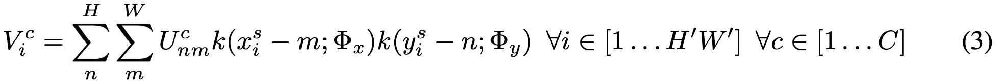

Spatial Transformer Networks \
Max Jaderberg, Karen Simonyan, Andrew Zisserman, Koray Kavukcuoglu \
Google DeepMind, London, UK \
{jaderberg,simonyan,zisserman,korayk}@google.com

2015 NIPS（NeurIPS，神经信息处理系统大会，人工智能领域的 A 类会议）论文

**Abstract**
Convolutional Neural Networks define an exceptionally(adv. 异常地；特殊地；例外地) powerful class of models, but are still limited by the lack of ability to be spatially invariant(n.[数]不变量；[计]不变式; adj. 不变的) to the input data in a computationally and parameter efficient manner(n. 方式；习惯；种类；规矩；风俗). In this work we introduce a new learnable module, the *Spatial Transformer*, which explicitly **allows the spatial manipulation of data within the network**.  **This differentiable module can be inserted into existing convolutional architectures**, giving neural networks the ability to actively spatially transform feature maps, conditional on the feature map itself, without any extra training supervision or modification to the optimisation process. We show that the use of spatial transformers results in models which learn invariance(n. 不变性；不变式) to translation, scale, rotation and more generic warping, resulting in state-of-the-art performance on several benchmarks, and for a number ofclasses of transformations.

# Introduction

# Related Work

# Spatial Transformers
In this section we describe the formulation of a **spatial transformer**. This is a differentiable(可微的;可鉴别的) module which **applies a spatial transformation to a feature map** during a single forward pass, where the transformation is conditioned on **the particular input**, producing **a single output feature map**. \
在本节中，我们将介绍 spatial transformer 的公式。这是一个可微分的模块，该模块在一个前向过程中将 spatial transformer 应用于 feature map，这个transformation以特定输入为条件，从而生成单个输出feature map. \
For multi-channel inputs, the same warping is applied to each channel. For simplicity, in this section we consider single transforms and single outputs per transformer, however we can generalise(v.概括;归纳;普及) to multiple transformations, as shown in experiments. \
对于多通道输入，将相同的 warping 应用于每个通道。为简单起见，在本节中，我们将考虑每个 transformer 的单个 transform 和单个输出，但是我们可以将其推广为多种 transformations，如 experiments 所示。

The spatial transformer mechanism is split into three parts, shown in Fig. 2. In order of computation, **first** a localisation network (Sect. 3.1) takes the input feature map, and `through a number of hidden layers outputs the parameters of the spatial transformation that should be applied to the feature map (通过多个隐藏层输出spatial transformation的参数，这些spatial transformation参数会被应用到feature-map上)` – this gives a transformation conditional on the input. \
**Then**, `the predicted transformation parameters are used to create a sampling grid, which is a set of points where the input map should be sampled to produce the transformed output.` This is done by the grid generator, described in Sect. 3.2. \
然后，这些 transformation-parameters 被用来创建“采样 grid” (其实就是一组坐标点)，这个grid 中的每个坐标点对应于输入map中应该被采样的地方（这在后面将被用于产生transformed-output）. \
**Finally**, the feature map and the sampling grid are taken as inputs to the sampler, producing the output map sampled from the input at the grid points (Sect. 3.3). \
最后，feature-map 和 采样 grid 将一起被当作是 sampler 的输入，这个 sampler 将根据对应的输入产生输出 map.

The combination of these three components forms a spatial transformer and will now be described in more detail in the following sections.

## Localisation Network
The localisation network takes the input feature map $U \in R^{H×W×C}$ with width $W$, height $H$ and $C$ channels and outputs $θ$, the parameters of the transformation $\mathcal{T}_θ$ to be applied to the feature map: $θ = f_{loc}(U)$. The size of $θ$ can vary depending on the transformation type that is parameterised, e.g. for an affine transformation $θ$ is 6-dimensional as in (10).

The localisation network function $f_{loc}()$ can take any form, such as a fully-connected network or a convolutional network, but should include a final regression layer to produce the transformation parameters $θ$.

 \
Figure 3: Two examples of applying the parameterised sampling grid to an image $U$ producing the output $V$ . (a) The sampling grid is the regular grid $G = \mathcal{T}_I (G)$, where $I$ is the identity transformation parameters. (b) The sampling grid is the result of warping the regular grid with an affine transformation $\mathcal{T}_{\theta} (G)$.

## Parameterised Sampling Grid
To perform a warping of the input feature map, each output pixel is computed by applying a sampling kernel centered at a particular location in the input feature map (this is described fully in the next section). \
通过使用 sampling-kernel 作用于 feature-map 的特定位置的中心 来计算每个输出像素（这将在下一节详细描述）。 \
By pixel we refer to an element of a generic feature map, not necessarily an image. \
逐像素我们指的是通用特征图的元素，而不一定是图像。 \
In general, the output pixels are defined to lie on a regular grid $G = {G_i}$ of pixels $Gi = (x^t_i, y_i^t)$, forming an output feature map $V ∈ R^{H^′×W^′×C}$, \
通常, 将输出像素定义为位于 regular grid 上的像素. (这里我们使用 $G = {G_i}, Gi = (x^t_i, y_i^t)$ 来表示这个 regular grid (me: grid 是一组坐标，不是位于坐标处的像素值))。这些输出像素形成一个输出feature-map $V ∈ R^{H^′×W^′×C}$，\
where $H^′$ and $W^′$ are the height and width of the grid, and $C$ is the number of channels, **which is the same in the input and output**. 

For clarity of exposition(n.阐述,说明;博览会), assume `for the moment (暂且,目前)` that $\mathcal{T}_θ$ is a 2D affine transformation $\text{A}_θ$. \
> moment (n. 片刻，瞬间，时刻；重要，契机)

为了清楚说明起见，暂且假设 $\mathcal{T}_θ$ 是2D仿射变换 $\text{A}_θ$ . \
We will discuss other transformations below. In this affine case, the pointwise transformation is \

where $(x^t_i , y_i^t)$ are the target coordinates of the regular grid in the output feature map, $(x^s_i , y_i^s)$ are the source coordinates in the input feature map that define the sample points, and $\text{A}_θ$ is the affine transformation matrix. \
其中 $(x^t_i , y_i^t)$ 是 regular-grid 在输出 feature-map 中的目标坐标，源坐标 $(x^s_i , y_i^s)$ 是输入 feature-map 中定义的采样点，$\text{A}_θ$ 是仿射变换矩阵。 \
We use height and width normalised coordinates, such that $−1 ≤ x^t_i , y_i^t ≤ 1$ when within the spatial bounds of the output, and $−1 ≤ x^s_i , y_i^s ≤ 1$ when within the spatial bounds of the input (and similarly for the $y$ coordinates). \
`The source/target transformation and sampling is equivalent(adj.等价的,相等的) to the standard texture mapping and coordinates used in graphics [8]. (源/目标转换和采样等效于图形[8]中使用的标准纹理和坐标映射.)`

The transform defined in (10) allows cropping, translation, rotation, scale, and skew(adj.偏的,歪斜的; v.偏离,歪斜;扭转;歪曲) to be applied to the input feature map, and requires only 6 parameters (the 6 elements of $\text{A}_θ$) to be produced by the localisation network. \
It allows cropping because if the transformation is a contraction (i.e. the determinant(n.决定因素;行列式;adj.决定性的) of the left $2 × 2$ sub-matrix has magnitude(n. 大小；量级；[地震]震级；重要) less than unity) then the mapped regular grid will lie in a parallelogram(n.平行四边形) of area less than the range of $x_i^s , y_i^s$ . \
它允许裁剪，因为如果变换是收缩的（即 左上焦 2×2 子矩阵的行列式的大小 小于1），则映射的 regular-grid 将位于面积小于 $x_i^s , y_i^s$ 的平行四边形中。 \
`The effect of this transformation on the grid compared to the identity transform is shown in Fig. 3. (与恒等变换相比，此变换对 grid 的影响如图3所示)`

The class of transformations $\mathcal{T}_θ$ may be more constrained, such as that used for attention
$$
\mathbf{A}_{\theta} = 
\begin{bmatrix}
s & 0 & t_x \\
0 & s & t_y 
\end{bmatrix} \tag{2}
$$
allowing cropping, translation, and isotropic(adj.各向同性的,等方性的) scaling by varying $s$, $t_x$, and $t_y$. The transformation $\mathcal{T}_θ$ can also be more general, such as a plane(n.飞机;平面;程度,水平;adj.平的;平面的) projective transformation with 8 parameters, piecewise(adj.[数]分段的;adv.分段地) affine, or a thin plate spline. \
Indeed, the transformation can have any parameterised form, `provided(conj.假如,倘若;v.提供,给予) that it is differentiable(adj.可微分的, 可鉴别的) with respect to the parameters – this crucially allows gradients to be backpropagated through from the sample points` $\mathcal{T}_θ(G_i)$ `to the localisation network output` $θ$. \
的确，该变换可以具有任何参数化形式，只要它关于参数是可微分的即可——因为这允许梯度从采样点$\mathcal{T}_θ(G_i)$反向传播到localisation network的输出$\theta$，这一点是至关重要的。\
If the transformation is parameterised in a structured, low-dimensional way, this reduces the complexity of the task assigned to the localisation network. \
如果以结构化的低维方式对transformation进行参数化，则可以降低分配给localisation network的任务的复杂性。\
For instance, a generic class of structured and differentiable transformations, which is a superset of attention, affine, projective, and thin plate spline transformations, is $\mathcal{T}_θ = M_θ B$, where $B$ is a target grid representation (e.g. in (10), $B$ is the regular grid $G$ in homogeneous(adj.均匀的;[数]齐次的;同种的;同类的,同质的) coordinates), and $M_θ$ is a matrix parameterised by $θ$. \
例如，一种通用的结构化且可微分的transformation类型是：attention、affine、projective、and thin plate spline transformations的超集，即 $\mathcal{T}_θ = M_θ B$，其中 $B$ 是target grid representation（例如，在公示(10)中，$B$ is the regular grid $G$ in homogeneous coordinates），而$M_θ$是由$θ$参数化的矩阵。 \
In this case it is possible to not only learn how to predict $θ$ for a sample, but also to learn $B$ for the task at hand. \
在这种情况下，不仅可以学习如何预测样本的 $θ$，还可以顺手学习 $B$.

## Differentiable Image Sampling
To perform a spatial transformation of the input feature map, a sampler must take the set of sampling points $\mathcal{T}_θ (G)$, along with the input feature map $U$ and produce the sampled output feature map $V$ . \
(为了对输入feature map执行空间转换，采样器必须要获取一组采样点 $\mathcal{T}_θ (G)$ 以及输入feature map $U$ 并生成采样后的输出feature map $V$. \
Each $(x^s_i , y_i^s)$ coordinate in $\mathcal{T}_θ (G)$ defines the spatial location in the input where a sampling kernel is applied to get the value at a particular pixel in the output $V$ .  \
$\mathcal{T}_θ (G)$ 中的每个 $(x^s_i , y_i^s)$ 坐标都定义了输入中的空间位置，在该位置上应用了采样核以得到输出 $V$ 中特定像素处的值。\
This can be written as \

> 公式(3)中的 $x_i^s - m， y_i^s - n$ 是什么意思？

where $Φ_x$ and $Φ_y$ are the parameters of a generic sampling kernel $k()$ which defines the image interpolation (e.g. bilinear), $U^c_{nm}$ is the value at location $(n, m)$ in channel $c$ of the input, and $V_i^c$ is the output value for pixel $i$ at location $(x^t_i, y_i^t)$ in channel $c$. \
`Note that the sampling is done identically(adv.同一地;相等地) for each channel of the input, so every channel is transformed in an identical way (this preserves spatial consistency between channels). (请注意，采样是针对输入的每个通道进行的，因此每个通道都以相同的方式进行转换（这保留了通道之间的空间一致性）).`

In theory, any sampling kernel can be used, as long as (sub-)gradients can be defined with respect to $x_i^s$ and $y_i^s$. For example, using the integer sampling kernel reduces (3) to \
$$
V_i^c = \sum_n^H \sum_m^W U_{nm}^c \delta ( \lfloor x_i^s + 0.5 \rfloor - m ) \delta ( \lfloor y_i^s + 0. 5 \rfloor - n ) \tag{4}
$$

where $⌊x + 0.5⌋$ rounds $x$ to the nearest integer and $δ()$ is the Kronecker delta function. This sampling kernel equates to just copying the value at the nearest pixel to $(x^s_i , y_i^s)$ to the output location $(x^t_i , y_i^t)$. Alternatively(adv.要不,或者;非此即彼;二者择一地;作为一种选择), a bilinear(adj.双线性的) sampling kernel can be used, giving \
$$
V_i^c = \sum_n^H \sum_m^W U_{nm}^c \max (0, 1 - |x_i^s - m|) max(0, 1 - |y_i^s - n|) \tag{5}
$$

To allow backpropagation of the loss through this sampling mechanism we can define the gradients with respect to $U$ and $G$. For bilinear sampling (5) the partial derivatives are \
为了允许通过这种采样机制对损失进行反向传播，我们可以定义关于 $U$ 和 $G$ 的梯度。对于双线性采样（5），偏导数为 \
 \
and similarly to (7) for $\frac{\partial V_i^c}{\partial y_i^s}$.

This gives us a (sub-)differentiable sampling mechanism, allowing loss gradients to flow back not only to the input feature map (6), but also to the sampling grid coordinates (7), and therefore back to the transformation parameters $θ$ and localisation network since $\frac{\partial x_i^s}{\partial \theta}$ and $\frac{\partial x_i^s}{\partial \theta}$ can be easily derived from (10) for example. \
这为我们提供了(亚)可微分的采样机制，不仅允许loss梯度回流到输入feature-map (6)，而且还回流到采样grid坐标（7），并因此返回到变换参数 $θ$ 和 localisation-network，因为 $\frac{\partial x_i^s}{\partial \theta}$ and $\frac{\partial x_i^s}{\partial \theta}$ 可以很容易地从公式(10)导出。\
Due to discontinuities(discontinuity n.断绝,中断,不连续) in the sampling fuctions, sub-gradients must be used.  \
由于采样函数的不连续性，必须使用子梯度。 \
This sampling mechanism can be implemented very efficiently on GPU, by ignoring the sum over all input locations and instead just looking at the kernel support region for each output pixel. \
通过忽略所有输入位置的总和，而只需查看每个输出像素的 kernel 支持区域，就可以在GPU上非常高效地实现这种采样机制。

## Spatial Transformer Networks
**The combination of** the localisation network, grid generator, and sampler **form** a spatial transformer (Fig. 2). This is a self-contained(adj. 独立的；设备齐全的；沉默寡言的) module which can be dropped into a CNN architecture at any point, and in any number, giving rise to spatial transformer networks. \
这是一个独立的模块，可以随时随地将其放入CNN架构中 并且数量不限，从而形成了 spatial transformer networks. \
This module is computationally very fast and does not impair(vt.损害;削弱;减少) the training speed, causing very little time overhead(在头顶上方;日常开支) when used naively(adv. 无邪地；天真烂漫地), and even speedups in attentive(adj. 注意的；体贴的；留心的) models due to subsequent downsampling that can be applied to the output of the transformer. \
该模块的计算速度非常快，并且不会损害训练速度，在 naively 使用时不会造成太多时间开销，并且由于随后的下采样可以应用于 transformer 的输出，因此即使在 attentive 模型中也可以提速。

>>>>>>>>>>>>>>>>>>>>>> 进度

Placing spatial transformers within a CNN allows the network to learn how to actively transform the feature maps to help minimise the overall cost function of the network during training. The knowledge of how to transform each training sample is compressed and cached in the weights of the localisation network (and also the weights of the layers previous to a spatial transformer) during training. For some tasks, it may also be useful to feed the output of the localisation network, θ, forward to the rest of the network, as it explicitly encodes the transformation, and hence the pose, of a region or object.

It is also possible to use spatial transformers to downsample or oversample a feature map, as one can define the output dimensions H ′ and W ′ to be different to the input dimensions H and W . However, with sampling kernels with a fixed, small spatial support (such as the bilinear kernel), downsampling with a spatial transformer can cause aliasing effects.

------------------------

tps 参考资料：
https://hideoninternet.github.io/2019/11/06/d3c15ac3/   （强烈推荐此篇）

有空看看：
https://zhuanlan.zhihu.com/p/80034501 \
https://blog.csdn.net/iverson_49/article/details/38160081 \
https://blog.csdn.net/VictoriaW/article/details/70161180 \
https://www.jianshu.com/p/2cc189dfbcc5

参考代码：
https://github.com/WarBean/tps_stn_pytorch \
https://github.com/cheind/py-thin-plate-spline/tree/master/thinplate