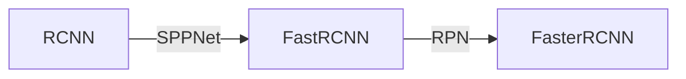

日常随笔，待整理。。。
<!-- more -->

**目标检测流程**
目标检测一般都由三步组成：
- step1：找proposal区域，（ssd是在高级特征图上找的，~~fasterrcnn是在输入图片上找的~~）
- step2：特征提取
- step3：连分类器，一般是softmax，有的时候在没有gpu的时候也会接svm，但这个现在已经不常用

## RCNN系列进化史

RCNN缺点：
- proposal 框太多，计算速度慢；
- 从 low level 的input image上使用selective search产生proposal框，然后再去分类，精度会大打折扣；（high level feature map对图像分类具有更好的辨识度）

FastRCNN通过ROI pooling 改变了RCNN的检测速度，其他和RCNN一样。
（ROI pooling是简化版的SPPNet，中文名叫“空间金字塔网络”）

FasterRCNN 是在FastRCNN的基础上，并引入了RPN

FastRCNN = RCNN + SPPNet
FasterRCNN = FastRCNN + RPN - SS(Selective Search)

