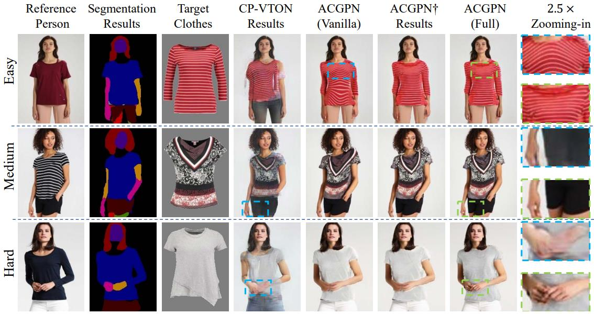
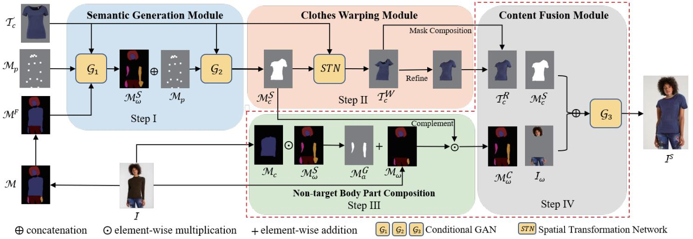
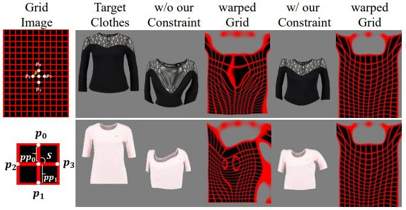
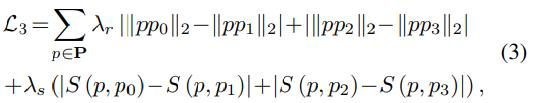
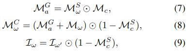

Towards Photo-Realistic Virtual Try-On by Adaptively Generating↔Preserving Image Content \
Han Yang1,2∗ Ruimao Zhang2 Xiaobao Guo2 Wei Liu3 Wangmeng Zuo1 Ping Luo4 \
1Harbin Institute of Technology, 2SenseTime Research \
3Tencent AI Lab, 4The University of HongKong \
{yanghancv, wmzuo}@hit.edu.cn, wl2223@columbia.edu, pluo@cs.hku.hk{zhangruimao, guoxiaobao}@sensetime.com

CVPR 2020 Poster

<!--more-->

 \
We define the difficulty level of try-on task to easy, medium, and hard based on current works. Given a target clothing image and a reference image, our method synthesizes a person in target clothes while preserving photo-realistic details such as character of clothes (texture, logo), posture of person (non-target body parts, bottom clothes), and identity of person. \
ACGPN (Vanilla) indicates ACGPN without warping constraint or non-target body !composition, ACGPN add../../ACing constraint on ACGPN (V!anilla). \
A../../ACanilla)指出了没有扭曲约束或非目标体组成的ACGPN, 而ACGPN在ACGPN(Vanilla)的基础上增加了扭曲约束。\
Also, zooming-in of the greatly improved regions are given on the right. \
还有，在右边给出了极大改进区域的放大。

Image visual try-on aims at transferring a target clothing image onto a reference person, and has become a hot topic in recent years. Prior arts usually focus on preserving the character of a clothing image (e.g. texture, logo, embroidery) when warping it to arbitrary human pose. However, it remains a big challenge to generate photo-realistic try-on images when large occlusions(occlusion n.闭塞;吸收;遮挡区域) and human poses are presented in the reference person (Fig. 1). To address this issue, we propose a novel visual try-on network, namely Adaptive Content Generating and Preserving Network (ACGPN). In particular, ACGPN **first predicts semantic layout(n.布局;设计;安排;陈列) of the reference image** that will be changed after try-on (e.g. long sleeve shirt→arm, arm→jacket), and **then determines whether its image content needs to be generated or preserved according to the predicted semantic layout**, leading to photo-realistic try-on and rich clothing details. ACGPN generally(adv. 通常；普遍地，一般地) involves three major modules. **First, a semantic layout generation module** utilizes semantic segmentation of the reference image to progressively predict the desired semantic layout after try-on. **Second, a clothes warping module** warps clothing images according to the generated semantic layout, where a `second-order difference constraint(二阶差分约束)` is intr!oduced to stabilize the wa../../ACprocess during training. **Third, an inpainting module for content fusion integrates all information** (e.g. reference image, semantic layout, warped clothes) to adaptively produce each semantic part of human body. In comparison to the state-of-the-art methods, ACGPN can generate photo-realistic images with much better perceptual(adj.知觉的;感知的;有知觉的) quality and richer fine-details.
> 为了解决先前try-on方法中 当reference-image有较大的遮挡或者人体姿态时，其生成的图片不realistic的问题。我们提出了ACGPN方法，该方法首先会根据reference-image预测出semantic-layout，然后再根据预测的semantic-layout来判决图片中的内容是否需要被生成或这被保留。
> 
> ACGPN 主要包括3个模块：semantic-layout生成模块、衣服扭曲模块、图片内容修复模块。

# Introduction

# Related Work

# Adaptive Content Generating and Preserving Network
&emsp; The proposed ACGPN is composed of three modules, as shown in Fig. 2. First, the Semantic Generation Module (SGM) progressively generates the mask of the body parts and the mask of the warped clothing regions via semantic segmentation, yielding semantic alignment of the spatial layout. Second, the Clothes Warping Module (CWM) is designed to warp target clothing image according to the warped clothing mask, where we introduce a second-order difference constraint on Thin-Plate Spline (TPS) [6] to produce geometric matching yet character retentive clothing images. Finally, Steps 3 and 4 are united in the Content Fusion Module (CFM), which integrates the information from previous modules to adaptively determine the generation or preservation of the distinct human parts in output synthesized image. Non-target body part composition is able to handle different scenarios flexibly in try-on task while mask inpainting fully exploits the layout adaptation ability of the ACGPN when dealing with the images from easy, medium, and hard levels of difficulty.

 \
Figure 2. The overall architecture of our ACGPN. (1) In Step I, the Semantic Generation Module (SGM) takes target clothing image $T_c$, the pose map $M_p$, and the fused body part mask $M^F$ as the input to predict the semantic layout and to output synthesized body part mask $M^S_ω$ and target clothing mask $M^S_c$ ; (2) In Step II, the Clothes Warping Module (CWM) warps the target clothing image to $T^R_c$ according to the predicted semantic layout, where a second-order difference constraint is introduced to stabilize the warping process; (3) In Steps III and IV, the Content Fusion Module (CFM) first produces the composited body part mask $M^C_ω$ using the original clothing mask $M_c$, the synthesized clothing mask $M^S_c$ , the body part mask Mω, and the synthesized body part mask $M^S_ω$ and then exploits a fusion network to generate the try-on images $I^S$ by utilizing the information $T^R_c$ , $M^S_c$ , and body part image $I_ω$ from previous steps.

图2。我们的ACGPN的总体架构。(1)步中,语义生成模块(SGM)目标服装图像Tc,构成地图议员和熔融体部分面具曼氏金融作为输入来预测语义布局和输出合成部位面具ω女士和女士服装面具c目标;(2)第二步，服装翘曲模块(CWM)根据预测的语义布局将目标服装图像翘曲到T R c，引入二阶差分约束，使翘曲过程稳定;(3)在第三和第四步骤,内容融合模块(CFM)首先产生合成部位面具使用原始服装面具MC MCω,合成c女士服装面具,面具Mω身体部分,合成的身体部分面具ω女士,然后利用一个融合网络生成试穿图片我T R c年代利用信息,c,女士和身体部位图像Iω从以前的步骤。

## Semantic Generation Module (SGM)
&emsp; The semantic generation module (SGM) is proposed to separate the target clothing region as well as to preserve the body parts (i.e. arms) of the person, without changing the pose and the rest human body details. Many previous works focus on the target clothes but overlook human body generation by only feeding the coarse body shape directly into the network, leading to the loss of the body part details. To address this issue, the mask generation mechanism is adopted in this module to generate semantic segmentation of body parts and target clothing region precisely.

&emsp; Specifically, given a reference image $I$, and its corresponding mask $M$, arms $M_a$ and torso(n. 躯干；裸体躯干雕像；未完成的作品；残缺不全的东西) $M_t$ are first fused into an indistinguishable area, resulting in the fused map $M^F$ shown in Fig. 2 as one of the inputs to SGM. Following a two-stage strategy, the try-on mask generation module first synthesize the masks of the **body parts** $M^S_ω \;\; (ω = {h, a, b}$ (h:head, a:arms, b:bottom clothes)), `which helps to adaptively preserve body parts instead of coarse feature in the subsequent steps (这有助于在后续步骤中自适应地保存身体部位，而不是粗糙的特征)`. As shown in Fig. 2, we train a body **parsing GAN** $G_1$ to generate $M^S_ω$ by leveraging the information from the fused map $M^F$ , the **pose map** $M_p$, and the **target clothing image** $T_c$. Using the generated information of body parts(即$M^S_ω$), its corresponding pose map(即$M_p$) and target clothing image(即$T_c$), it is tractable(adj. 易于管教的；易驾驭的；易处理的) to get the estimated clothing region. In the second stage, $M^S_ω$, $M_p$ and $T_c$ are combined to generate the **synthesized mask of the clothes** $M^S_c$ by $G_2$.

&emsp; For training SGM, both stages adopt the conditional generative adversarial network (cGAN), in which a U-Net structure is used as the generator while a discriminator given in pix2pixHD [43] is deployed to distinguish generated masks from their ground-truth masks. For each of the stages, the CGAN loss can be formulated as
$$
\mathcal{L}_1 = \mathbb{E}_{x, y} [\text{log} (\mathcal{D} (x, y))] + \mathbb{E}_{x, z} [\text{log} (1 - \mathcal{D} (x, \mathcal{G} (x, z)))], \tag{1}
$$
where $x$ indicates the input and $y$ is the ground-truth mask. $z$ is the noise which is an additional channel of input sampled from standard normal distribution.

The overall objective function for each stage of the proposed try-on mask generation module is formulated as $\mathcal{L}_m$,
$$
\mathcal{L}_m = \lambda_1 \mathcal{L}_1 + \lambda_2 \mathcal{L}_2, \tag{2}
$$

where $\mathcal{L}_2$ is the pixel-wise cross entropy loss [9], **which improves the quality of synthesized masks from generator with more accurate semantic segmentation results. $λ_1$ and $λ_2$ are the trade-off(n. 交换，交易；权衡；协定) parameters for each loss term in Eq. (2), which are set to 1 and 10, respectively in our experiments. 

&emsp; The two-stage SGM can serve as a core component for accurate understanding of body-parts and clothes layouts in visual try-on and guiding the adaptive preserving of image content by composition. We also believe SGM is effective for other tasks that need to partition(n.划分,分开;[数]分割;隔墙;隔离物;vt.[数]分割;分隔;区分) semantic layout. \
两阶段的SGM可以作为视觉试穿中准确理解人体部位和服装布局的核心组件，指导组合图像内容的自适应保存。我们还认为SGM对于其他需要划分语义布局的任务是有效的。

## Clothes Warping Module (CWM)
&emsp; Clothes warping aims to fit the clothes into the shape of target clothing region with visually natural deformation according to human pose as well as to retain the character of the clothes. However, simply training a Spatial Transformation Network (STN) [18] and applying Thin-Plate Spline (TPS) [6] cannot ensure the precise transformation especially when dealing with hard cases (i.e. the clothes with complex texture and rich colors), leading to misalignment(n.错位;不重合;未对准) and blurry(adj.模糊的;污脏的;不清楚的) results. To address these problems, we introduce a second-order difference constraint on the clothes warping network to realize(vt.实现;认识到;变卖) geometric matching and character retention(n.保留;扣留,滞留;记忆力;闭尿). As shown in Fig. 3, compared to the result with our proposed constraint, target clothes transformation without the constraint shows obvious distortion on shape and unreasonable mess(n.混乱；食堂;困境;vt.弄乱,弄脏;毁坏) on texture.

 \
Figure 3. Comparison of STN warping results with and without the second-order difference constraint.

&emsp; Formally, given $T_c$ and $M^S_c$ as the input, we train the STN to learn the mapping between them. The warped clothing image $T^W_c$ is transformed by the learned parameters from STN, where we introduce the following constraint $L_3$ as a loss term, \
 \
where $λ_r$ and $λ_s$ are the trade-off hyper-parameters. Practically we can minimize $max(L_3 - \Delta, 0)$ for restriction, and $\Delta$ is a hyper-parameter. As illustrated in Fig. 3, $p(x, y)$ represents a certain sampled control point and $p_0(x_0, y_0), \; p_1(x_1, y_1), \; p_2(x_2, y_2), \; p_3(x_3, y_3)$ are the top, bottom, left, right sampled control points of $p(x, y)$, respectively(adv. 分别地；各自地，独自地) in the whole control points set $\mathbf{P}$; $S (p, p_i) = \frac{y_i - y}{x_i - x} (i = 0, 1, 2, 3)$ is the slope(n.斜坡;倾斜;斜率) between two points. $L_3$ is proposed to serve as a constraint on TPS transformation by minimizing the metric distance of two neighboring intervals(interval n.间隔;[声]音程) for each axis and the distance of slopes, which maintains the collinearity(n.[数]共线性), parallelism(n. 平行;类似,对应) and immutability(n. 不变;永恒性;不变性) property of affine transformation. To avoid divided-by-zero error, the actual implementation of the second term is
$$
\vert S (p, p_i) - S (p, p_j) \vert = \vert (y_i - y) (x_j - x) - (y_j - y)(x_i - x) \vert, \tag{4}
$$
where $(i, j) \in {(0, 1),(2, 3)}$. The warping loss can be represented as $L_w$, which measures the loss between the warped clothing image $T^W_c$ and its ground-truth $I_c$,
> TODO：what's the $I_c$ ?
$$
\mathcal{L}_w = \mathcal{L}_3 + \mathcal{L}_4, \tag{5}
$$

where $L_4 = \Vert T^W_c - I_c \Vert_1$. The warped clothes are then fed into the refinement network to further generate more details, where a learned matrix $α(0 \leq α_{ij} \leq 1)$ is then utilized to finally combine the two clothing images as the refined(adj.细化的;精炼的;精确的) clothing image $T^R_c$ by
$$
\mathcal{T}^R_c = (1 - \alpha) \odot \mathcal{T}^W_c + \alpha \odot \mathcal{T}^R_c,  \tag{6}
$$
where $\odot$ denotes element-wise multiplication(n.[数]乘法). $α$ is also restricted by an regularization term (refer to CP-VTON [42]) and VGG loss is also introduced on $T^R_c$ and $T^W_c$ . For better quality, GAN loss can be also used here. Consequently(adv.因此;结果;所以), the refined clothing image can fully retain the character of the target clothes. We believe our formulation of CWM is effective in enforcing the collinearity(n.[数]共线性) of local affine transforms while maintaining the flexibility(n.灵活性;弹性;适应性) of TPS warping globally, which is beneficial(adj.有益的,有利的) to produce geometrically matched and realistic warped results.

## Content Fusion Module (CFM)
&emsp; Going beyond semantic alignment and character retention(n.保留;扣留), it remains a great challenge to realize(vt. 实现;认识到) layout adaptation on visual try-on task. \
除了语义对齐和字符保留之外，如何在视觉try-on任务中实现布局的适应性仍然是一个很大的挑战。\
`To this end (为此)`, both the target clothing region is required to clearly rendered, and `fine-scale (精密的,小尺度)` details of body parts (i.e. finger gaps) are needed to be adaptively preserved. \
为此，既需要清晰地渲染目标服装区域，又需要自适应地保留身体部位的精细细节(例如:指缝)。\
Existing methods usually adopt the coarse body shape as a cue(线索) to generate the final try-on images, and fail to reconstruct fine details. \
现有的方法通常采用粗糙的人体形状作为线索来生成最终的try-on图像，而无法重构出细节。\
In contrast, the proposed content fusion module (CFM) is composed of two main steps, i.e. Steps 3 and 4 in Fig. 2. \
In particular, Step 3 is designed to fully maintain the untargeted body parts as well as adaptively preserve the changeable body part (i.e. arms). \
特别地, Step-3被设计为完全保持非目标身体部位，以及自适应地保持可变化的身体部位(例如:手臂)。\
Step 4 fills in the changeable body part by utilizing the masks and images generated from previous steps accordingly by an inpainting based fusion GAN, $\mathcal{G}_3$ in Fig. 2. \
> Step-4 填充可变的身体部位(Fig2中的$I_w$)，填充方法是通过利用mask和之前生成的图片来进行的。

>>>> 未完待续

&emsp; **Non-target Body Part Composition.** The composited body mask $M^C_ω$ is composed by original body part mask $M_ω$, the generated body mask $M^G_a$ which is the region for generation, and synthesized clothing mask $M^S_c$ according to \

where $\odot$ denotes element-wise multiplication, and Eq. (9) is not shown in Fig. 2 for simplicity; $I_{ω^{'} }$ is the original image $I$ subtracting clothing region $M_c$. Note that the composited body mask $M^C_ω$ always keeps a similar layout with synthesized body part mask $M^S_ω$ by composition to eliminate the misaligned pixels in $M^S_ω$ . It precisely preserves the non-target body part by combining the two masks (i.e. $M^S_ω$ and $M_ω$), which are used to fully recover the nontargeted details in the following step to fully preserve $I_ω$ and generate coherent body parts with the guidance of $M^G_a$. It is also worth noting that it can adaptively deal with different cases. For example, when transferring a T-shirt (shortsleeve) to a person in long-sleeve only the within region of $M^G_a$ will perform generation and preserve all the others, while in the opposite case, $M^G_a = 0$ and surfeit body parts will be shaded by clothes as in Eq. (8) and Eq. (9).

# Experiments

# 参考文献
[1] [CVPR 2020 Poster | ACGPN: 基于图像的虚拟换装新思路](https://zhuanlan.zhihu.com/p/149472070) \
[2] [开源代码：DeepFashion_Try_On](https://github.com/switchablenorms/DeepFashion_Try_On)
