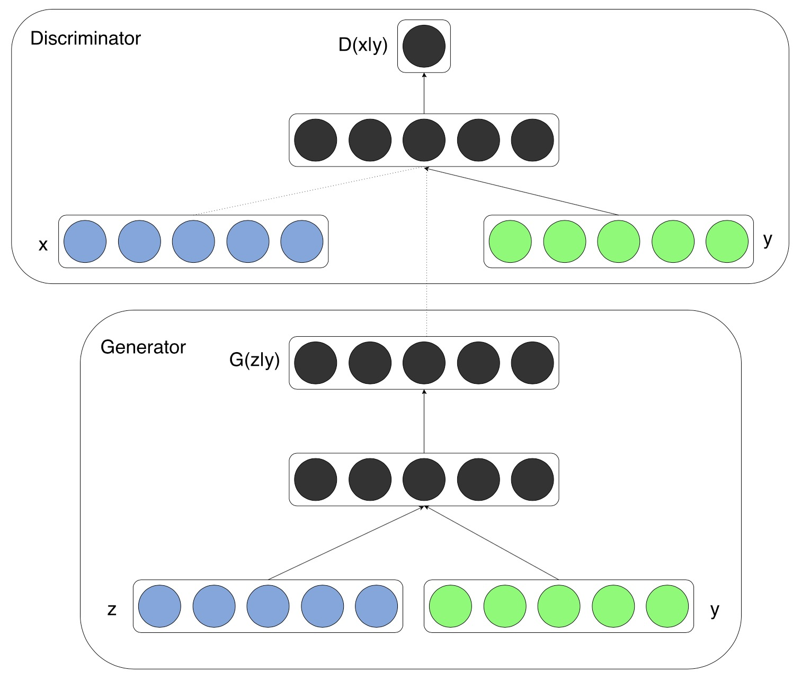
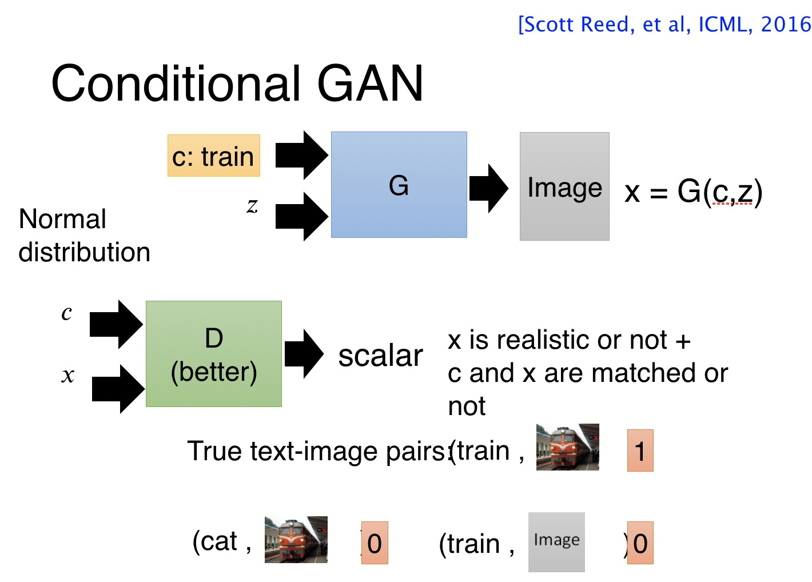
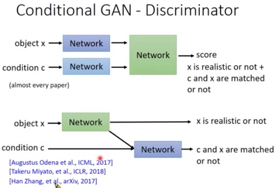
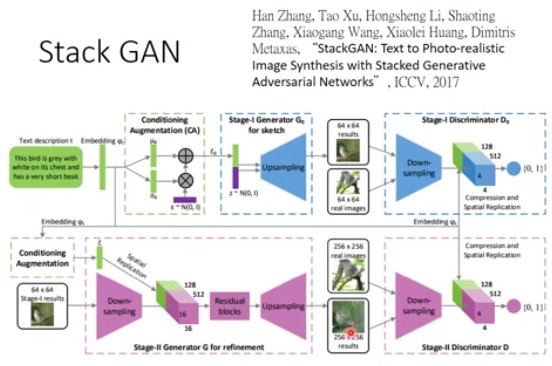
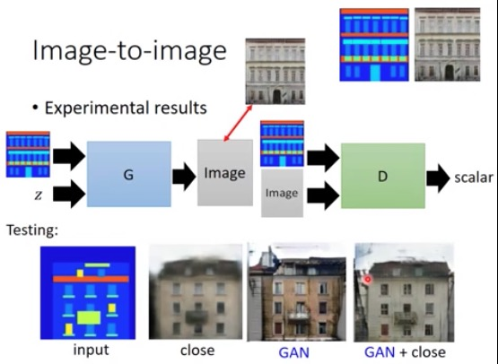

[Conditional Generative Adversarial Nets]()

Mehdi Mirza \
D ́epartement d’informatique et de recherche op ́erationnelle \
Universit ́e de Montr ́eal \
Montr ́eal, QC H3C 3J7 \
mirzamom@iro.umontreal.ca

Simon Osindero \
Flickr / Yahoo Inc. \
San Francisco, CA 94103 \
osindero@yahoo-inc.com

2014
<!--more-->

**Abstract**

**Generative Adversarial Nets**[8] were recently introduced as a novel way to train generative models. In this work we introduce the **conditional version of generative adversarial nets**, which can be **constructed by simply feeding the data,** $y$, we wish to condition on to both the generator and discriminator. We show that this model can generate MNIST digits conditioned on class labels. \
`We also illustrate how this model could be used to learn a multi-modal model, and provide preliminary(adj. 初步的；开始的；预备的; n. 初步行动；准备工作；预赛，预试) examples of an application to image tagging(tag n. 标签；名称；结束语；附属物; vt. 给…加上标签；尾随，紧随；连接) in which we demonstrate how this approach can generate descriptive(adj. 描写的，叙述的；描写性的) tags which are not part of training labels.`
我们还演示了该模型如何用于学习多模态模型，并提供了图像标记应用程序的初步示例，在示例中，我们演示了该方法如何生成不属于训练标签的描述性标签。

# Introduction

# Related Work

## Multi-modal Learning For Image Labelling

# Conditional Adversarial Nets

## Generative Adversarial Nets

## Conditional Adversarial Nets
Generative adversarial nets can be extended to a conditional model if both the generator and discriminator `are conditioned on (以…为条件;在条件下,取决于;视…而定)` some extra information $y$. $y$ could be any kind of auxiliary information, such as class labels or data from other modalities(n.样式,形式,形态). We can perform the conditioning by feeding $y$ into the both the discriminator and generator as additional input layer.
> 如果generator和discriminator都以一些额外的信息 $y$ 为条件，则 GANs 能够被扩展为一个条件模型。而这个额外的信息 $y$ 可以是任何类型的辅助信息，如类别标签或者来自其他模式的数据。

In the generator the prior input noise $p_z (z)$, and $y$ are combined in **joint hidden representation**, and the adversarial training framework allows for considerable flexibility(n. 灵活性；弹性；适应性) in how **this hidden representation** is composed.
> summary: 在生成器中，先验输入噪声 $p_z (z)$ 和 $y$ 被组合在一起构成**联合隐藏表示**，而对抗训练框架则在如何构成**该隐藏表示**方面具有相当大的灵活性。

> For now we simply have the conditioning input and prior noise as inputs to a single hidden layer of a MLP, but one could imagine using higher order interactions(interaction n.相互作用,相互影响) allowing for complex generation mechanisms that would be extremely difficult to work with in a traditional generative framework.
> summary: 目前，我们只是将条件输入和先验噪声作为MLP的单个隐含层的输入。但人们可能会设想使用更高阶的交互作用来做更复杂的生成机制，这在传统生成框架中将是极其困难的工作。

In the discriminator $x$ and $y$ are presented as inputs and to a discriminative function (embodied(embody vt.代表,使具体化,包含,使(精神)肉体化) again by a MLP in this case).

The objective function of a two-player minimax game would be as Eq 2
$$
\min \limits_G \max \limits_D V(D, G) = \mathbb{E}_{x \sim p_z(z)} [\text{log} D(x|y)] + \mathbb{E}_{z \sim p_z (z)} [\text{log} (1 - D( G(z|y) ))].  \tag{2}
$$

Fig 1 illustrates the structure of a simple conditional adversarial net. \
 \
Figure 1: Conditional adversarial net

# Experimental Results

略

------------------------

# My Summary
> 关于本文思想，我的一些理解:
> 
> z 表示噪声，y 表示Condition，在传统GANs中，只有噪声z被送入到G，G的输出为G(z)；\
> 而在 Conditonal-GANs 中，输入到G的除了噪声z，还有条件y，即此时G的输出为 G(z, y)，但本论文将其记作为 G(z|y)，用于形象地表示y是条件. \
> 为了表述方便，令 fakeX = G(z, y), 则： \
> train Generator 时，loss_G = MSELoss[D(fakeX, y), 1], \
> train Discriminator 时，loss_D = MSELoss[D(x, y), 1] + MSELoss[D(fakeX, y), 0]
> 
> **补充**：传统GANs输入噪声z，生成图片 G(z)，那么 Conditional-GANs 增加条件 y 并和 z 一起构成 G 的输入的动机是什么呢？\
> **答**：一方面，因为 G(z) 具体产生什么样的结果，人为无法控制。所以需要引入条件来认为控制输出的结果，例如在产生手写数字时，我们可以用 one-hot 编码作为条件 y，这样训练完成后，我们就可以通过输入不同的one-hot编码来控制生成的手写数字。\
> 另一方面，如果只有噪声z和目标域X，那么G会以为只要生成像X中那样看似真实的图片就可以骗过Discriminator了，但很多时候我们不但希望G生成的图片真实，我们还希望G生成的图片是类别正确的。
> 
> **补充**：不像传统GANs的G和D的输入只有一个tensor，Conditional-GANs 的输入都是有两个tensor，如：G(z, y)、D(x, y)、D(fakeX, y) 的输入都是两个，那么这两个tensor是怎么被联系在一起并输入到网络中去的呢？ \
> **答**: 可以先直接将输入的两个tensor做concat操作后再输入到网络；也可以先将两个tensor分别经过几个layer，然后concat到一起后再输入到后面的layer中。
> 
> **补充**: G(z, y) 和 G(z|y) 表述方式的区别？\
> **答**: 不要太在意 “z和y同时发生”、“在y发生的条件下z发生” 等表述方式，这里都理解为将 z 和 y 同时输入到 G.

# Conditional-GAN 补充

以下来自文献[1]

在使用 Conditional-GAN 做 Text-to-Image 时的一些想法： \
  \
如上图，在训练D时，只有当输入到D的x是真实图片且与之匹配的text正确时，D才会给高分；
而当输入到D的x是真实图片但与之匹配的text不正确时、以及text正确但x不是真实图片等情况，D都要给低分。

关于 Conditional-GAN 的 Discriminator 的一些设计思路： \
 \
现在大部分paper使用的仍然是第一种网络结构，但李宏毅认为第二种可能会更好。

如果想要生成高清图像，则可以堆叠多个GAN不断提高分辨率： \

Conditional-GAN 在 Image-to-Image 上的一些应用: \

# 参考文献
[1] [李宏毅2020机器学习深度学习(完整版)国语 -> P76 GAN2]()
