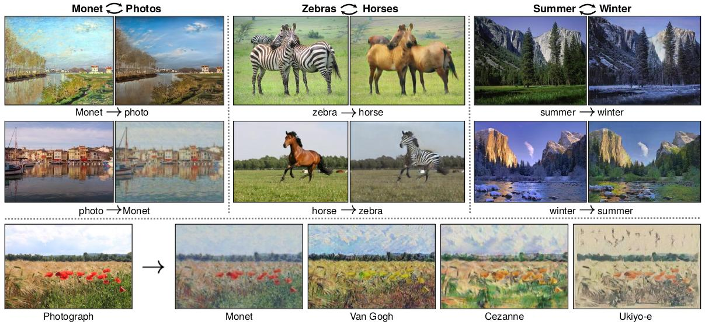
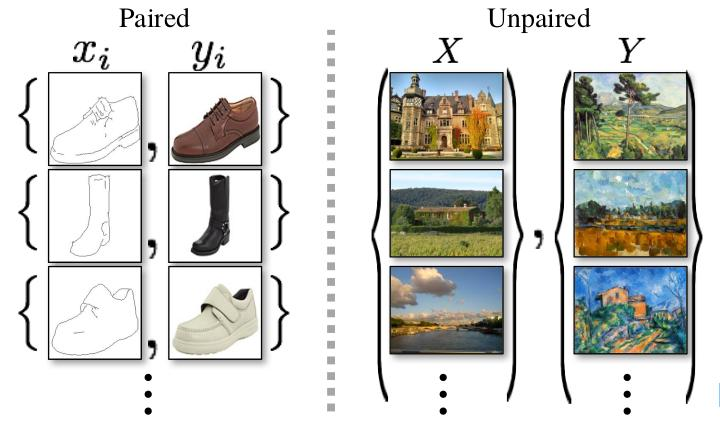
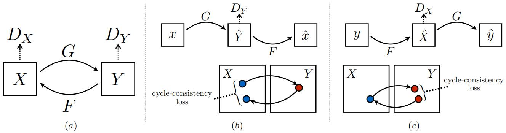
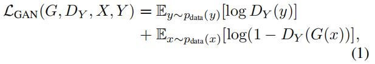
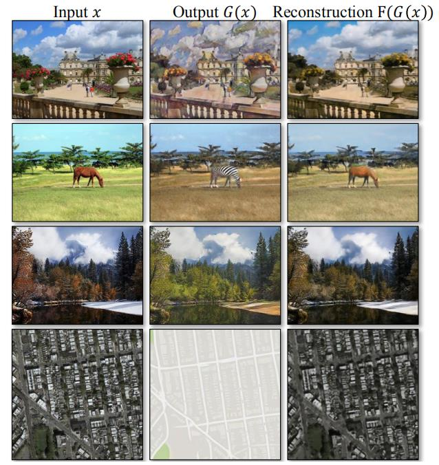
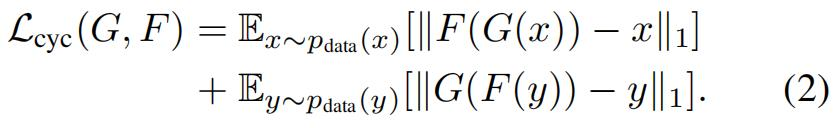
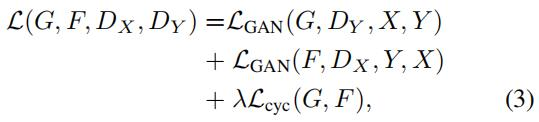
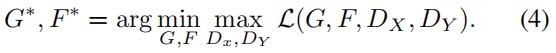

[Unpaired Image-to-Image Translation using Cycle-Consistent Adversarial Networks](https://arxiv.org/abs/1703.10593)
Jun-Yan Zhu ∗, Taesung Park ∗, Phillip Isola, Alexei A. Efros \
Berkeley AI Research (BAIR) laboratory, UC Berkeley

2017年

**Abstract**
Image-to-image translation is a class of vision and graphics problems where the goal is to learn the mapping between an input image and an output image using a training set of aligned image pairs. However, for many tasks, paired training data will not be available. We present an approach for learning to translate an image from a source domain X to a target domain Y in the absence(n. 没有；缺乏；缺席；不注意) of paired examples. Our goal is to learn a mapping G : X → Y such that the distribution of images from G(X) is indistinguishable(adj. 不能区别的，不能辨别的；不易察觉的) from the distribution Y using an adversarial loss. Because this mapping is highly under-constrained(adj.约束过少的;未限定的), we couple(n. 对；夫妇；数个;vi. 结合；成婚;vt. 结合；连接；连合) it with an inverse mapping F : Y → X and introduce a cycle consistency(n. [计] 一致性；稠度；相容性) loss to enforce F (G(X)) ≈ X (and `vice versa(反之亦然)`). Qualitative(adj. 定性的；质的，性质上的) results are presented on several tasks where paired training data does not exist, including collection style transfer, object transfiguration(n. 变形；变容；变貌), season transfer, photo enhancement, etc. Quantitative(adj. 定量的；量的，数量的) comparisons against several prior methods demonstrate the superiority(n. 优越，优势；优越性) of our approach.

# Introduction
&emsp; What did Claude Monet see as he placed his easel by the bank of the Seine near Argenteuil on a lovely spring day in 1873 (Figure 1, top-left)? A color photograph, had it been invented, may have documented a crisp blue sky and a glassy river reflecting it. Monet conveyed his impression of this same scene through wispy brush strokes and a bright palette.

&emsp; What if Monet had happened upon the little harbor in Cassis on a cool summer evening (Figure 1, bottom-left)? A brief stroll through a gallery of Monet paintings makes it possible to imagine how he would have rendered the scene: perhaps in pastel shades, with abrupt dabs of paint, and a somewhat flattened dynamic range.

&emsp; We can imagine all this despite never having seen a side by side example of a Monet painting next to a photo of the scene he painted. Instead, we have knowledge of the set of Monet paintings and of the set of landscape photographs. We can reason about the stylistic differences between these two sets, and thereby imagine what a scene might look like if we were to “translate” it from one set into the other.

&emsp; In this paper, we present a method that can learn to do the same: capturing special characteristics of one image collection and figuring out how these characteristics could be translated into the other image collection, all in the absence of any paired training examples.

&emsp; This problem can be more broadly described as image-to-image translation [22], converting an image from one representation of a given scene, $x$, to another, $y$, e.g., grayscale to color, image to semantic labels, edge-map to photograph. Years of research in computer vision, image processing, computational photography, and graphics have produced powerful translation systems in the supervised setting, where example image pairs ${x_i, y_i}^N_{i=1}$ are available (Figure 2, left), e.g., [11, 19, 22, 23, 28, 33, 45, 56, 58, 62]. **However, obtaining paired training data can be difficult and expensive.** For example, only a couple of datasets exist for tasks like semantic segmentation (e.g., [4]), and they are relatively small. Obtaining input-output pairs for graphics tasks like artistic stylization can be even more difficult since the desired output is highly complex, typically requiring artistic authoring. For many tasks, like object transfiguration (e.g., zebra↔horse, Figure 1 top-middle), the desired output is not even well-defined.

&emsp; We therefore seek an algorithm that can learn to translate between domains without paired input-output examples (Figure 2, right). `We assume there is some underlying relationship between the domains – for example, that they are two different renderings(render n/v. 翻译；表现；表演；描写) of the same underlying scene – and seek to learn that relationship.(我们假设在域之间有一些潜在的关系(例如，它们是同一基本场景的两种不同的渲染), 并试图了解这种关系.` Although we lack supervision in the form of paired examples, we can exploit supervision at the level of sets: we are given one set of images in domain X and a different set in domain Y . We may train a mapping $G : X → Y$ such that the output $ŷ = G(x), x ∈ X$, is indistinguishable(adj. 不能区别的，不能辨别的；不易察觉的) from images $y ∈ Y$ by an adversary trained to classify $ŷ$ apart(adj/adv. 分离的/地；与众不同的/地) from $y$. \
In theory, this objective can induce an output distribution over $ŷ$ that matches the empirical distribution $p_{data}(y)$ (in general, this requires $G$ to be stochastic) [16]. \
这个目标能够推导出一个关于 $\hat{y}$ 的分布，从经验上来说该分布可以匹配 $p_{data}(y)$ 分布)   \
The optimal G thereby translates the domain X to a domain Ŷ distributed identically(adv. 同一地；相等地) to Y . \
优化G从而转换X域到Ŷ域，并且使Ŷ域的分布和Y域相同。\
`However, such a translation does not guarantee that an individual input x and output y are paired up in a meaningful way – there are infinitely many mappings G that will induce the same distribution over ŷ. (然而这样的转换并不能保证单个的输入x和输出y是以一种有意义的方式匹配的，因为有无穷多个这种映射G能够实现这种操作).` \
`Moreover, in practice, we have found it difficult to optimize the adversarial objective in isolation: standard procedures often lead to the well-known problem of mode collapse, where all input images map to the same output image and the optimization fails to make progress [15].(此外，在实践中，我们发现很难单独对敌对目标进行优化:标准程序经常会导致众所周知的模式崩溃问题，即所有输入图像都映射到同一输出图像，优化无法取得进展).`

> Summary：以前的通过训练一个X域到Y域的映射 $G : X → Y$ 这种方法，并不能保证 X 和 Y 是有意义的。言外之意就是说本文后面将要提出的方法能够解决这一问题。

These issues call for(要求；需要；提倡；邀请；为…叫喊) adding more structure to our objective. Therefore, we exploit the property that translation should be “cycle consistent(adj. 始终如一的，一致的；坚持的)”, in the sense that if we translate, e.g., a sentence from English to French, and then translate it back from French to English, we should arrive back at the original sentence [3]. Mathematically, if we have a translator $G : X → Y$ and another translator $F : Y → X$, then $G$ and $F$ should be inverses(n/adj. 相反；倒转；反面) of each other, and both mappings should be bijections(n. [数]双射). We apply this structural assumption by training both the mapping G and F simultaneously, and adding a *cycle consistency(n. [计]一致性；稠度；相容性) loss* [64] that encourages $F(G(x)) ≈ x$ and $G(F(y)) ≈ y$. `Combining this loss with adversarial losses on domains X and Y yields our full objective for unpaired image-to-image translation.(将这种损失与X和Y域上的对抗损失结合起来，就得到了未配对图像到图像转换的完整目标.)` 
> Summary: 在非配对 image-to-image 转换任务中，要遵循 cycle consistent 原则，即通过G生成的图片要尽可能被F解回去，即$F(G(x)) ≈ x$ and $G(F(y)) ≈ y$

&emsp; We apply our method to a wide range of applications, including collection style transfer, object transfiguration(n. 变形；变容；变貌), season transfer and photo enhancement. `We also compare against previous approaches that rely either on hand-defined factorizations(n. [数]因式分解) of style and content, or on shared embedding functions,(我们还将以前的方法与依赖于手工定义的style和content的因式分解或共享的嵌入函数进行了比较),` and show that our method outperforms these  baselines. We provide both [PyTorch](https://github.com/junyanz/pytorch-CycleGAN-and-pix2pix) and [Torch](https://github.com/junyanz/CycleGAN) implementations. Check out more results at our [website](https://junyanz.github.io/CycleGAN/).
> summary: 将我们的方法应用在不同的生成式任上，结果表明我们的方法更好。

# Related work
&emsp; **Generative Adversarial Networks (GANs)** [16, 63] have achieved impressive results in image generation [6, 39], image editing [66], and representation learning [39, 43, 37]. Recent methods adopt the same idea for conditional image generation applications, such as text2image [41], image inpainting(图像修复;图像修补) [38], and future prediction [36], as well as to other domains like videos [54] and 3D data [57]. `The key to GANs’ success is the idea of an adversarial loss that forces the generated images to be, in principle, indistinguishable(adj.不能辨别的;不易察觉的) from real photos.(GANs成功的关键是对抗性缺失的理念，迫使生成的图像原则上与真实的照片无法区分).` `This loss is particularly(adv. 异乎寻常地；特别是；明确地) powerful for image generation tasks, as this is exactly(adv. 恰好地；正是；精确地；正确地) the objective that much of computer graphics aims to optimize.(这种损失对于图像生成任务尤其强大，因为这正是许多计算机图形优化的目标).` We adopt an adversarial loss to learn the mapping such that the translated images cannot be distinguished from images in the target domain.
> summary: 近年来GAN在很多方面得到应用，GAN能够起作用的关键就是其“对抗损失”的训练思想。（具体什么对抗损失，本段也没细说）

&emsp; **Image-to-Image Translation** The idea of image-to-image translation goes back at least to Hertzmann et al.’s Image Analogies [19], who employ a non-parametric texture model [10] on a single input-output training image pair. More recent approaches use a dataset of input-output examples to learn a parametric translation function using CNNs (e.g., [33]). Our approach builds on the “pix2pix” framework of Isola et al. [22], which uses a conditional generative adversarial network [16] to learn a mapping from input to output images. Similar ideas have been applied to various tasks such as generating photographs from sketches(n.[测]草图;示意图;草图法(sketch的复数);v.素描,写生) [44] or from attribute and semantic layouts [25]. However, `unlike the above prior work(与上面的工作不同)`, we learn the mapping without paired training examples. 
> summary: 简单介绍了下 image-to-image 方法的起源以及more recent进展，我们的方法是基于 pix2pix [22] 的，它使用GAN学习一个从输入到输出的映射，但是我们这里没有配对的训练样本。

**Unpaired Image-to-Image Translation** Several other methods also tackle(v. 应付,处理) the unpaired setting, where **the goal is to relate two data domains: X and Y**. Rosales et al. [42] propose a **Bayesian framework** that includes a prior based on a patch-based **Markov random field** computed from a source image and a likelihood term obtained from multiple style images. More recently, **CoGAN** [32] and cross-modal scene networks [1] use a weight-sharing strategy to learn a common representation across domains. Concurrent(adj. 并发的；一致的；同时发生的；并存的) to our method, Liu et al. [31] extends the above framework with a **combination of variational(adj. 变化的；因变化而产生的；[生物]变异的) autoencoders [27] and generative adversarial networks** [16]. Another line of concurrent work [46, 49, 2] **encourages the input and output to share specific “content” features even though they may differ in “style“**. These methods also use adversarial networks, with additional terms to enforce the output to be close to the input in a predefined metric space, such as class label space [2], image pixel space [46], and image feature space [49].
> summary: 介绍了几个其他处理非配对数据的方法，他们的目标都是关联X和Y两个域的数据，这些方法也使用对抗网络，只是额外的会强化输出和预定义的输入空间之间的联系。

&emsp; `Unlike the above approaches, our formulation does not rely on any task-specific, predefined similarity function between the input and output, nor do we assume that the input and output have to lie in the same low-dimensional embedding space.(与上述方法不同，我们的公式不依赖于任何特定的任务(预定义的输入和输出之间的相似性函数)，也不假设输入和输出必须位于相同的低维嵌入空间).` This makes our method a `general-purpose(adj. 通用的;多用途的;一般用途的)` solution for many vision and graphics tasks. We directly compare against several prior and contemporary approaches in Section 5.1.
> summary: 我们不一样、不一样 ……

**Cycle Consistency** The idea of using transitivity(n.传递性;转移性) as a way to regularize structured data has a long history. `In visual tracking, enforcing simple forward-backward consistency has been a standard trick for decades [24, 48].(在视觉跟踪中，几十年来 强制简单的forward-backward一致性一直是一个标准技巧[24,48]).` \
In the language domain, verifying and improving translations via “back translation and reconciliation(n.和解;调和;和谐;甘愿)” is a technique used by human translators [3] (including, humorously(adv.幽默地;滑稽地), by Mark Twain [51]), as well as by machines [17]. \
在语言领域，人类翻译家 (有趣的是，包括马克·吐温的[51]) 和机器[17]使用的技术是通过反向翻译和核对来验证和改进翻译的。\
More recently, `higher-order(高阶)` **cycle consistency** has been used in structure from motion(n.动作;移动;手势;请求;意向;议案) [61], 3D shape matching [21], co-segmentation [55], dense semantic alignment [65, 64], and depth estimation [14]. `Of these(其中)`, **Zhou et al. [64] and Godard et al. [14] are most similar to our work, as they use a cycle consistency loss as a way of using transitivity to supervise CNN training.** In this work, we are introducing a similar loss to push G and F to be consistent with each other. Concurrent(adj.并发的;一致的;同时发生的;并存的) with our work, `in these same proceedings, Yi et al. [59] independently use a similar objective for unpaired image-to-image translation, inspired(inspire v.激发,鼓舞) by dual learning in machine translation [17]. (在这些相同的研究中，受机器翻译[17]中的双重学习启发，Yi等人[59]独立地使用了一个类似的目标用于图像到图像的非配对翻译)`
> summary：介绍了“一致性(Consistency)原则”有史以来的一些应用。我们介绍了一个种类似于[64,14]中的 loss 用于推动 G 和 F 的相互一致性。

**Neural Style Transfer** [13, 23, 52, 12] is another way to perform image-to-image translation, which synthesizes a novel image by combining the content of one image with the style of another image (typically a painting) `based on matching the Gram matrix statistics of pre-trained deep features (通过匹配预先训练好的深度特征的Gram矩阵统计量)`. Our primary focus, on the other hand, is learning the mapping between two image collections, rather than between two specific images, by trying to capture correspondences between higher-level appearance structures. Therefore, our method can be applied to other tasks, such as painting → photo, object transfiguration(n.变形;变容;变貌), etc. where single sample transfer methods do not perform well. We compare these two methods in Section 5.2.
> summary: 介绍了image-to-image的另一种方法——**Style Transfer**。我们这里重点关注的是要学习两个图片集合（而不是图片）之间的映射。

Figure 3: (a) Our model contains two mapping functions $G : X → Y$ and $F : Y → X$, and associated adversarial discriminators $D_Y$ and $D_X$ . $D_Y$ encourages $G$ to translate $X$ into outputs indistinguishable from domain $Y$ , and `vice versa(反之亦然)` for $D_X$ and $F$. To further regularize the mappings, we introduce two cycle consistency losses that capture the intuition that if we translate from one domain to the other and back again we should arrive at where we started: (b) forward cycle-consistency loss: $x → G(x) → F(G(x)) ≈ x$, and (c) backward cycle-consistency loss: $y → F(y) → G(F(y)) ≈ y$

# Formulation
&emsp; Our goal is to learn mapping functions between two domains X and Y given training samples ${x_i}^N_{i=1}$ where $x_i ∈ X$ and ${y_j}^M_{j=1}$ where $y_j ∈ Y$. 
> We often omit(vt. 省略;遗漏;删除;疏忽) the subscript(n.下标;脚注) $i$ and $j$ for simplicity.

We denote the data distribution as $x ∼ p_{data}(x)$ and $y ∼ p_{data}(y)$. As illustrated in Figure 3 (a), our model includes two mappings $G : X → Y$ and $F : Y → X$. In addition, we introduce two adversarial discriminators $D_X$ and $D_Y$ , where $D_X$ aims to distinguish between images ${x}$ and translated images ${F(y)}$; in the same way, $D_Y$ aims to discriminate between ${y}$ and ${G(x)}$. Our objective contains two types of terms: adversarial losses [16] for matching the distribution of generated images to the data distribution in the target domain; and cycle consistency losses to prevent the learned mappings $G$ and $F$ from contradicting(contradict v.矛盾;反驳;顶触) each other.

## Adversarial Loss
&emsp; We apply adversarial losses [16] to both mapping functions. For the mapping function $G : X → Y$ and its discriminator $D_Y$ , we express the objective as: \
 \
where $G$ tries to generate images $G(x)$ that look similar to images from domain $Y$ , while $D_Y$ aims to distinguish between translated samples $G(x)$ and real samples $y$. $G$ aims to minimize this objective against an adversary $D$ that tries to maximize it, i.e., $min_G max_{D_Y} \mathcal{L}_{GAN}(G, D_Y, X, Y )$. We introduce a similar adversarial loss for the mapping function $F : Y → X$ and its discriminator $D_X$ as well: i.e., $min_F max_{D_X} \mathcal{L}_{GAN}(F, D_X, Y, X)$.

 \
Figure 4: The input images x, output images G(x) and the reconstructed images F(G(x)) from various experiments. From top to bottom: photo↔Cezanne, horses↔zebras, winter→summer Yosemite, aerial photos↔Google maps.

## Cycle Consistency Loss
&emsp; Adversarial training can, in theory, learn mappings G and F that produce outputs identically distributed as target domains Y and X respectively (strictly speaking, this requires G and F to be stochastic functions) [15]. However, with large enough capacity, a network can map the same set of input images to any random permutation(n.[数]排列;[数]置换) of images in the target domain, `where any of the learned mappings can induce(vt.诱导;引起;引诱;感应) an output distribution that matches the target distribution. (其中任何一个学习到的映射都可以诱导出匹配目标分布的输出分布).` Thus, adversarial losses alone cannot guarantee that the learned function can map an individual input $x_i$ to a desired output $y_i$ . To further reduce the space of possible mapping functions, we argue that the learned mapping functions should be cycle-consistent: as shown in Figure 3 (b), for each image x from domain X, the image translation cycle should be able to bring x back to the original image, i.e., x → G(x) → F(G(x)) ≈ x. We call this forward cycle consistency. Similarly, as illustrated in Figure 3 (c), for each image y from domain Y , G and F should also satisfy(vt.使满足;说服,使相信;使高兴) backward cycle consistency: y → F(y) → G(F(y)) ≈ y. We incentivize(激励;给予激励) this behavior using a cycle consistency loss: \
 \
`In preliminary(adj. 初步的；开始的；预备的) experiments, we also tried replacing the L1 norm in this loss with an adversarial loss between F(G(x)) and x, and between G(F(y)) and y, but did not observe improved performance. (在初步实验中，我们也尝试用F(G(x))与x、G(F(y))与y之间的对抗性损失替换L1范数，但没有观察到性能的改善).`

&emsp; The behavior induced by the cycle consistency loss can be observed in Figure 4: the reconstructed images F(G(x)) end up matching closely to the input images x.

## Full Objective
Our full objective is: \
 \
where $λ$ controls the relative importance of the two objectives. We aim to solve: \

&emsp; Notice that our model can be viewed as training two “autoencoders” [20]: we learn one autoencoder $F ◦ G : X → X$ jointly with another $G◦F : Y → Y$ . However, these autoencoders each have special internal structures: they map an image to itself via an intermediate representation that is a translation of the image into another domain. Such a setup can also be seen as a special case of “adversarial autoencoders” [34], which use an adversarial loss to train the bottleneck layer of an autoencoder to match an arbitrary(adj.[数]任意的;武断的;专制的) target distribution. In our case, `the target distribution for the X → X autoencoder is that of the domain $Y$. (X → X自动编码器的目标分布是域Y的分布).`

&emsp; In Section 5.1.4, we compare our method against ablations of the full objective, including the adversarial loss $\mathcal{L}_{GAN}$ alone and the cycle consistency loss $L_{cyc}$ alone, and `empirically show that both objectives play critical roles in arriving at high-quality results. (经验表明，这两个目标在获得高质量结果方面都发挥了关键作用).` `We also evaluate our method with only cycle loss in one direction and show that a single cycle is not sufficient to regularize the training for this under-constrained problem. (我们也评估了我们的方法只在一个方向上的循环损失，并表明单一的循环是不足以正则化训练这个欠约束问题).`

# Implementation
&emsp; **Network Architecture** We adopt the architecture for our generative networks from Johnson et al. [23] who have shown impressive results for neural style transfer and superresolution. This network contains two stride-2 convolutions, several residual blocks [18], and two fractionallystrided convolutions with stride 12. We use 6 blocks for 128 × 128 images and 9 blocks for 256 × 256 and higherresolution training images. Similar to Johnson et al. [23], we use instance normalization [53]. For the discriminator networks we use 70 × 70 PatchGANs [22, 30, 29], which aim to classify whether 70 × 70 overlapping image patches are real or fake. Such a patch-level discriminator architecture has fewer parameters than a full-image discriminator and can work on arbitrarily-sized images in a fully convolutional fashion [22].

**Training details** We apply two techniques from recent works to stabilize our model training procedure. First, for $\mathcal{L}_{GAN}$ (Equation 1), we replace the negative log likelihood objective by a `least-squares(最小二乘)` loss [35]. This loss is more stable during training and generates higher quality results. In particular, for a GAN loss $\mathcal{L}_{GAN}(G, D, X, Y)$, we train the $G$ to minimize $\mathbb{E}_{x∼p_{data}(x)} [(D(G(x)) - 1)^2]$ and train the $D$ to minimize $\mathbb{E}_{y∼p_{data}(y)} [(D(y) - 1)^2] + \mathbb{E}_{x∼p_{data}(x)} [D(G(x))^2]$.
> 注意：相比原始GAN，本文使用最小二乘损失来代替最初的log似然损失。

&emsp; Second, to reduce model oscillation(n. 振荡;振动;摆动) [15], we follow Shrivastava et al.’s strategy [46] and update the discriminators using a history of generated images rather than the ones produced by the latest generators. We keep an image buffer that stores the 50 previously created images. 

&emsp; For all the experiments, we set $λ = 10$ in Equation 3. We use the Adam solver [26] with a batch size of 1. All networks were trained from scratch with a learning rate of 0.0002. We keep the same learning rate for the first 100 epochs and linearly decay the rate to zero over the next 100 epochs. Please see the appendix (Section 7) for more details about the datasets, architectures, and training procedures.

