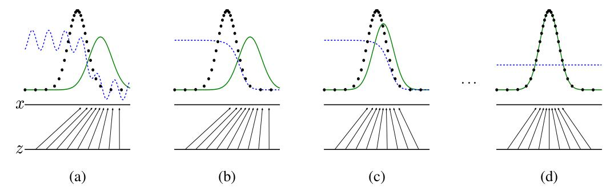
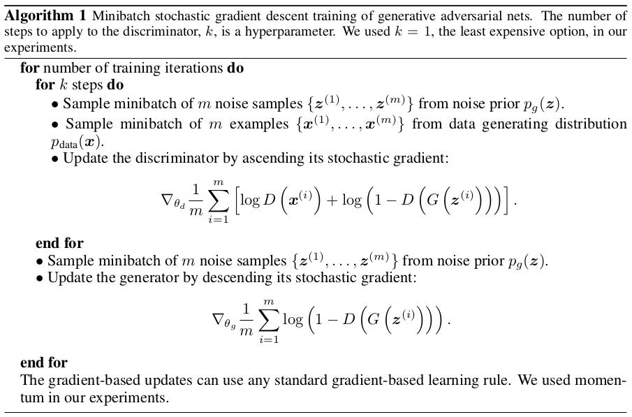

论文地址：[Generative Adversarial Nets]()

Ian J. Goodfellow, Jean Pouget-Abadie ∗ , Mehdi Mirza, Bing Xu, David Warde-Farley, Sherjil Ozair, Aaron Courville, Yoshua Bengio

Département d’informatique et de recherche opérationnelle
Université de Montréal
Montréal, QC H3C 3J7

2014年

<!--more-->

**Abstract**
We propose a new framework for estimating generative models via an adversarial process, in which we simultaneously train two models: a generative model G that captures the data distribution, and a discriminative model D that estimates the probability that a sample came from the training data rather than G. `The training procedure for G is to maximize the probability of D making a mistake.(G的训练过程是使D犯错的概率最大化.)` \
This framework `corresponds to(相当于…，符合于…)` a minimax two-player game. In the space of `arbitrary(adj.[数]任意的;武断的;专制的)` functions G and D, `a unique solution exists(存在一个唯一解)`, with G recovering(recover  v.恢复;再生) the training data distribution and D equal to $\frac{1}{2}$ everywhere. In the case where G and D are defined by multilayer perceptrons, the entire(adj.全部的,整个的;全体的) system can be trained with backpropagation. There is no need for any Markov chains or `unrolled approximate inference networks(展开的近似推理网络)` during either training or generation of samples. Experiments demonstrate the potential of the framework through qualitative(adj.定性的;质的,性质上的) and quantitative(adj.定量的;量的,数量的) evaluation of the generated samples.

# Introduction

# Related work

# Adversarial nets
The adversarial modeling framework is most straightforward to apply when the models are both multilayer perceptrons. `To learn the generator’s distribution $p_g$ over data $x$,(为了通过数据 x 来学习生成器的分布 $p_g$),` we define a prior on input noise variables $p_z(z)$, then represent a mapping to data space as $G(z; θ_g)$, where G is a differentiable function represented by a multilayer perceptron with parameters $θ_g$. We also define a second multilayer perceptron $D(x; θ_d)$ that outputs a single scalar. D(x) represents the probability that $x$ came from the data rather than $p_g$. We train D to maximize the probability of assigning the correct label to both training examples and samples from G. We simultaneously train G to minimize log(1 − D(G(z))):

In other words, D and G play the following two-player minimax game with value function V (G, D):
$$
\min \limits_{G} \max \limits_{D} V(D, G) = \mathbb{E}_{\boldsymbol{x} \sim p_{data} (\boldsymbol{x})} [\text{log} D(\boldsymbol{x})] + \mathbb{E}_{\boldsymbol{z} \sim p_{z} (\boldsymbol{z})} [\text{log} (1 - D(G(\boldsymbol{z})))].  \tag{1}
$$

上式中，$\mathbb{E}_{\boldsymbol{x} \sim p_{data} (\boldsymbol{x})} [\text{log} D(\boldsymbol{x})]$ 表示将真实图片输入到 D 时 D 的输出概率，我们当然希望此时D的输出概率越大越好；

$\mathbb{E}_{\boldsymbol{z} \sim p_{z} (\boldsymbol{z})} [\text{log} (1 - D(G(\boldsymbol{z})))]$ 表示将 G 生成的图片输入到 D 时 D 的输出概率，我们当然希望此时D的输出概率越小越好。

In the next section, we present a theoretical analysis of adversarial nets, essentially showing that the training criterion(n. （批评判断的）标准；准则；规范；准据) allows one to recover the data generating distribution as G and D are given enough capacity, i.e., in the non-parametric limit. See Figure 1 for a `less formal(非正式的)`, more pedagogical(adj. 教育学的；教学法的) explanation of the approach. In practice, we must implement the game using an iterative(adj.[数]迭代的;重复的), numerical approach. Optimizing D to completion(n. 完成，结束；实现) in the inner loop of training is computationally prohibitive(adj.禁止的,禁止性的;抑制的;(费用,价格)过高的), and on finite(adj. 有限的；限定的) datasets would result in overfitting. **Instead, we alternate(adj.交替的,轮流的;间隔的) between k steps of optimizing D and one step of optimizing G.** `This results in D being maintained near its optimal solution, so long as G changes slowly enough.(这使得D保持在其最优解附近，只要G变化足够慢.)` This strategy is analogous to the way that SML/PCD [31, 29] training maintains samples from a Markov chain from one learning step to the next in order to avoid burning(burn v.燃烧;晒黑;以……作燃料;飞速驾驶) in a Markov chain as part of the inner loop of learning. The procedure is formally presented in Algorithm 1.

In practice, equation 1 may not provide sufficient gradient for G to learn well. Early in learning, when G is poor, D can reject samples with high confidence because they are clearly different from the training data. In this case, log(1 − D(G(z))) saturates(saturate v.(使)浸透;使饱和,使充满). Rather than training G to minimize log(1 − D(G(z))) we can train G to maximize log D(G(z)). This objective function results in the same fixed point of the dynamics of G and D but provides much stronger gradients early in learning.

Figure 1: Generative adversarial nets are trained by simultaneously updating the discriminative distribution (D, blue, dashed(dash n.虚线;v.猛冲) line) so that it discriminates between samples from the data generating distribution (black, dotted line) $p_x$ from those of the generative distribution $p_g (G)$ (green, solid line). The lower horizontal line is the domain from which $z$ is sampled, in this case uniformly(adv.一致地,均匀地). The horizontal line above(prep.多于,胜过;高于;在…上面) is part of the domain of $x$. \
The upward arrows show how the mapping $x = G(z)$ imposes the non-uniform distribution $p_g$ on transformed samples. \
向上的箭头显示了映射 $x = G(z)$ 如何将非均匀分布 $p_g$ 强加于变换后的样本上。\
G contracts in regions of high density and expands in regions of low density of $p_g$. \
G在高密度区域收缩，在低密度区域膨胀。\
(a) Consider an adversarial pair near convergence(收敛): $p_g$ is similar to $p_{data}$ and $D$ is a partially accurate classifier. \
对于(a)图，考虑一个接近收敛的对抗pair，$p_g$ 相似于 $p_{data}$, $D$ 是一个部分精确的分类器。\
(b) In the inner loop of the algorithm $D$ is trained to discriminate samples from data, converging(converge v.聚合;收敛) to $D^∗ (x) = \frac{p_{data} (x)}{p_{data} (x) + p_g(x)}$. \
> 这个公式的推导过程论文后面将会证明之，不过这个证明过程有些复杂，目前可以不用掌握。\
(c) After an update to G, gradient of D has guided G(z) to flow to regions that are more likely to be classified as data. (d) After several steps of training, if G and D have enough capacity, they will reach a point at which both cannot improve because $p_g = p_{data}$ . The discriminator is unable to differentiate(v. 区分;辨别) between the two distributions, i.e. $D(x) = \frac{1}{2}$ .

> 乔纳森语：关于图1，我们主要需掌握两点：\
> 1. Generator 生成的数据分布 是被 Discriminator 拉向 $p_{data}$ 的； \
> 2. Generator 和 Discriminator 最后的平衡条件（收敛条件）是 $p_{data} = p_g$.

> 乔纳森语：\
> Discriminator可以看成是一个loss，这个特殊的loss function是一个网络结构，它被用来度量G(z)和真实数据的相似程度，或者说是G(z)的分布$p_g$和真实数据的分布$p_{data}$之间的接近程度。

# Theoretical Results
The generator G implicitly defines a probability distribution $p_g$ as the distribution of the samples $G(\boldsymbol{z})$ obtained when $\boldsymbol{z} ∼ p_{\boldsymbol{z}}$. \
发生器 G 隐式定义了一个概率分布，即当 $\boldsymbol{z} ∼ p_{\boldsymbol{z}}$ 时得到的样本 $G(\boldsymbol{z})$ 的分布. \
Therefore, we would like Algorithm 1 to converge to a good estimator of $p_data$ , if given enough capacity and training time. The results of this section are done in a non-parametric setting, `e.g. we represent a model with infinite(adj. 无限的，无穷的；无数的；极大的) capacity by studying convergence in the space of probability density functions. (例如，我们通过研究概率密度函数空间的收敛来表示一个具有无限容量的模型.)`

We will show in section 4.1 that this minimax game has a global optimum for $p_g = p_{data}$ . We will then show in section 4.2 that Algorithm 1 optimizes Eq 1, thus obtaining the desired result. \
我们将在4.1节中说明，当 $p_g = p_{data}$ 时，这个 minimax game 具有全局最优性。然后，我们将在4.2节中说明算法1优化了 Eq 1，从而获得了预期的结果。

## Global Optimality of $p_g = p_{data}$
本节主要证明 Eq 1 的全局最优解为什么是 $p_g = p_{data}$

## Convergence of Algorithm 1
本节主要讨论为什么通过 Algorithm 1 可以优化 Eq 1 使其得到最优解

# Experiments

# Advantages and disadvantages

# Conclusions and future work

