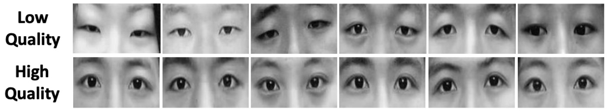
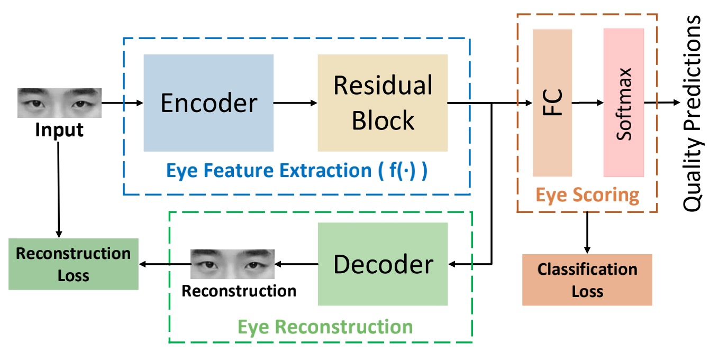
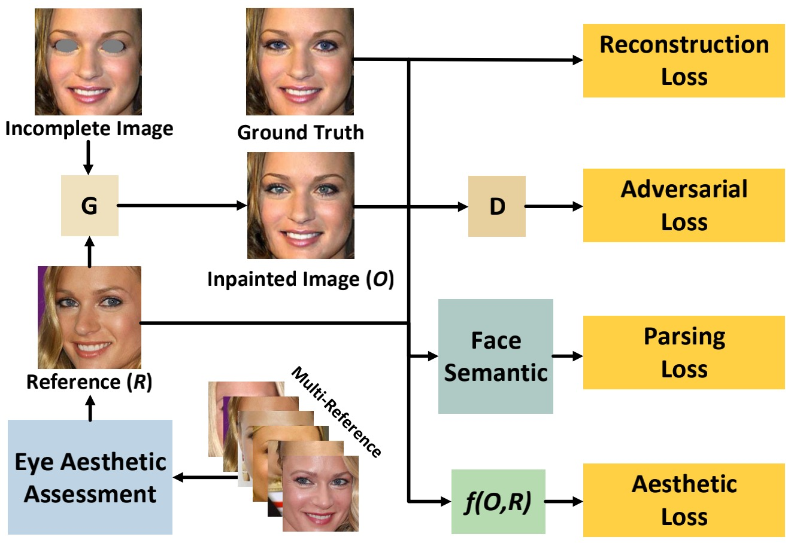

<!--more-->

Assessing Eye Aesthetics for Automatic Multi-Reference Eye In-Painting

Bo Yan∗, Qing Lin, Weimin Tan, Shili Zhou
Shanghai Key Laboratory of Intelligent Information Processing,
School of Computer Science, Fudan University
{byan, 18210240028, wmtan14, 15307130270}@fudan.edu.cn

CVPR 2020，将美学信息引入到图像修复中

 \
Figure 3. The labeled eye aesthetics assessment dataset according to manual scoring. The dataset has a total of 1,040 eye images divided into two categories. The first line shows low-quality eye images, and the second line shows high-quality ones.
> 制作了一个人眼美学数据集，用于训练 **Eye Aesthetic Assessment Network** . (应该是事先训练好，在后面训练AesGAN的时候是直接拿来用的。)

 \
Figure 4. The architecture of our eye aesthetic assessment network. We first introduce the reconstruction branch into the image quality assessment task to maintain the uniqueness of eye aesthetic. Only the eye aesthetic feature extraction module and the eye scoring module are needed during testing.
> 上图即是 **Eye Aesthetic Assessment Network**

 \
Figure 5. The architecture of our eye in-painting network (AesGAN) based on eye aesthetic and face semantic, containing a generator, two discriminators, an eye aesthetic assessment network and a parsing network. The function f(O,R) is the eye aesthetic feature extraction module in Figure 4.
> Step1: 事先训练好 Eye Aesthetic Assessment Network
> 
> Step2: 事先训练好 Face Semantic Network
> 
> Step3: 训练 AesGAN \
> Step3.1 从 Multi-Reference 中 挑选 Reference(R) \
> &emsp; 事先准备好一组 Multi-Reference，这组 Reference 应该都是很美的🐶，他们虽然拥有不同的脸型，但都具有美丽的眼睛。\
> 我们将这组 Multi-Reference 输入到事先训练好的 Eye Aesthetic Assessment Network 进行打分，然后再使用 SSIM 从中挑出脸型和输入的 Incomplete-Image 最相似的作为本次的 Reference(R).
> 
> Step3.2: Generator 前向计算 \
> &emsp; Incomplete-Image 和 Reference(R) 一起被输入到 Generator，生成一张 Inpainted-Image(O)（也就是fake-image）
> 
> Step3.3: Discriminate 和 loss 计算 \
> loss_GAN(O, GT) \
> loss_Recon(?, ?)   # TODO: 这个loss可参考 ExGAN \
> loss_Aesth(O, R) \
> loss_Parsing(O, I)  # I 表示原图，即 Incomplete-Image \
> 总loss就是上述loss加权求和。

----------------------------------------

[Soft-Gated Warping-GAN for Pose-Guided Person Image Synthesis](https://papers.nips.cc/paper/7329-soft-gated-warping-gan-for-pose-guided-person-image-synthesis.pdf)

虚拟换装: [VITON: An Image-based Virtual Try-on Network](https://arxiv.org/pdf/1711.08447.pdf)

[Object-driven Text-to-Image Synthesis via Adversarial Training](https://arxiv.org/abs/1902.10740)

[Deep Neural Network Augmentation: Generating Faces for Affect Analysis](https://link.springer.com/article/10.1007/s11263-020-01304-3)

[ClothFlow: A Flow-Based Model for Clothed Person Generation](https://openaccess.thecvf.com/content_ICCV_2019/papers/Han_ClothFlow_A_Flow-Based_Model_for_Clothed_Person_Generation_ICCV_2019_paper.pdf)

StyleFlow

