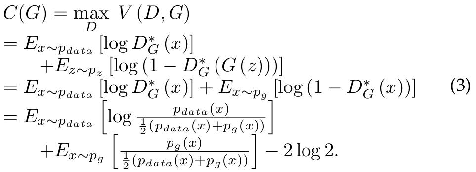

论文地址：[A Review on Generative Adversarial Networks:Algorithms, Theory, and Applications](https://arxiv.org/pdf/2001.06937.pdf)

Jie Gui, Zhenan Sun, Yonggang Wen, Dacheng Tao, Jieping Ye

2020年

<!--more-->

**Abstract**—Generative adversarial networks (GANs) are a hot research topic recently. GANs have been widely studied since 2014, and a large number of algorithms have been proposed. However, there is few comprehensive study explaining the connections among different GANs variants, and how they have evolved. In this paper, we attempt to provide a review on various GANs methods from the perspectives of algorithms, theory, and applications. Firstly, the motivations, mathematical representations, and structure of most GANs algorithms are introduced in details. Furthermore, GANs have been combined with other machine learning algorithms for specific applications, such as semi-supervised learning, transfer learning, and reinforcement learning. This paper compares the commonalities and differences of these GANs methods. Secondly, theoretical issues related to GANs are investigated. Thirdly, typical applications of GANs in image processing and computer vision, natural language processing, music, speech and audio, medical field, and data science are illustrated. Finally, the future open research problems for GANs are pointed out.
**Index Terms**—Deep Learning, Generative Adversarial Networks, Algorithm, Theory, Applications.

# INTRODUCTION
&emsp; Generative adversarial networks (GANs) have become a hot research topic recently. Yann LeCun, a legend in deep learning, said in a Quora post “GANs are the most interesting idea in the last 10 years in machine learning.” There are a large number of papers related to GANs according to Google scholar. For example, there are about 11,800 papers related to GANs in 2018. That is to say, there are about 32 papers everyday and more than one paper every hour related to GANs in 2018.

&emsp; GANs consist of two models: a generator and a discriminator. `These two models are typically implemented by neural networks, but they can be implemented with any form of differentiable(adj.[数]可微的;可辨的;可区分的) system that maps data from one space to the other.(这两个模型通常是由神经网络实现的，但它们可以由任何将数据从一个空间映射到另一个空间的可微系统实现).` The generator tries to capture the distribution of true examples for new data example generation. The discriminator is usually a binary classifier, discriminating generated examples from the true examples as accurately as possible. The optimization of GANs is a minimax(n.极大极小;使对方得点减到最低以使自己得最高分的战略) optimization problem. `The optimization terminates at a saddle point that is a minimum with respect to the generator and a maximum with respect to the discriminator.(优化在一个鞍点结束，这个鞍点对于发生器是最小的，对于鉴别器是最大的).` That is, the optimization goal is to reach Nash equilibrium [1]. Then,the generator can be thought to have captured the real distribution of true examples.

&emsp; Some previous work has adopted the concept of making two neural networks compete with each other. The most relevant work is predictability minimization [2]. The connections between predictability minimization and GANs can be found in [3], [4].

&emsp; The popularity and importance of GANs have led to several previous reviews. The difference from previous work is summarized in the following.

1) GANs for specific applications: There are surveys of using GANs for specific applications such as image synthesis(n.综合;合成) and editing [5], audio enhancement and synthesis [6].

2) `General survey(综合评述;一般检验)`: The earliest relevant review was probably the paper by Wang et al. [7] which mainly introduced the progress of GANs before 2017. References [8], [9] mainly introduced the progress of GANs ‵prior to(在…之前,居先)` 2018. The reference [10] introduced the  architecture-variants and loss-variants of GANs only related to computer vision. Other related work can be found in [11]–[13].

As far as we know, this paper is the first to provide a comprehensive survey on GANs from the algorithm, theory, and application perspectives which introduces the latest progress. Furthermore, our paper focuses on applications not only to image processing and computer vision, but also
sequential data such as natural language processing, and other related areas such as medical field.

&emsp; The remainder(n/adj. [数]余数,残余;剩余物;其余的) of this paper is organized as follows: The related work is discussed in Section 2. Sections 3-5 introduce GANs from the algorithm, theory, and applications perspectives, respectively. Tables 1 and 2 show GANs’ algorithms and applications which will be discussed in Sections 3 and 5, respectively. The open research problems are discussed in Section 6 and Section 7 concludes the survey.

# RELATED WORK
GANs belong to generative algorithms. Generative algorithms and discriminative algorithms are two categories of machine learning algorithms. If a machine learning algorithm is based on a fully probabilistic model of the observed data, this algorithm is generative. Generative algorithms
have become more popular and important due to their wide practical applications.

## Generative algorithms
Generative algorithms can be classified into two classes: explicit(adj.显式的;明确的;清楚的;直率的;详述的) density model and implicit(adj.隐式的;含蓄的;暗示的;盲从的) density model.

### Explicit density model
An explicit density model assumes the distribution and utilizes true data to train the model containing the distribution or fit the distribution parameters. When finished, new examples are produced utilizing the learned model or distribution. The explicit density models include maximum
likelihood estimation (MLE), `approximate inference(近似推理)` [95],[96], and Markov chain method [97]–[99]. These explicit density models have an explicit distribution, but have limitations. For instance, MLE is conducted on true data and the parameters are updated directly based on the true data, which leads to an overly(adv.过度地;极度地) smooth generative model. The generative model learned by approximate inference can only approach(v.处理;临近,逐渐接近;n.方法,式;接近) `the lower bound of(…的下界)` the objective function rather than directly approach the objective function, because of the difficulty in solving the objective function. The Markov chain algorithm can be used to train generative models, but it is computationally expensive. Furthermore, the explicit density model has the problem of computational tractability(n.温顺;易处理). It may fail to represent the complexity of true data distribution and learn the high-dimensional data distributions [100].

### Implicit density model
An implicit density model does not directly estimate or fit the data distribution. It produces data instances from the distribution without an explicit hypothesis [101] and utilizes the produced examples to modify the model. Prior to GANs, the implicit density model generally needs to be trained utilizing either ancestral(adj.祖先的;祖传的;原始的) sampling [102] or Markov chain-based sampling, which is inefficient(adj.无效率的,效率低的;无能的) and limits their practical applications. GANs belong to the directed implicit density model category. A detailed summary and relevant papers can be found in [103].

### The comparison between GANs and other generative algorithms
GANs were proposed to overcome(vt.克服;胜过) the disadvantages(n.劣势;不利条件;损害) of other generative algorithms. The basic idea behind(prep.在……的后面;在其后面;落后于;支持;是……产生的原因;adv.拖欠;落在后面) adversarial learning is that the generator tries to create as realistic examples as possible to deceive(v.欺骗;行骗) the discriminator. The discriminator tries to distinguish fake examples from true examples. Both the generator and discriminator improve through adversarial learning. This adversarial process gives GANs notable(adj.值得注意的,显著的;著名的;n.名人,显要人物) advantages over other generative algorithms. More specifically, GANs have advantages over other generative algorithms as follows:

1) GANs can parallelize the generation, which is impossible for other generative algorithms such as PixelCNN [104] and fully visible(adj.明显的;看得见的;现有的;可得到的) belief(n.相信,信赖;信仰;教义) networks(FVBNs) [105], [106].
2) The generator design has few restrictions.
3) GANs are subjectively(adv.主观地;臆想地;内省地) thought to produce better examples than other methods. Refer to [103] for more detailed discussions about this.

## Adversarial idea
The adversarial idea has been successfully applied to many areas such as machine learning, artificial intelligence, computer vision and natural language processing. The recent event that AlphaGo [107] defeats world’s top human player engages public interest in artificial intelligence. The intermediate version of AlphaGo utilizes two networks competing with each other.

&emsp; Adversarial examples [108]–[117] have the adversarial idea, too. `Adversarial examples are those examples which are very different from the real examples, but are classified into a real category very confidently, or those that are slightly(adv.轻微地;纤细地,瘦小的) different than the real examples, but are classified into a wrong category.(对抗性例子是指那些与真实例子有很大不同，但被非常有把握地归为真实类别的例子，或者是那些与真实例子略有不同，但归为错误类别的例子.)` This is a very hot research topic recently [112], [113]. To be against adversarial attacks [118],[119], references [120], [121] utilize GANs to `conduct the right defense(实施正确的防御)`.

&emsp; Adversarial machine learning [122] is a minimax problem. The defender, who builds the classifier that we want to work correctly, is searching over the parameter space to find the parameters that reduce the cost of the classifier as much as possible. Simultaneously, the attacker is searching over the inputs of the model to maximize the cost.

&emsp; The adversarial idea exists in adversarial networks, adversarial learning, and adversarial examples. However, they have different objectives.

# ALGORITHMS
In this section, we first introduce the original GANs. Then, the representative variants, training, evaluation of GANs, and task-driven GANs are introduced.

## Generative Adversarial Nets (GANs)
The GANs framework is straightforward(adj.简单的;坦率的;明确的;径直的;adv.直截了当地;坦率地) to implement when the models are both neural networks. In order to learn the generator’s distribution $p_g$ over data $x$ , a prior on input noise variables is defined as $p_z(z)$ [3] and $z$ is the noise variable. Then, GANs represent a mapping from noise space to data space as $G(z, θ_g)$ , where $G$ is a differentiable function represented by a neural network with parameters $θ_g$. `Other than(除…以外)` $G$ , the other neural network $D(x, θ_d)$ is also defined with parameters $θ_d$ and the output of $D(x)$ is a single scalar. $D(x)$ denotes the probability that $x$ was from the data rather than the generator $G$ . The discriminator $D$ is trained to maximize the probability of giving the correct label to both training data and fake samples generated from the generator $G$ . $G$ is trained to minimize $\text{log} (1 − D (G (z)))$ simultaneously.

### Objective function
Different objective functions can be used in GANs.

#### Original minimax game:
The objective function of GANs [3] is

$$
\min \limits_{G} \max \limits_{D} V(D, G) = E_{x \sim p_{data}(x)} [\text{log} D(x)] + E_{z \sim p_z (z)} [\text{log} (1 - D(G(z)))].  \tag{1}
$$

$\text{log} D(x)$ is the cross-entropy between $[1 \quad 0]^T$ and $[D(x) \quad 1 - D(x)]^T$. Similarly, $\text{log} (1 - D(G(z)))$ is the cross-entropy between $[0 \quad 1]^T$ and $[D(G(z)) \quad 1 - D(G(z))]^T$ . For fixed $G$, the optimal discriminator $D$ is given by [3]:

$$
D^*_{G} (x) = \frac{p_{data} (x)}{p_{data} (x) + p_g (x)}.  \tag{2}
$$

The minmax game in (1) can be reformulated as:

[1] L. J. Ratliff, S. A. Burden, and S. S. Sastry, “Characterization and
computation of local nash equilibria in continuous games,” in
Annual Allerton Conference on Communication, Control, and Com-
puting, pp. 917–924, 2013.
[2] J. Schmidhuber, “Learning factorial codes by predictability mini-
mization,” Neural Computation, vol. 4, no. 6, pp. 863–879, 1992.
[3] I. Goodfellow, J. Pouget-Abadie, M. Mirza, B. Xu, D. Warde-
Farley, S. Ozair, A. Courville, and Y. Bengio, “Generative adver-
sarial nets,” in Neural Information Processing Systems, pp. 2672–
2680, 2014.
[4] J. Schmidhuber, “Unsupervised minimax: Adversarial curiosity,
generative adversarial networks, and predictability minimiza-
tion,” arXiv preprint arXiv:1906.04493, 2019.
[5] X. Wu, K. Xu, and P. Hall, “A survey of image synthesis and
editing with generative adversarial networks,” Tsinghua Science
and Technology, vol. 22, no. 6, pp. 660–674, 2017.
[6] N. Torres-Reyes and S. Latifi, “Audio enhancement and synthesis
using generative adversarial networks: A survey,” International
Journal of Computer Applications, vol. 182, no. 35, pp. 27–31, 2019.
[7] K. Wang, C. Gou, Y. Duan, Y. Lin, X. Zheng, and F.-Y. Wang,
“Generative adversarial networks: introduction and outlook,”
IEEE/CAA Journal of Automatica Sinica, vol. 4, no. 4, pp. 588–598,
2017.
[8] Y. Hong, U. Hwang, J. Yoo, and S. Yoon, “How generative
adversarial networks and their variants work: An overview,”
ACM Computing Surveys, vol. 52, no. 1, pp. 1–43, 2019.
[9] A. Creswell, T. White, V. Dumoulin, K. Arulkumaran, B. Sen-
gupta, and A. A. Bharath, “Generative adversarial networks: An
overview,” IEEE Signal Processing Magazine, vol. 35, no. 1, pp. 53–
65, 2018.
[10] Z. Wang, Q. She, and T. E. Ward, “Generative adversarial net-
works: A survey and taxonomy,” arXiv preprint arXiv:1906.01529,
2019.
[11] S. Hitawala, “Comparative study on generative adversarial net-
works,” arXiv preprint arXiv:1801.04271, 2018.
[12] M. Zamorski, A. Zdobylak, M. Zieba, and J. Swiatek, “Generative
adversarial networks: recent developments,” in International Con-
ference on Artificial Intelligence and Soft Computing, pp. 248–258,
Springer, 2019.
[13] Z. Pan, W. Yu, X. Yi, A. Khan, F. Yuan, and Y. Zheng, “Recent
progress on generative adversarial networks (gans): A survey,”
IEEE Access, vol. 7, pp. 36322–36333, 2019.

