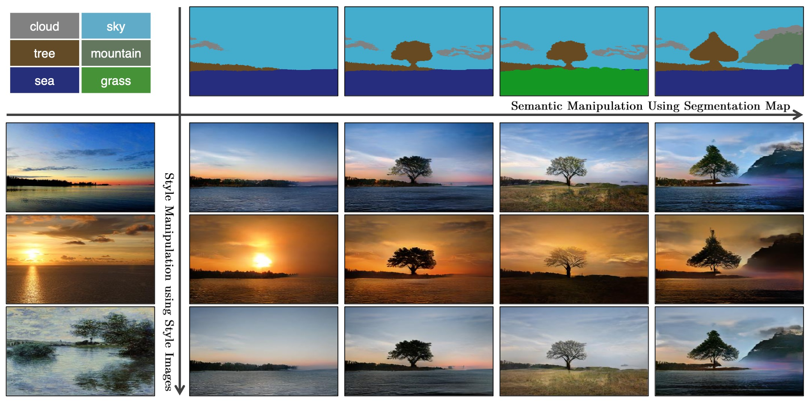
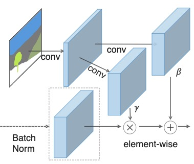
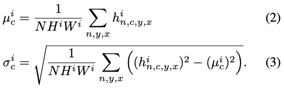
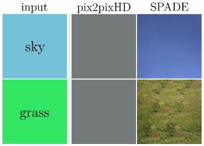
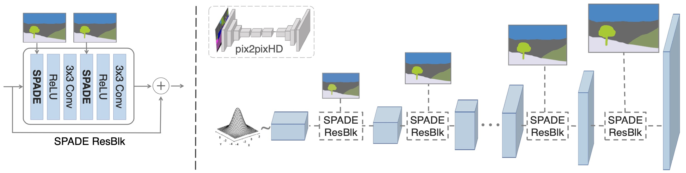

Semantic Image Synthesis with Spatially-Adaptive Normalization

Taesung Park1,2∗ Ming-Yu Liu2 Ting-Chun Wang2 Jun-Yan Zhu2,3 

1UC Berkeley 2NVIDIA 2,3MIT CSAIL

2019

<!--more-->

 \
Figure 1: Our model allows user control over both semantic and style as synthesizing an image. The semantic (e.g., the existence of a tree) is controlled via a label map (the top row), while the style is controlled via the reference style image (the leftmost column). Please visit our [website](https://github.com/NVlabs/SPADE) for interactive image synthesis demos.

**Abstract**

&emsp; We propose spatially-adaptive normalization, a simple but effective layer for synthesizing photorealistic images given an input semantic layout. Previous methods directly feed the semantic layout as input to the deep network, which is then processed through stacks of convolution, normalization, and nonlinearity layers. We show that this is suboptimal(adj. 次最优的；最适度下的；未达最佳标准的) `as the normalization layers tend to “wash away” semantic information (因为 normalization layers 倾向于“冲走”语义信息)`. \
To address the issue, we propose using the input layout for modulating the activations in normalization layers through a spatially-adaptive, learned transformation. \
为了解决该问题，我们建议使用**空间自适应的输入布局**，学习的变换被来调制 normalization layers 中的激活。\
Experiments on several challenging datasets demonstrate the advantage of the proposed method over existing approaches, `regarding both visual fidelity(n. 保真度；忠诚；精确；尽责) and alignment with input layouts (无论是视觉保真度还是输入布局的对齐方式)`. Finally, our model allows user control over both semantic and style. Code is available at https://github.com/NVlabs/SPADE .

# Introduction

# Related Work

# Semantic Image Synthesis

 \
Figure 2: In the SPADE, the mask is first projected onto an embedding space and then convolved to produce the modulation parameters $γ$ and $β$. Unlike prior conditional normalization methods, $γ$ and $β$ are not vectors, but tensors with spatial dimensions. The produced $γ$ and $β$ are multiplied and added to the normalized activation element-wise.

Let $\mathbf{m} ∈ \mathbb{L}^{H×W}$ be a semantic segmentation mask where $\mathbb{L}$ is a set of integers denoting the semantic labels, and $H$ and $W$ are the image height and width. Each entry in $\mathbf{m}$ denotes the semantic label of a pixel. We aim to learn a mapping function that can convert an input segmentation mask $\mathbf{m}$ to a photorealistic image.

&emsp; **Spatially-adaptive denormalization.** Let $\mathbf{h}^i$ denote the activations of the $i$-th layer of a deep convolutional network for a batch of $N$ samples. Let $C^i$ be the number of channels in the layer. Let $H^i$ and $W^i$ be the height and width of the activation map in the layer. **We propose a new conditional normalization method called the SPatially-Adaptive (DE)normalization^1 (SPADE).**

> Conditional normalization [11, 19] uses external data to denormalize the normalized activations; i.e., the denormalization part is conditional.

**Similar to the Batch Normalization [21], the activation is normalized in the channel-wise manner and then modulated with learned scale and bias.** Figure 2 illustrates the SPADE design. The activation value at site $(n ∈ N,c ∈ C^i,y ∈ H^i,x ∈ W^i)$ is \
$$
\gamma^i_{c, y, x} (\mathbf{m}) \frac{h^i_{n, c, y, x}}{\sigma}^i_c + \beta^i_{c, y, x} (\boldsymbol{m}) \tag{1}
$$

where $h^i_{n, c, y, x}$ is the activation at the site before normalization and $μ^i_c$ and $σ^i_c$ are the mean and standard deviation of the activations in channel $c$:

The variables $γ^i_{c,y,x}(\mathbf{m})$ and $\beta^i_{c, y, x} (\mathbf{m})$ in (1) are the learned modulation parameters of the normalization layer. In contrast to the BatchNorm [21], they depend on the input segmentation mask and vary with respect to the location (y, x). We use the symbol $γ^i_{c,y,x}$ and $\beta^i_{c, y, x}$ to denote the functions that convert $\mathbf{m}$ to the scaling and bias values at the site (c, y, x) in the $i$-th activation map. We implement the functions $γ^i_{c, y, x}$ and $\beta^i_{c, y, x}$ using a simple two-layer convolutional network, whose design is in the appendix.

&emsp; In fact, SPADE is related to, and is a generalization of several existing normalization layers. \
实际上，SPADE与几个现有的 normalization layers 有关，并且是对它们的概括。 \
(下面举例说明，对我们的SPADE稍做改进就是其他现有的 normalization layers) \
First, replacing the segmentation mask $\boldsymbol{m}$ with the image class label and making the modulation parameters spatially-invariant (i.e.,
$\gamma^i_{c, y_1, x_1} ≡ \gamma^i_{c, y_2, x_2}$ and $\beta^i_{c, y_1, x_1} ≡ \beta^i_{c, y_2, x_2}$ for any $y_1, y_2 ∈ {1,2,...,H^i}$ and $x_1, x_2 ∈ {1,2,...,W^i})$, we arrive at the form of the Conditional BatchNorm [11]. \
通过上面这些改变，我们的SPADE就变成了 Conditional BatchNorm [11] 的形式。\
Indeed, for any spatially-invariant conditional data, our method reduces to the Conditional BatchNorm. \
实际上，对于任何空间不变的条件数据，我们的方法都简化为 Conditional BatchNorm. \
Similarly, we can arrive at the AdaIN [19] by replacing $\boldsymbol{m}$ with a real image, making the modulation parameters spatially-invariant(不变的, 不变量), and setting N = 1. \
类似的，我们也可以通过改变SPADE使其变成 AdaIN[19] 的形式。\
As the modulation parameters are adaptive to the input segmentation mask, the proposed SPADE is better suited for semantic image synthesis.

 \
Figure 3: Comparing results given uniform segmentation maps: while the SPADE generator produces plausible textures, the pix2pixHD generator [48] produces two identical outputs due to the loss of the semantic information after the normalization layer.

**SPADE generator.** With the SPADE, there is no need to feed the segmentation map to the first layer of the generator, **since the learned modulation parameters have encoded enough information about the label layout. Therefore, we discard encoder part of the generator**, which is commonly used in recent architectures [22, 48]. `This simplification results in a more lightweight network (这种简化导致网络更加轻便)`. Furthermore, `similarly to (类似于)` existing class-conditional generators [36,39,54], the new generator can take a random vector as input, enabling a simple and natural way for multi-modal synthesis [20, 60].

&emsp; Figure 4 illustrates our generator architecture, which employs several ResNet blocks [15] with upsampling layers. The modulation parameters of all the normalization layers are learned using the SPADE. Since each residual block operates at a different scale, we downsample the semantic mask to match the spatial resolution.

&emsp; We train the generator with the same multi-scale discriminator and loss function used in pix2pixHD [48] except that we replace the least squared loss term [34] with the hinge loss term [31,38,54]. We test several ResNet-based discriminators used in recent unconditional GANs [1, 36, 39] but observe similar results at the cost of a higher GPU memory requirement. Adding the SPADE to the discriminator also yields a similar performance. For the loss function, we observe that removing any loss term in the pix2pixHD loss function lead to degraded generation results.

Figure 4: In the SPADE generator, each normalization layer uses the segmentation mask to modulate the layer activations. (left) Structure of one residual block with the SPADE. (right) The generator contains a series of the SPADE residual blocks with upsampling layers. Our architecture achieves better performance with a smaller number of parameters by removing the downsampling layers of leading image-to-image translation networks such as the pix2pixHD model [48].

**Why does the SPADE work better?** A short answer is that it can better preserve semantic information against common normalization layers. Specifically, while normalization layers such as the InstanceNorm [46] are essential pieces in almost all the state-of-the-art conditional image synthesis models [48], they tend to wash away semantic information when applied to uniform or flat segmentation masks.

&emsp; **Let us consider a simple module that first applies convolution to a segmentation mask and then normalization. Furthermore, let us assume that a segmentation mask with a single label is given as input to the module (e.g., all the pixels have the same label such as sky or grass). Under this setting, the convolution outputs are again uniform, with different labels having different uniform values. Now, after we apply InstanceNorm to the output, the normalized activation will become all zeros no matter what the input semantic label is given. Therefore, semantic information is totally lost.** \
This limitation applies to a wide range of generator architectures, including pix2pixHD and its variant that concatenates the semantic mask at all intermediate layers, as long as a network applies convolution and then normalization to the semantic mask.
这限制了包括pix2pixHD及其变体在内的 Generator 的大范围应用，……（后面这半句很迷惑）\
In Figure 3, we empirically show this is precisely(adv.精确地; adv.正好，恰恰，确实地（表示强调）) the case for pix2pixHD. \
Because a segmentation mask consists of a few uniform regions in general, the issue of information loss emerges when applying normalization. \
因为一个 segmentation mask 通常由一些统一的区域组成，因此当使用 normalization 的时候就会由信息损失的问题出现。

>>>>>>>>> 主要思想已讲完，其他未完待续

&emsp; In contrast, the segmentation mask in the SPADE Generator is fed through spatially adaptive modulation without normalization. Only activations from the previous layer are normalized. Hence, the SPADE generator can better preserve semantic information. It enjoys the benefit of normalization without losing the semantic input information.

**Multi-modal synthesis.** By using a random vector as the input of the generator, our architecture provides a simple way for multi-modal synthesis [20, 60]. Namely, one can attach an encoder that processes a real image into a random vector, which will be then fed to the generator. The encoder and generator form a VAE [28], in which the encoder tries to capture the style of the image, while the generator combines the encoded style and the segmentation mask information via the SPADEs to reconstruct the original image. The encoder also serves as a style guidance network at test time to capture the style of target images, as used in Figure 1. For training, we add a KL-Divergence loss term [28].

# Experiments

# My Summary

- 之前的BN会丢失语义信息，因此作者提出 Spatially-adaptive denormalization，其实就是将 BN 的 $\alpha$ 和 $\beta$ vector 换成可学习的 map（这个map比vector参数更多，而且还是可学习的，即更大更强)；
- SPADE 是现有的几个 normalization layers 的概括，通过对 SPADE 做一些改变就可以得到其他的 normalization layers；
- 因为学习到的 $\gamma$ 和 $\beta$ 参数有足够多的label-layout 信息，所以我们这里将 Generator 的 Encoder 部分给去掉了。而我们的 Generator 使用一个随机向量作为输入，这使多模态合成方法变得更加简单自然；
- 和 pix2pixHD 一样，我们也使用多尺度鉴别器，但是我们将 pix2pixHD 中使用的最小二乘损失替换成了 hinge 损失
- **为什么 SPADE 比现有的 normalization layers 管用 ？** \
  答：因为现有的 normalization layers 会将输入map归一化到0均值1方差附近，那么如果输入是如图3中的 sky、grass 的话，即使他们拥有不同的语义label，但他们都会被归一化到同一个0均值1方差附近，这就损失了语义信息。而我们的SPADE就可以避免这样的情况。

