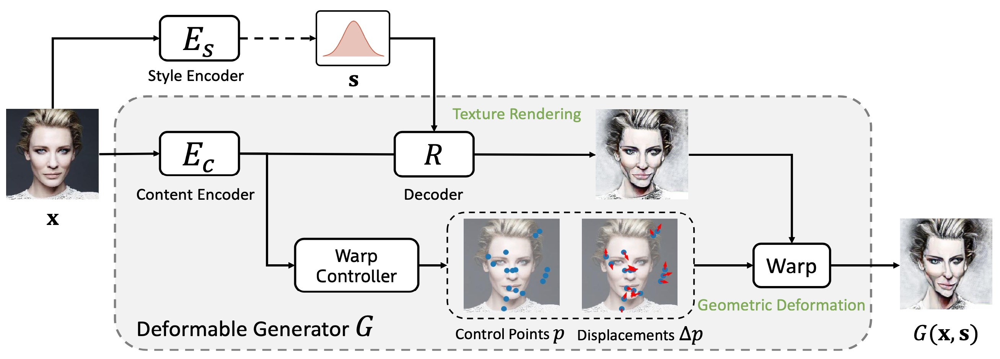
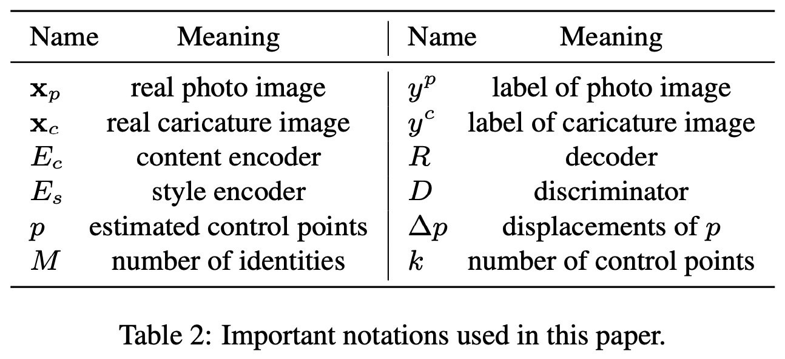
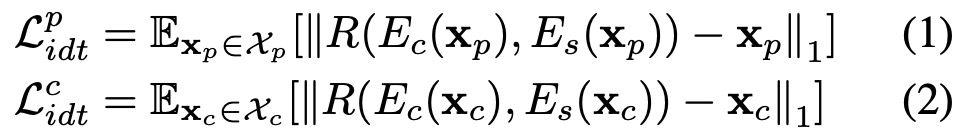
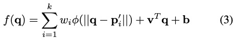
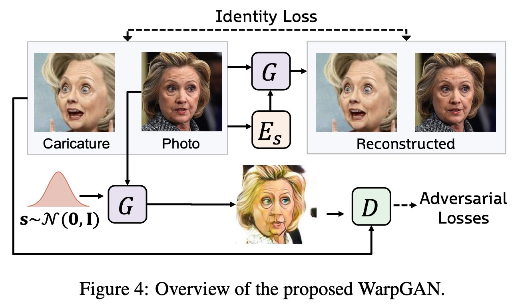
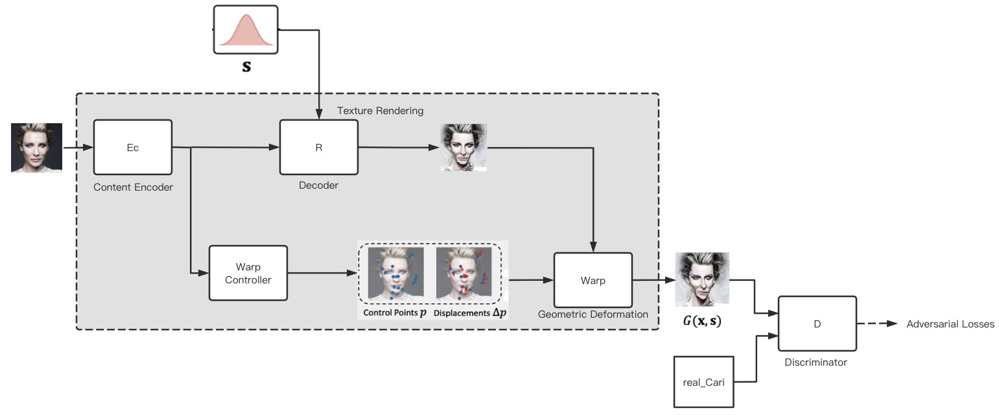
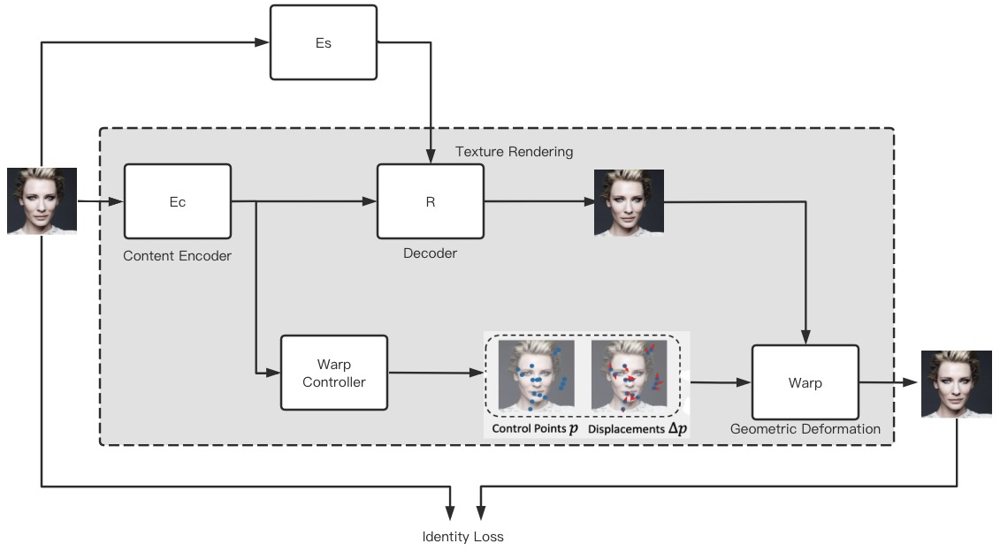
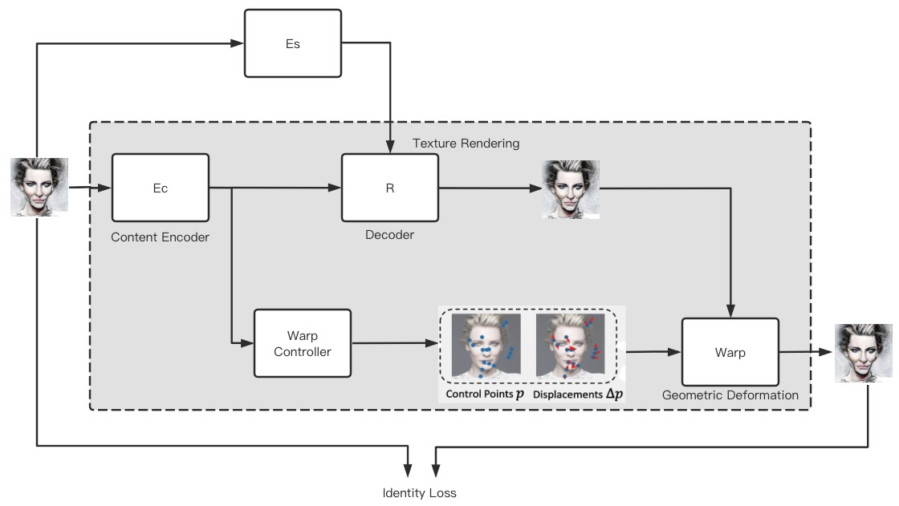

WarpGAN: Automatic Caricature Generation

Yichun Shi∗ Debayan Deb∗ Anil K. Jain

Michigan State University, East Lansing MI 48824

{shiyichu, debdebay}@msu.edu, jain@cse.msu.edu

CVPR 2019 Oral

<!--more-->

**Abstract**

&emsp; We propose, WarpGAN, a fully automatic network that can generate caricatures(caricature n.讽刺画, 漫画, 讽刺描述法，笨拙的模仿; v.画成漫画, 讽刺，使滑稽化) given an input face photo. `Besides transferring rich texture styles (除了传递丰富的纹理样式外)`, WarpGAN learns to automatically predict a set of control points that can warp the photo into a caricature, while preserving identity. `We introduce an identity-preserving adversarial loss (我们引入了一种保持身份的对抗性损失)` that aids the discriminator to distinguish between different subjects. Moreover, WarpGAN **allows customization of the generated caricatures by controlling the exaggeration extent and the visual styles**. Experimental results on a public domain dataset, WebCaricature, show that WarpGAN is capable of generating caricatures that not only preserve the identities but also outputs a diverse(adj.不同的,相异的,多种多样的) set of caricatures for each input photo. Five caricature experts suggest that caricatures generated by WarpGAN are visually similar to hand-drawn ones and only prominent facial features are exaggerated.

# Methodology
&emsp; Let $\mathbf{x}_p ∈ \mathcal{X}_p$ be images from the domain of face photos, $\mathbf{x} _c ∈ \mathcal{X}_c$ be images from the caricature domain and $\mathbf{s} ∈ \mathcal{S}$ be the latent codes of texture styles. We aim to build a network that transforms a photo image into a caricature by both transferring its texture style and exaggerating its geometric shape. Our system includes one deformable generator (see Figure 3) $G$, one style encoder $E_s$ and one discriminator $D$ (see Figure 4). The important notations used in this paper are summarized in Table 2.

 \
Figure 3: The generator module of WarpGAN. Given a face image, the generator outputs an image with a different texture style and a set of control points along with their displacements. A differentiable module takes the control points and warps the transferred image to generate a caricature.

## Generator
&emsp; The proposed deformable generator in WarpGAN is composed of three sub-networks: a content encoder $E_c$, a decoder $R$ and a warp controller. Given any image $\mathbf{x} \in \mathbb{R}^{H \times W \times C}$, the encoder outputs a feature map $E_c(\mathbf{x})$. Here H, W and C are height, width and number of channels respectively. The content decoder takes $E_c(\mathbf{x})$ and a random latent style code $\mathbf{s} ∼ \mathcal{R} (0, \mathbf{I})$ to render the given image into an image $R(E_c(\mathbf{x}), \mathbf{s})$ of a certain style. The warp controller estimates the control points and their dis- placements to warp the rendered images. An overview of the deformable generator is shown in Figure 3.

**Texture Style Transfer** Since there is a large variation in the texture styles of caricatures images (See Figure 1), **we adopt an unsupervised method [7] to disentangle**(v.解开,松开,摆脱,解决(纠纷等)) **the style representation from the feature map** $E_c(\mathbf{x})$ **so that we can transfer the input photo into different texture styles present in the caricature domain**. \
我们采用一种无监督的方法[7]来将 style representation 从 feature map $E_c(\mathbf{x})$ 中分离出来，以便可以将输入的照片转换为不同的纹理样式，以呈现在漫画domain. \
During the training, **the latent style code** $\mathbf{s} ∼ \mathcal{N} (0, \mathbf{I})$ **is sampled randomly from a normal distribution** and passed as an input into the decoder $R$. \
A **multi-layer perceptron** in $R$ decodes s to **generate the parameters of the Adaptive Instance Normalization (AdaIN) layers** in $R$, which have been shown to be effective in controlling visual styles [31]. \
在 $R$ 中使用一个多层感知器来生成其中的自适应实例归一化(AdaIN)层的参数，这已被证明在控制视觉styles[31]中是有效的。\
The generated images $R(E_c(\mathbf{x}), \mathbf{s})$ with random styles are **then warped and passed to the discriminator**. Various styles obtained from WarpGAN can be seen in Figure 5.

&emsp; To prevent $E_c$ and $R$ from losing semantic information during texture rendering, we combine the identity mapping loss [29] and reconstruction loss [7] to regularize(vt. 调整；使有秩序；使合法化) $E_c$ and $R$. In particular, a style encoder $E_s$ is used to learn the mapping from the image space to the style space $S$. Given its own style code, both photos and caricatures should be reconstructed from the latent feature map: \

&emsp; **Automatic Image Warping** The warp controller is a sub-network of two fully connected layers. With latent feature map $E_c(x)$ as input, the controller learns to estimate $k$ control points $p = {\mathbf{p}_1,\mathbf{p}_2,....,\mathbf{p}_k}$ and their displacement vectors $\Delta p = {\Delta \mathbf{p}_1, \Delta \mathbf{p}_2, ... \Delta \mathbf{p}_k}$, where each $\mathbf{p}_i$ and $∆ \mathbf{p}_i$ is a 2D vector in the u-v space. The points are then fed into a differentiable warping module [18]. Let $p^{'} = \{ \mathbf{p}^{'}_1 , \mathbf{p}^{'}_2 , ... , \mathbf{p}^{'}_k \}$ be the destination points, where $\mathbf{p}^{'}_i = \mathbf{p}_i + ∆ \mathbf{p}_i$. A grid sampler of size $H  × W$ can then be computed via thin-plate spline interpolation: \

where the vector $\mathbf{q}$ denotes the u-v location of a pixel in the target image, and $f (\mathbf{q})$ gives the inverse mapping of the pixel $\mathbf{q}$ in the original image, and $\phi (r) = r^2 log(r)$ is the kernel function. The parameters $\mathbf{w, v, b}$ are fitted to minimize $\sum^k_j \Vert f(\mathbf{p}^{'}_j) - \mathbf{p}_j \Vert^2$ and a curvature constraint, which can be solved in closed form [32]. With the grid sampler constructed via inverse mapping function $f (\mathbf{q})$, the warped image \
$$
G(\mathbf{x, s}) = \text{Warp} (R(E_c (\mathbf{x}), \mathbf{s}), p, \Delta p) \tag{4}
$$

can then be generated through bi-linear sampling [14]. The entire warping module is differentiable and can be trained as part of an end-to-end system.

## Discriminator

未完待续。。。

# My Summary

时间匆促 任务紧迫，论文没有完全看完，现总体本文大体思想如下：

对抗损失：\

Identity 损失，即重建loss，realistic-image 和 caricature-image 都要分别算 identity-loss: \

