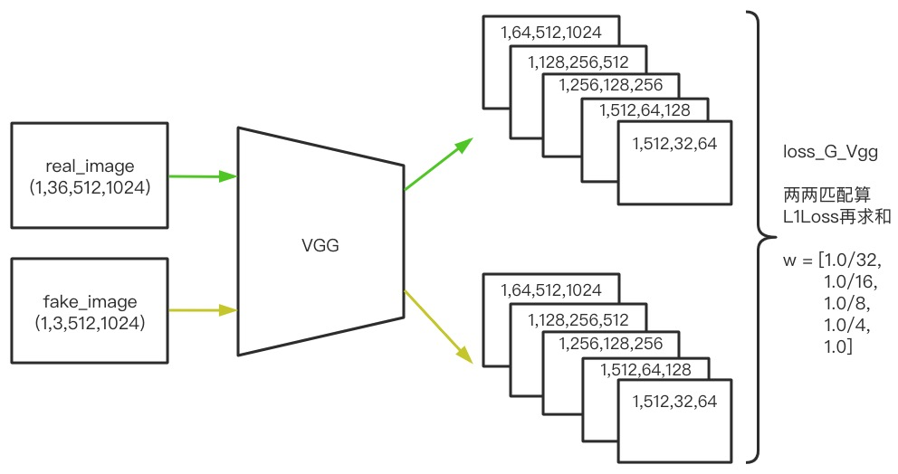

[High-Resolution Image Synthesis and Semantic Manipulation with Conditional GANs]() \
Ting-Chun Wang, Ming-Yu Liu, Jun-Yan Zhu, Andrew Tao, Jan Kautz, Bryan Catanzaro \
NVIDIA Corporation, UC Berkeley \
2018 CVPR
<!--more-->


**Abstract**
&emsp; We present a new method for synthesizing high-resolution photo-realistic images from semantic label maps using conditional generative adversarial networks (conditional GANs). Conditional GANs have enabled a variety of applications, but the results are often limited to low-resolution and still far from realistic. In this work, we generate 2048 × 1024 visually appealing results **with a novel adversarial loss, as well as new multi-scale generator and discriminator architectures**. Furthermore, we **extend our framework to interactive(adj. 交互式的；相互作用的) visual manipulation with two additional features**. First, we **incorporate object instance segmentation information**, which enables object manipulations such as removing/adding objects and changing the object category. Second, we **propose a method to generate diverse(adj. 不同的，相异的；多种多样的，形形色色的) results given the same input**, allowing users to edit the object appearance interactively. Human opinion(n. 意见；主张) studies demonstrate that our method significantly outperforms existing methods, `advancing both the quality and the resolution of deep image synthesis(n.综合,[化学]合成) and editing. (提高了图像深度合成和编辑的质量和分辨率.)`
> summary: 我们提出了一种新方法来从语义标签图来合成高分辨率的真实图片的新方法，该方法使用conditional GANs。我们使用一个新颖的adversarial-loss 和新的多尺度网络结构来生成 2048 × 1024 的图片。此外，我们还使用两个额外的feature来扩展我们的框架来进行交互式视觉操作。第一，我们合并目标实例分割信息，这将使得像“增加或移除目标”、“改变目标种类”这类操作变得可行。第二，我们提出了一个方法来从相同的输入生成不同的结果，允许用户交互式编辑目标外观。


# Introduction
&emsp; Rendering(n.渲染;表现;表演;描写;翻译) photo-realistic images using standard graphics techniques is involved, since geometry(n.几何学), materials, and light transport must be simulated explicitly(adv.明确地;明白地). Although existing graphics algorithms excel at the task, building and editing virtual environments is expensive and time-consuming. That is because we have to model every aspect(n.方面;方向;形势;外貌) of the world explicitly. `If we were able to render photo-realistic images using a model learned from data, we could turn the process of graphics rendering into a model learning and inference problem. (如果我们能够使用从数据中学习到的模型来渲染逼真的图像，我们就可以将图形渲染的过程转化为模型学习和推理问题.)` Then, we could simplify the process of creating new virtual worlds by training models on new datasets. We could even make it easier to customize environments by allowing users to simply specify semantic information rather than modeling geometry, materials, or lighting.
> summary: 图像渲染所涉及到的技术很复杂，如果我们能够使用从数据中学习到的模型来渲染图像，那么我们便可以将图形渲染过程转化为一个模型学习和推理过程。

&emsp; In this paper, we discuss a new approach that produces high-resolution images from semantic label maps. This method has a wide range of applications. For example, we can use it to create synthetic(adj.综合的;合成的,人造的) training data for training visual recognition algorithms, `since it is much easier to create semantic labels for desired scenarios than to generate training images (因为为所需场景创建语义标签要比生成训练图像容易得多).` Using semantic segmentation methods, **we can transform images into a semantic label domain, edit the objects in the label domain, and then transform them back to the image domain.** This method also gives us new tools for higher-level image editing, e.g., adding objects to images or changing the appearance of existing objects.
> summary: 本文我们将讨论一种新的从语义标签map来产生高分辨率图像的新方法，这种方法有很多应用场景，如生成训练样本、图像编辑。


&emsp; To synthesize(v.合成;综合) images from semantic labels, one can use the pix2pix method, an image-to-image translation framework [21] which leverages(n. 手段，影响力；杠杆作用; v. 利用；举债经营) generative adversarial networks (GANs) [16] in a conditional setting. Recently, Chen and Koltun [5] suggest that adversarial training might be unstable and prone(adj.俯卧的;有…倾向的,易于…的) to failure for high-resolution image generation tasks. `Instead(替代的,相反的), they adopt a modified perceptual loss [11, 13, 22] to synthesize images, which are highresolution but often lack fine details and realistic textures. (相反，他们采用一种改进的感知损失来合成高分辨率图片，但是这些图片经常缺乏较好的细节以及逼真的纹理.)`
> summary: 在通过语义标签合成图像方面，有的人使用pix2pix的conditional-GAN方法。但最近 Chen 和 Koltun 等人认为GAN不稳定且在生成高分辨率图像时容易失败，所以与使用GAN方法相反，他们使用一种改进的感知损失来合成高分辨率图片，但也还是有缺乏细节纹理等问题。


&emsp; Here we address two main issues of the `above(超过;高于;在…上面;前文)` state-of-the-art methods: (1) the difficulty of generating highresolution images with GANs [21] and (2) the lack of details and realistic textures in the previous high-resolution results [5]. We show that through a new, robust adversarial learning objective together with new **multi-scale generator and discriminator architectures**, we can synthesize photo-realistic images at 2048 × 1024 resolution, which are more visually appealing than those computed by previous methods [5,21]. We **first** obtain our results with adversarial training only, without relying on any hand-`crafted (adj.精心制作的)` losses [44] or pre-trained networks (e.g. VGGNet [48]) for perceptual losses [11,22] (Figs. 7c, 9b). **Then** we show that **adding perceptual losses from pre-trained networks [48] can slightly(adv. 些微地，轻微地；纤细地，瘦小的) improve the results in some circumstances (Figs. 7d, 9c)**, if a pre-trained network is available. `Both results outperform previous works substantially(adv.实质上;大体上;充分地) in terms of image quality. (在图像质量方面，这两个结果都超过了之前的工作).`
> summary: 这里我们解决上述先进方法的两个主要问题：(1) GANs生成高分辨率图片很困难；(2) 在生成的高分辨率图片时缺乏细节以及逼真的纹理。我们证明了通过使用一个新的对抗学习目标以及多尺度网络结构 能够有效合成高分辨率图片，如果再增加一个预训练网络的感知损失则可以再提高些许结果。


&emsp; Furthermore, to support interactive semantic manipulation, we extend our method in two directions. First, we **use instance-level object segmentation information, which can separate different object instances within the same category**. This enables flexible object manipulations, such as adding/removing objects and changing object types. Second, we **propose a method to generate diverse(adj. 不同的，相异的；多种多样的，形形色色的) results given the same input label map**, allowing the user to edit the appearance of the same object interactively. 


&emsp; We compare against state-of-the-art visual synthesis systems [5, 21], and show that our method outperforms these approaches regarding both quantitative evaluations and human perception studies. We also perform an ablation study regarding(prep.关于,至于;就…而论) the training objectives and the importance of instance-level segmentation information. Our code and data are available at our website.
> summary: 我们和最先进的视觉合成系统[5,21]作比较，结果证明我们的方法要更好。


# Related Work
&emsp; **Generative adversarial networks** Generative adversarial networks (GANs) [16] aim to model the natural image distribution by forcing the generated samples to be indistinguishable from natural images. GANs enable a wide variety of applications such as image generation [1, 42, 62], representation learning [45], image manipulation [64], object detection [33], and video applications [38, 51, 54]. Various coarse-to-fine schemes [4] have been proposed [9,19,26,57] to synthesize larger images (e.g. 256 × 256) in an unconditional setting. Inspired by their successes, **we propose a new coarse-to-fine generator and multi-scale discriminator architectures** suitable for conditional image generation at a much higher resolution.
> summary: 受 [4,9,19,26,57] 启发，我们提出了一个新的 coarse-to-fine 生成器和多尺度鉴别器结构，适合更高分辨率下的条件图像生成。


&emsp; **Image-to-image translation** Many researchers have leveraged(leverage n.手段,影响力;杠杆作用;杠杆效率;v.利用;举债经营) adversarial learning for image-to-image translation [21], whose goal is to translate an input image from one domain to another domain given input-output image pairs as training data. Compared to L1 loss, which often leads to blurry images [21, 22], the adversarial loss [16] has become a popular choice for many image-to-image tasks [10, 24, 25, 32, 41, 46, 55, 60, 66]. The reason is that the **discriminator can learn a trainable loss function** and automatically adapt to the differences between the generated and real images in the target domain. For example, the recent pix2pix framework [21] used image-conditional GANs [39] for different applications, such as transforming Google maps to satellite views and generating cats from user sketches. Various methods have also been proposed to learn an image-to-image translation in the absence(n. 没有；缺乏；缺席；不注意) of training pairs [2, 34, 35, 47, 50, 52, 56, 65].
> summary: 和L1损失会产生模糊的图片相比，对抗损失在一些 image-to-image 任务上逐渐变成一个流行的选择，因为discriminator会学习一个可训练的损失函数。（discriminator本身可以看成一个损失函数，只不过这个损失函数是一个网络结构.）


&emsp; Recently, Chen and Koltun [5] suggest that it might be hard for conditional GANs to generate high-resolution images due to the training instability and optimization issues. To avoid this difficulty, they use a `direct regression objective (直接回归目标)` based on a perceptual loss [11, 13, 22] and produce the first model that can synthesize 2048 × 1024 images. The generated results are high-resolution but often lack fine details and realistic textures. Our method is motivated by their success. We show that **using our new objective function as well as novel multi-scale generators and discriminators**, we not only largely stabilize the training of conditional GANs on high-resolution images, but also achieve significantly better results compared to Chen and Koltun [5]. `Side-by-side (adv.并肩地;并行地)` comparisons clearly show our advantage(n.优势;利益;有利条件;vt.获利;有利于;使处于优势) (Figs. 1, 7, 8, 9).
> summary: 针对使用 conditional GANs 来生成高分辨率图像所面临的训练不稳定以及优化问题，Chen and Koltun [5] 等人使用基于感知损失来直接回归目标的方法 是第一个能够合成2048×1024图片的模型，但是他们合成的图片经常会缺乏较好的细节以及逼真的纹理。受他们的启发，我们这里使用一个新的目标函数和新颖的多尺度generator和discriminator，我们不仅能够使训练稳定，还能够产生比Chen and Koltun更好的结果。


&emsp; **Deep visual manipulation** Recently, deep neural networks have obtained promising results in various image processing tasks, such as style transfer [13], inpainting(图像修复) [41], colorization [58], and restoration [14]. However, most of these works lack an interface for users to adjust the current result or explore the output space. To address this issue, Zhu et al. [64] developed an optimization method for editing the object appearance based on the priors learned by GANs. Recent works [21, 46, 59] also provide user interfaces for creating novel imagery from low-level cues such as color and sketch. All of the prior works report results on low-resolution images. Our system shares the same spirit(n. 精神；心灵；情绪；志气; vt. 鼓励；鼓舞；诱拐) as this past work, but we focus on object-level semantic editing, allowing users to interact with the entire scene and manipulate individual objects in the image. As a result, users can quickly create a novel scene with minimal effort(n.努力;成就). Our interface is inspired by prior data-driven graphics systems [6, 23, 29]. But our system allows more flexible(adj. 灵活的；柔韧的；易弯曲的) manipulations and produces high-res results in real-time.
> summary: 最近，深度学习在很多图像处理任务上取得了成功，然而这些工作都缺乏一个使用户能够调整当前结果或者探索输出空间的接口。就算有这种交互接口，但也都是从一些诸如颜色、素描这类低级别的接口线索来创建新颖的图片，而且之前产生的都是一些低分辨率的图片。我们受前人的些许启发，但是我们更关注目标级别的语义编辑。


# Instance-Level Image Synthesis
&emsp; We propose a conditional adversarial framework for generating high-resolution photo-realistic images from semantic label maps. We first review our baseline model pix2pix (Sec. 3.1). We then describe how we increase the photo-realism and resolution of the results with our improved objective function and network design (Sec. 3.2). Next, we use additional instance-level object semantic information to further improve the image quality (Sec. 3.3). Finally, we introduce an instance-level feature embedding scheme to better handle the multi-modal nature of image synthesis, which enables interactive object editing (Sec. 3.4).


## The pix2pix Baseline
&emsp; The pix2pix method [21] is a conditional GAN framework for image-to-image translation. It consists of a generator G and a discriminator D. For our task, the objective of the generator G is to translate semantic label maps to realistic-looking images, while the discriminator D aims to distinguish real images from the translated ones. The framework operates in a supervised setting. In other words, the training dataset is given as a set of pairs of corresponding images ${(s_i, x_i)}$, where $s_i$ is a semantic label map and $x_i$ is a corresponding natural photo. **Conditional GANs aim to model the conditional distribution of real images given the input semantic label maps via the following minimax game:**
$$
\min \limits_{G} \max \limits_{D} \mathcal{L}_{GAN} (G, D)  \tag{1}
$$

where the objective function $\mathcal{L}_{GAN} (G, D)$^1 is given by
$$
\mathbb{E}_{s, x} [ \text{log} D(s, x) ] + \mathbb{E}_s [ \text{log} (1 - D(s, G(s))) ].  \tag{2}
$$

> we denote $\mathbb{E}_s \triangleq \mathbb{E}_{s \sim p_{data} (s)}$ and $\mathbb{E}_{(s, x)} \triangleq \mathbb{E}_{(s, x) \sim p_{data} (s, x)}$ for simplicity.


The pix2pix method adopts U-Net [43] as the generator and a patch-based fully convolutional network [36] as the discriminator. The input to the discriminator is a channel-wise concatenation of the semantic label map and the corresponding image. However, the resolution of the generated images on Cityscapes [7] is up to 256 × 256. We tested directly applying the pix2pix framework to generate highresolution images, but found the training unstable and the quality of generated images unsatisfactory. We therefore describe how we improve the pix2pix framework in the next subsection.
> summary: pix2pix 方法输入到 discriminator 的是语义标签图和对应的真实图片之间的逐通道连接，然而它所生成图片只达到了256 × 256. 我们有测试直接使用 pix2pix 来生成高分辨率的图像，但发现这样做训练不稳定且生成质量欠佳。


## Improving Photorealism and Resolution
&emsp; We improve the pix2pix framework by using a coarse-to-fine generator, a multi-scale discriminator architecture, and a robust adversarial learning objective function. 

**Coarse-to-fine generator** We decompose(vi.分解;腐烂) the generator into two sub-networks: G1 and G2. We term G1 as the global generator network and G2 as the local enhancer network. The generator is then given by the tuple G = {G1, G2} as visualized in Fig. 2. The global generator network operates at a resolution of 1024 × 512, and `the local enhancer network outputs an image with a resolution that is 4× the output size of the previous one (2× along each image dimension).`   \
局部增强网络以之前尺寸的4倍分辨率来输出图片. \
For synthesizing images at an even higher resolution, additional local enhancer networks could be utilized(utilize v.利用). For example, the output image resolution of the generator G = {G1, G2} is 2048 × 1024, and the output image resolution of G = {G1, G2, G3} is 4096 × 2048.
> summary: 我们将generator拆成两部分，具体如上。另外，如果想要输出更高分辨率的图片，则可以继续附加 local enhancer network 来达到此目的。


Figure 2: Network architecture of our generator. We first train a residual network G1 on lower resolution images. Then, another residual network G2 is appended to G1 and the two networks are trained jointly on high resolution images. Specifically, the input to the residual blocks in G2 is the element-wise sum of the feature map from G2 and the last feature map from G1.
> 补充：为什么G2有两个框框？\s
> 答：Figure 2 中G2的两个框框同属于一个网络结构G2，只不过在和G1联合训练时，输入到 $G_2^{(R)}$ 的不仅仅是 $G_2^{(F)}$，而是 $G_2^{(F)}$ 和 $G_1^{(B)}$ 的 element-wise 求和，所以G2在作图时被拆分成了两部分。


Our **global generator** is built on the architecture proposed by Johnson et al. [22], which has been proven successful for neural style transfer on images up to 512 ✖️ 512. It consists of 3 components: a convolutional front-end $G_1^{(F)}$ , a set of residual blocks $G_1^{(R)}$ [18], and a transposed convolutional back-end $G_1^{(B)}$ . A semantic label map of resolution 1024 ✖️ 512 is passed through the 3 components sequentially to output an image of resolution 1024 ✖️ 512.


**The local enhancer network** also consists of 3 components: a convolutional front-end $G_2^{(F)}$ , a set of residual blocks $G_2^{(R)}$ , and a transposed convolutional back-end $G_2^{(B)}$. The resolution of the input label map to G2 is 2048 ✖️ 1024. Different from the global generator network, the input to the residual block $G_2^{(R)}$ is the element-wise sum of two feature maps: the output feature map of $G_2^{(F)}$ , and the last feature map of the back-end of the global generator network $G_1^{(B)}$ . **This helps integrating the global information from G1 to G2.**


&emsp; During training, we first train the global generator and then train the local enhancer `in the order of their resolutions (按照分辨率顺序)`. We then jointly fine-tune all the networks together. We use this generator design to effectively aggregate(v.集合;聚集;合计) global and local information for the image synthesis task. We note that such a multi-resolution pipeline is a well-established practice in computer vision [4] and two-scale is often enough [3]. Similar ideas but different architectures could be found in recent unconditional GANs [9, 19] and conditional image generation [5, 57].
> **注意:** Figure 2 描述说明提到：先训练G1，然后将G1和G2联合在一起训练。但是这一段有说：先分别在各自的分辨率下训练G1、G2，然后再联合训练G1和G2。（me: 我倾向于后者）


**Multi-scale discriminators** High-resolution image synthesis poses a great challenge to the GAN discriminator design. To differentiate high-resolution real and synthesized images, the discriminator **needs to have a large receptive field**. This would require either a deeper network or larger convolutional kernels. As both choices lead to an increased network capacity, overfitting would become more of a concern. Also, both choices require a larger memory footprint(n.足迹;脚印) for training, which is already a scarce(adj. 缺乏的，不足的；稀有的; adv. 仅仅；几乎不；几乎没有) resource for high-resolution image generation. 
> summary: 高分辨率图像合成给discriminator带来了很大挑战，这时候discriminator通常需要很大的感受野，而满足这样的要求又需要很大的网络(容易过拟合)。而且对于高分辨率图片，通常硬件以及数据资源都有所受限。


&emsp; To address the issue, we propose using multi-scale discriminators. We use 3 discriminators that have an identical network structure but operate at different image scales. We will `refer to(参考；涉及；指的是；适用于)` the discriminators as D1, D2 and D3. \
Specifically, we downsample the real and synthesized high-resolution images by a factor of 2 and 4 to create an image pyramid of 3 scales. \
特别地，我们将真实图片和合成的高分辨率图片下采样4倍，以创建3种尺度的图像金字塔。\
The discriminators D1, D2 and D3 are then trained to differentiate real and synthesized images at the 3 different scales, respectively. Although the **discriminators have an identical(adj.相同的,同一的) architecture**, **the one that operates at the coarsest scale has the largest receptive field. It has a more global view of the image** and can guide the generator to generate globally consistent images. On the other hand, **the discriminator operating at the finest scale is specialized in guiding the generator to produce finer details.** This also makes training the coarse-to-fine generator easier, since extending a low-resolution model to a higher resolution only requires adding an additional discriminator at the finest level, rather than retraining from scratch. `Without the multi-scale discriminators, we observe that many repeated patterns often appear in the generated images. (在没有多尺度鉴别器的情况下，我们发现在生成的图像中会出现许多重复的模式.)`
> 使用多尺度discriminator来解决高分辨率图片合成问题，需要主要的是：这里的多尺度discriminator具有相同的网络结构，只是输入到他们的图片具有多种尺度，不同的discriminator会鉴别不同的输入图片尺度。


&emsp; With the discriminators, the learning problem in Eq. (1) then becomes a multi-task learning problem of
$$
\min \limits_{G} \max \limits_{D_1, D_2, D_3} \sum_{k=1,2,3} \mathcal{L}_{GAN} (G, D_k).  \tag{3}
$$

Using multiple GAN discriminators at the same image scale has been proposed in unconditional GANs [12]. Iizuka et al. [20] add a global image classifier to conditional GANs to synthesize globally coherent(adj.连贯的,一致的;条理分明的) content for inpainting. Here we extend the design to multiple discriminators at different image scales for modeling high-resolution images. 

**Improved adversarial loss** We improve the GAN loss in Eq. (2) by incorporating(incorporate vt.组成公司;包含;使混合;使具体化;vi.包含;吸收;合并) a feature matching loss based on the discriminator. This loss stabilizes the training as the generator has to produce natural statistics at multiple scales. Specifically, we extract features from multiple layers of the discriminator, and learn to match these intermediate(adj.中间的,过渡的;中等的;v.调解;干涉) representations from the real and the synthesized image. For ease of presentation(n. 展示；描述，陈述；介绍；赠送), we denote the $i$th-layer feature extractor of discriminator $D_k$ as $D^{(i)}_k$ (from input to the $i$th layer of $D_k$). The feature matching loss $\mathcal{L}_{FM} (G, D_k)$ is then calculated as:
$$
\mathcal{L}_{FM} (G, D_k) = \mathbb{E}_{(s, x)} \sum^T_{i=1} \frac{1}{N_i} [ \Vert D_k^{(i)} (s, x) - D_k^{(i)} (s, G(s)) \Vert_1 ].  \tag{4}
$$

where $T$ is the total number of layers and $N_i$ denotes the number of elements in each layer. Our GAN discriminator feature matching loss is related to the perceptual loss [11, 13,22], which has been shown to be useful for image superresolution [32] and style transfer [22]. In our experiments, **we discuss how the discriminator feature matching loss and the perceptual loss can be jointly used** for further improving the performance. We note that a similar loss is used for training VAE-GANs [30].


Our full objective combines both GAN loss and feature matching loss as:
$$
\min \limits_{G} \bigg( \Big( \max \limits_{D_1, D_2, D_3} \sum_{k=1,2,3} \mathcal{L}_{GAN} (G, D_k) \Big) + \lambda \sum_{k=1,2,3} \mathcal{L}_{FM} (G, D_k) \bigg)  \tag{5}
$$

where λ controls the importance of the two terms. Note that for the feature matching loss $\mathcal{L}_{FM}$, $D_k$ only serves as a feature extractor and does not maximize the loss $\mathcal{L}_{FM}$.

 \
Figure 3: Using instance maps: (a) a typical semantic label map. Note that all connected cars have the same label, which makes it hard to tell them apart(adv.分别地,分开地,有区别地; adj.分开的,分离的). (b) The extracted instance boundary map. With this information, separating different objects becomes much easier.

 \
Figure 4: Comparison between results without and with instance maps. It can be seen that when instance boundary information is added, adjacent(adj.毗连的,邻近的,接近的) cars have sharper(sharp adj.急剧的;锋利的;强烈的;敏捷的;刺耳的) boundaries.


## Using Instance Maps
&emsp; Existing image synthesis methods only utilize semantic label maps [5, 21, 25], an image where each pixel value represents the object class that the pixel belongs to. This map does not differentiate objects of the same class. On the other hand, an instance-level semantic label map contains a unique object ID for each individual object. To incorporate the instance map, a simple way would be to directly pass it into the network, or encode it into a one-hot vector. However, both approaches are difficult to implement in practice, since different images may contain different numbers of objects of the same category. A simple solution would be to preallocate a fixed number of channels (e.g.10) for each class, but it fails when the number is set too small,  and wastes memory when the number is too large.


&emsp; Instead, we argue that **the most important information the instance map provides**, which is not available in the semantic label map, **is the object boundary**. For example, when a number of same-class objects are `next to one another (彼此相邻,紧挨着的)`, looking at the semantic label map alone(单独的,仅仅) cannot tell them apart. This is especially true for the street scene since many parked cars or walking pedestrians are often next to one another, as shown in Fig. 3a. However, with the instance map, separating these objects becomes an easier task.
> semantic-label-map(语义标签图)通常不能区分彼此相邻的目标，但是instance-map却可以。

&emsp; Therefore, to extract this information, we first compute the instance boundary map (Fig. 3b).  In our implementation, a pixel in the instance boundary map is 1 if its object ID is different from any of its 4-neighbors, and 0 otherwise. **The instance boundary map is then concatenated with *the one-hot vector representation of the semantic label map*, and fed into the generator network.**  Similarly, the input to the discriminator is the channel-wise concatenation of instance boundary map, semantic label map, and the real/synthesized image. Figure 4b shows an example demonstrating the improvement by using object boundaries. **Our user study in Sec. 4 also shows the model trained with instance boundary maps renders more photo-realistic object boundaries.**
> **注意：** 使用 instance-boundary 的好处：使generator能够渲染更加逼真的目标边界。

> 这里说明了instance boundary map是如何生成以及是如何被输入到网络的，但是关于 semantic-label-map 是采用 one-hot 编码的思想，全文只在这里提到过，可能关于semantic-label-map的one-hot编码方式前人有呈现过，所以本文一笔带过。我后面结合代码才弄明白了semantic-label-map具体的one-hot编码方式 （参见文后我的总结）。


Figure 5: Using instance-wise features in addition to labels for generating images.

## Learning an Instance-level Feature Embedding
&emsp; Image synthesis from semantic label maps is a one-to-many mapping problem. An ideal(理想的,完美的) image synthesis algorithm should be able to generate diverse(adj.不同的,相异的,多种多样的) realistic images using the same semantic label map. Recently, several works learn to produce a fixed number of discrete(adj.不连续的;离散的) outputs given the same input [5, 15] or synthesize diverse modes controlled by a latent code that encodes the entire image [66]. Although these approaches tackle(v.应付,处理;抓住) the multi-modal image synthesis problem, they are unsuitable for our image manipulation task mainly for two reasons. First, the user has no intuitive(adj.直觉的) control on which kinds of images the model would produce [5, 15]. Second, these methods focus on global color and texture changes and allow no object-level control on the generated contents.


&emsp; To generate diverse images and allow instance-level control, we **propose adding additional low-dimensional feature channels as the input to the generator network**. We show that, by manipulating these features, we can have flexible(adj.灵活的,易弯曲的,柔韧的,可变通的) control over the image synthesis process. Furthermore, note that since the feature channels are `continuous quantities(连续量)`, our model is, in principle, capable of generating infinitely many images.

&emsp; To generate the low-dimensional  features, we train an encoder network $E$ to find a low-dimensional feature vector that corresponds to the ground truth target for each instance in the image. Our feature encoder architecture is a standard encoder-decoder network. To ensure the features are consistent(adj. 始终如一的，一致的；坚持的) within each instance, we add an instance-wise average pooling layer to the output of the encoder to compute the average feature for the instance. The average feature is then broadcasted to all the pixel locations of the instance. Figure 5 visualizes an example of the encoded features.

> instance-wise average pooling 是如何进行的？\
> 一个shape为(1,3,512,1024)的realistic图片在被输入到E后，会得到一个shape为(1,3,512,1024)的feature-map，我们可通过semantic-labels或者instance-labels将这个feature-map中同一label所在位置的特征都提取出来，然后按通道计算其均值，这里有3个通道，所以一共会得到3个均值（就是3个数值），我们将这3个数值分别复制到他们各自对应通道的feature-map位置处。
> 
> 举例来说：在E的某一次输出feature-map中，对于所有的汽车，我们把他们的特征都设置为这些汽车所有特征的均值；同理，对于所有的人，我们也把他们的特征都设置为这些人所有特征的均值，其它类别类似。如此以来，对于一个instance-feature-map中，所有的汽车都拥有相同的特征，所有人也拥有相同的特征。


&emsp; We replace G(s) with G(s, E(x)) in Eq. (5) and train the encoder jointly with the generators and discriminators. After the encoder is trained, we run it on all instances in the training images and record the obtained features. Then we perform a K-means clustering on these features for each semantic category. Each cluster thus encodes the features for a specific style, for example, the asphalt(n.沥青;柏油;vt.以沥青铺) or cobblestone(n.圆石, 鹅卵石) texture for a road. At inference time, we randomly pick one of the cluster centers and use it as the encoded features. These features are concatenated with the label map and used as the input to our generator. We tried to enforce the Kullback-Leibler loss [28] on the feature space for better test-time sampling as used in the recent work [66], but found it quite involved(adj.有关的;卷入的;复杂的; involue v.涉及;使参与;包含) for users to adjust the latent vectors for each object directly. Instead, for each object instance, we simply present K modes for users to choose from.

> 当 E 被训练好之后，instance-feature-map 是如何被聚类的？
> 
> step1: 遍历所有训练图片提取feature-map：\
> 当 E 被训练好之后，要遍历所有的训练Realistc和Instance样本，并用 E 提取feature-map (提取方式和训练时相同)。如此一来，一张shape为(1,3,512,1024)的图片会得到一个shape同为(1,3,512,1024)的feature-map。此时该feature-map是已经经过instance-wise-average-pooling的了，即该张图片中所有的同一个instance的同一个channel拥有相同的特征值，一个feature-map有3个channel，这个3个channel分别对应3个特征值（就是三个浮点数值）。
> 
> step2: 从feature-map中提取instance的特征向量：\
> 我们将这个3个数值组合在一起作为这个instance的的特征向量。（注意这个特征向量中只有3个数）\
> 
> (文献代码[1]中然后我们再为这个特征向量添加了一个权重，这个权重似乎是根据一个instance在整副图片中所占的面积来计算的，不过该权重只是用于筛选instance，而不参与后面的聚类计算。) 
> 
> step3: 将同属一类instance的特征向量放到一起做聚类：\
> 一张图片中的每个instance都会得到一个特征向量，依次将所有训练图片输入到E，就为每个instance搜集到了很多特征向量。假设我们一共有N个instance，每个instance有 $a_i \  (i \in [1, N])$ 个特征向量。对于每个instance，我们将它的 $a_i$ 个特征向量放在一起做KMeans聚类，假设每个instance聚K个类，那么聚类完后这类instance就得到了K个类别中心向量。\
> 
> 举个例子：假设某个instance是路面，我们将其聚类完后，一共得到K个类别中心，这K个类别中心分别代表了K种不同的路面，例如柏油路、鹅卵石路等等。


> 补充：在inference阶段时，是怎样通过控制instance-feature-map来控制生成不同样式的图片的？\
> 答：在inference时，我们输入的是semantic-label，假设该semantic-label中有路面这个instance，但是普通的G在inference时生成什么样的路面是不可控的。但是有了上面我们聚类好的instance特征向量，我们就可以控制G生成什么样的路面啦。
> 
> 由上面的聚类分析可知，对于路面这个instance，我们已经通过聚类得到了K个不同的类别中心向量，分别代表K种不同的路面。现在我们随机从K个中提取一个向量作为我们路面特征向量（记作 $\mathbb{v}$ ），我们在生成instance-feature-map后，直接将该map中的路面这类instance位置上的数值替换为向量 $\mathbb{v}$ 中的数值，然后就是将这个新得到的instance-feature-map和semantic-label &emsp; concat 到一起再输入到G中，如此我们便可以控制路面这类instance的生成样式了。
> 
> 同理，其他种类的instance的生成样式的控制方式类似。


> 补充：在inference阶段时，semantic-label是已知的，但是instance-feature-map要怎么生成呢？\
> 答：可以直接根据semantic-label来生成.


---------------------------------

# My Summary

**贡献1: 提出 Coarse-to-fine Generator 结构** \
Coarse-to-fine Generator = Global Generator Network + Local-Enhancer-Networks

目的：
- 为了生成高分辨率的图片


**贡献2: 多尺度 Discriminators** \
Generator、Discriminator 对应的损失如下：\
loss_G_GAN, loss_D_real, loss_D_fake

目的：
- 为了能够鉴别Generator生成高分辨率的图片


**贡献3: 改进的对抗损失** \
Discriminator 的多尺度特征匹配损失：loss_G_GAN_Feat

目的：
- 为了训练的稳定；
- 生成更加真实的图片

**贡献4: 使用instance-labels提取边缘信息，和 semantic-labels concat 到一起后再输入到Generator中** \
目的：
- 为了生成使生成的图片具有更加逼真的边界信息。


**贡献5: 编码instance-feature**
目的：
- 为了生成的实例可控


## 训练 Global-Generator-Network


其中 edge_map 是可选的，论文说如果使用边缘图会则使generator生成更加逼真的边界。

**由 label_map 制作 input_label 的方法**：
```python
label_num_ch = 35  # 35 表示数据集中一共有35种instance

size = label_map.size()  # (1, 1, 512, 1024)
oneHot_size = (size[0], label_num_ch, size[2], size[3])
# (1, 1, 512, 1024) > (1, label_num_ch, 512, 1024)

input_label = Tensor(torch.Size(oneHot_size)).zero_()
input_label = input_label.scatter_(1, label_map.data.long(), 1.0)
```


### 使用 instance-feature-map 的 Generator
作者认为如果想要生成目标可控的Generator，则可以在上面的Generator基础上再加一个 Encoder用于提取instance-feature-map 到 Generator，形如论文 Figure 5 所示。

此时完整的流程图结构如下图：\


### Discriminator 和各种 loss




$$
\begin{aligned}
    \text{loss\_G} &= \text{loss\_GAN + loss\_GAN\_Feat + loss\_Vgg} \\
    \text{loss\_D} &= \text{loss\_D\_real + loss\_D\_fake} \\
\end{aligned}
$$


## 增加 Local-Enhancer-Network 生成更高分辨率的图片
如果想要生成更高分辨率的图片，可以先分别训练 Global-Generator-Network 和 Local-Enhancer-Network，然后把他们联合在一起训练。此时的网络结构长 Figure 2 那样，思路同上，具体可参见论文。

Local-Enhancer-Network 的训练思想同上，只是分辨率不一样而已。


# Coding Practice


Global Generator Network

```python
# input.shape = (-1, 39, 512, 1024)
----------------------------------------------------------------
        Layer (type)               Output Shape         Param #
================================================================
# head
   ReflectionPad2d-1         [1, 39, 518, 1030]               0
            Conv2d-2         [1, 64, 512, 1024]         122,368
    InstanceNorm2d-3         [1, 64, 512, 1024]               0
              ReLU-4         [1, 64, 512, 1024]               0

# down sample
           Conv2d-16         [1, 128, 256, 512]          73,856
   InstanceNorm2d-17         [1, 128, 256, 512]               0
             ReLU-18         [1, 128, 256, 512]               0
           Conv2d-30         [1, 256, 128, 256]         295,168
   InstanceNorm2d-31         [1, 256, 128, 256]               0
             ReLU-32         [1, 256, 128, 256]               0
           Conv2d-44          [1, 512, 64, 128]       1,180,160
   InstanceNorm2d-45          [1, 512, 64, 128]               0
             ReLU-46          [1, 512, 64, 128]               0
           Conv2d-58          [1, 1024, 32, 64]       4,719,616
   InstanceNorm2d-59          [1, 1024, 32, 64]               0
             ReLU-60          [1, 1024, 32, 64]               0

# 9 个 resnet blocks
  ReflectionPad2d-72          [1, 1024, 34, 66]               0
           Conv2d-73          [1, 1024, 32, 64]       9,438,208
   InstanceNorm2d-74          [1, 1024, 32, 64]               0
             ReLU-75          [1, 1024, 32, 64]               0
             .
             .
             .

# up sample
 ConvTranspose2d-243          [1, 512, 64, 128]       4,719,104
  InstanceNorm2d-244          [1, 512, 64, 128]               0
            ReLU-245          [1, 512, 64, 128]               0
 ConvTranspose2d-257         [1, 256, 128, 256]       1,179,904
  InstanceNorm2d-258         [1, 256, 128, 256]               0
            ReLU-259         [1, 256, 128, 256]               0
 ConvTranspose2d-271         [1, 128, 256, 512]         295,040
  InstanceNorm2d-272         [1, 128, 256, 512]               0
            ReLU-273         [1, 128, 256, 512]               0
 ConvTranspose2d-285         [1, 64, 512, 1024]          73,792
  InstanceNorm2d-286         [1, 64, 512, 1024]               0
            ReLU-287         [1, 64, 512, 1024]               0

# final
 ReflectionPad2d-299         [1, 64, 518, 1030]               0
          Conv2d-300          [1, 3, 512, 1024]           9,411
            Tanh-301          [1, 3, 512, 1024]               0
 ReflectionPad2d-302         [1, 64, 518, 1030]               0
          Conv2d-303          [1, 3, 512, 1024]           9,411
            Tanh-304          [1, 3, 512, 1024]               0
================================================================
Total params: 182,565,574
Trainable params: 182,565,574
Non-trainable params: 0
----------------------------------------------------------------
Input size (MB): 78.00
Forward/backward pass size (MB): 17155.35
Params size (MB): 696.43
Estimated Total Size (MB): 17929.78
----------------------------------------------------------------
```


# 参考文献
[1] [NVIDIA/pix2pixHD](https://github.com/NVIDIA/pix2pixHD)

