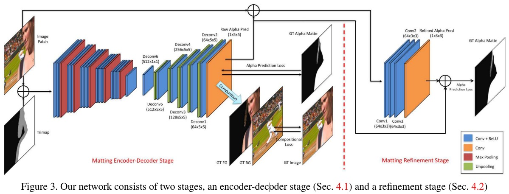
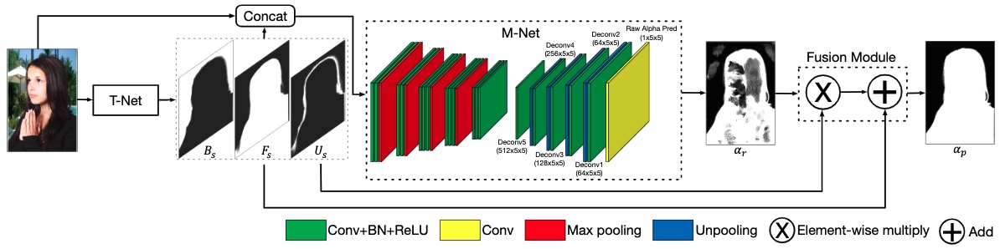
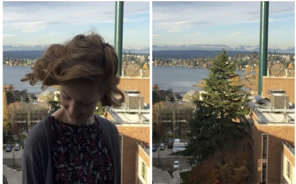
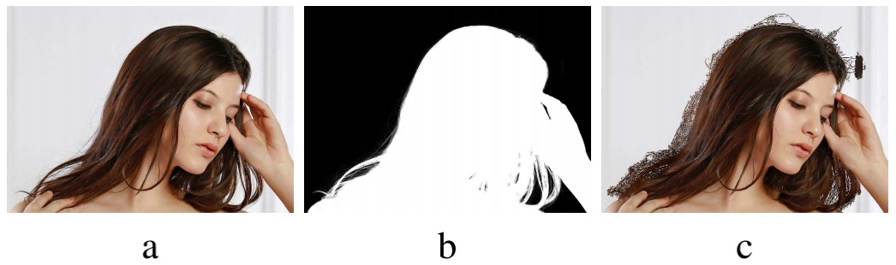
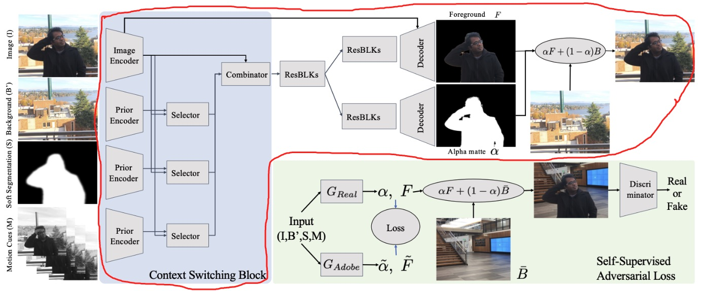

<!--more-->

# Deep Image Matting

Ning Xu1,2, Brian Price3, Scott Cohen3, and Thomas Huang1,2 \
1Beckman Institute for Advanced Science and Technology \
2University of Illinois at Urbana-Champaign \
3**Adobe Research** \
{ningxu2,t-huang1}@illinois.edu, {bprice,scohen}@adobe.com

CVPR 2017

**挖前人的坑：** \
Previous algorithms have poor performance when an image has similar foreground and background colors or complicated textures. The main reasons are prior methods 1) only use low-level features and 2) lack high-level context. 

**本文提出的改进方法：** \
In this paper, we propose a novel deep learning based algorithm that can tackle both these problems. Our deep model has two parts. 

**The first part** is a deep convolutional encoder-decoder network that takes an image and the corresponding trimap as inputs and **predict the alpha matte of the image**. 

**The second part** is a small convolutional network that **refines the alpha matte** predictions of the first network to have more accurate alpha values and sharper edges.

**本文的一个附加贡献：** \
In addition, we also create a large-scale image matting dataset including 49300 training images and 1000 testing images.

该数据集的创建方法：事先准备好493张独一无二的前景以及对应的 alpha-matte 图（需要手动抠图得来），再从COCO和VOC中挑选N张作为背景图，将他们随机组合再一次即可构成我们的image.

**Method**

step1: 训练第一阶段的 Matting Encoder-Decoder

input: (b, 4, 320, 320)
其前3个 channel 是 GT_Image，第四个channel是 Trimap

output: (b, 1, 320, 320), 即 predict_alpha_matte

composite_img = predict_alpha_matte + GT_FG + GT_BG

$$
loss = 
w_l \cdot \text{loss}_{\alpha} (
    \text{predict\_alpha\_matte, GT\_alpha\_matte}) + 
    (1 - w_l) \cdot \text{loss}_c (\text{composite\_image, GT\_image}
)
$$

注意：在计算loss时，作者还利用 trimap 对未知区域施以权重1，而其他区域使用权重0，具体详细见 paper 4.1 节。

step2: 训练第二阶段的 Matting Refinement 部分

input: (b, 4, 320, 320), 即GT_image + predict_alpha_matte

output: output: (b, 1, 320, 320), 即 refine 过的 predict_alpha_matte

这里的 loss 计算只使用了类似 $\text{loss}_c$ 的loss

step3: 将两个阶段放在一起 finetune

--------------------------

# Semantic Human Matting

Quan Chen1, Tiezheng Ge1, Yanyu Xu1,2, Zhiqiang Zhang1, Xinxin Yang1, Kun Gai1 \
1**Alibaba Group, Beijing, China;** \
2ShanghaiTech University, Shanghai, China \
{chenquan.cq,tiezheng.gtz,zhang.zhiqiang,xinxin.yxx}@alibaba-inc.com \
xuyy2@shanghaitech.edu.cn,jingshi.gk@taobao.com

CVPR 2018

**Method**

Figure 3: Overview of our semantic human matting method. Given an input image, a T-Net, which is implemented as PSPNet-50, is used to predict the 3-channel trimap. The predicted trimap is then concatenated with the original image and fed into the M-Net to predict the raw alpha matte. Finally, both the predicted trimap and raw alpha matte are fed into the Fusion Module to generate the €nal alpha matte according to Eq. 4. The entire network is trained in an end-to-end fashion.

T-Net 是一个分割网络，它会生成一个trimap;

M-Net 实际上和 DIM 中提到的网络结构类似，但也有些许差别如下：
> The structure of M-Net difers from DIM [27] in following aspects: 1) M-Net has 6-channel instead of 4-channel inputs; 2) Batch Normalization is added after each convolutional layer to accelerate convergence; 3)”conv6” and ”deconv6” layers are removed since these layers have large number of parameters and are prone to overfitting.

> **训练思想：** \
> 先分别单独训练好 T-Net 和 M-Net，然后将他们合在一起做 end-to-end finetune 训练。

> **论文中的公式(3)的理解：** \
> Us表示取U区域的概率值，在U区域，Us值近乎于1，所以U区域式(3)前半部分近乎0，后半部分近乎$\alpha_r$;
> 
> 而(1 - Us) 表示非 U 区域，在非U区域，Us值近乎0，所以在非U区域，式(3)的前半部分近乎$\frac{F_s}{F_s + B_s}$，后半部分近乎0. \
> 而在非U区域，又分为F区域和B区域，\
> 当取F区域时，Fs近乎1，Bs近乎0，所以$\frac{F_s}{F_s + B_s} \approx 1$; \
> 当取B区域时，Fs近乎0，Bs近乎1，所以此时$\frac{F_s}{F_s + B_s} \approx 0$ .

-------------------

# Background Matting: The World is Your Green Screen

Soumyadip Sengupta, Vivek Jayaram, Brian Curless, Steve Seitz, and Ira Kemelmacher-Shlizerman \
University of Washington

> **question:** \
> Paper 3.1 节说到的 B' 和 B 有什么关系？
> 
> **answer:** \
> 
> 
> 如上图所示，左边是待抠图的输入图片I，本论文要求在拍摄完I后还要再拍摄一张如上右图所示的B。然而现实情况是，我们很难获取大量这样的 (I, B) 配对数据。
> 那么该怎么办呢？
> 
> 好在前人(如:DIM)已经有标注了一部分 matting 数据集，如下图所示：
>  \
> 图片来自DIM(Deep Image Matting) \
> 但是这个数据集的规模还是太小了。
> 
> 于是本文作者就提出可以从 MS-COCO 中挑选出一些图片作为背景，即B'，然后将DIM中标注好的数据和B'组合在一起构成新的图片I，如此便构造了大量的 (I, B')
> 注意在实际操作时，我们生成B'时是对B随机地做一些小的变换或添加一些噪声，论文原文如下：\
>  we generated each B' by randomly applying
either a small gamma correction γ ∼ N(1, 0.12) to B or
adding gaussian noise η ∼ N(µ ∈ [7, 7], σ ∈ [2, 6])
around the foreground region.

**Method**

Figure 2: Overview of our approach. Given an input image I and background image B', we jointly estimate the alpha matte α and the foreground F using soft segmentation S and motion prior M (for video only). We propose a Context Switching Block that efficiently combines all different cues. We also introduce self-supervised training on unlabelled real data by compositing into novel backgrounds.

> $G_{Adobe}$ 和 $G_{Real}$ 中的 G 指的都是 Figure2 红色框中的内容，只是他们训练所用的数据集不一样而已。

> **Soft Segmentation(S) 是怎么来的？** \
> 直接使用别人训练好的语义分割模型提取即可。

> **关于Context Switching Block的一些理解：** \
> 一个很自然的选择是将 {I, B', S, M} concate 到一起后一股脑输入到 Encoder-Decoder，但实际上我们发现这样做并不好，尤其是当前景F中存在与背景B'相近的颜色块时，网络会倾向于将这些相近色块预测为背景，也就是会导致生成的 alpha-matte 中间会产生孔洞。 \
> 我们的想法是当F中出现与B'较相似度较高的区域时，我们希望网络此时更关注的是segmentation线索，为了实现这个目标，我们将I的Encoder特征依次与B'、S、M的Encoder特征通过3个Selector分别组合在一起（如Figure 2所示），让网络自己决定什么时候应该关注什么信息，也就是所谓的 **Context Switching Block**.

**数据集制作过程：** \
- step1: 以 DIM 提出的 Adobe-Matting-Dataset 为基础，它一共有450个GT，但我们只从中挑选出280个(具体多少个看论文)具有非透明度目标的图片；
- step2: 从 MS-COCO 数据集抽取了100张作为背景，将其与step1中280个GT合成最终得到我们的 Adobe-Train-Dataset；（当然在合成的时候会加入随机扰动）
- step3: 使用手持相机或者固定相机拍摄图片或者视频，注意最后一帧要求没有前景目标，最终组成 Self-Supervised-Adversarial-Training 阶段的数据集 Real-Train-Dataset；（无需任何人工抠图标注）

**训练方法：** \
先用 Adobe-Train-Dataset 训练 $G_{Adobe}$，然后使用训练好的 $G_{Adobe}$ 作为 teacher 模型，用 Real-Train-Dataset 来训练 student 模型 $G_{Real}$.

