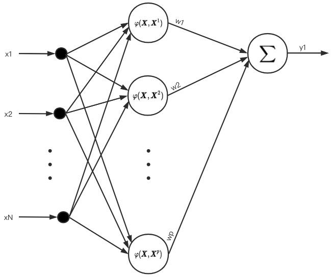
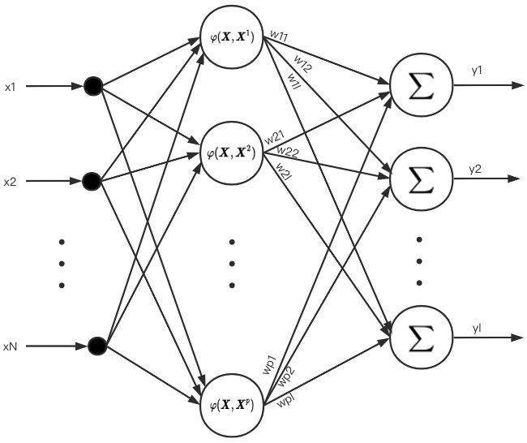

<!--more-->

# 径向基函数 RBF

## 基于径向基函数技术的函数逼近与内插

参见文献[1]>第8章>第8.1.1节
式(8.4、8.5、8.6)描述的实际上可以看成是下面这种**输出是1维空间的神经网络**。

图中N表示向量 $\boldsymbol{X}$ 或 $\boldsymbol{X}^p$ 都是N维度向量，即 $\boldsymbol{X}_i = (x_1, x_2, ..., x_N)^T$.

> 我的理解：基函数 $\varphi (\Vert \boldsymbol{X} - \boldsymbol{X}^p) \Vert \ \ (其中p = 1,2,...,P)$ 中，$\boldsymbol{X}$ 实际上是依次从 $\boldsymbol{X}^p, p = 1,2,...,P$ 中取的值，最终构成一个 $P \times P$ 的矩阵 $\Phi$ .

## 正则化 RBF 神经网络

> 上一节中讨论的内容可以看成是输出只有1个节点的神经网络，本节将讨论输出有 $l$ 个节点的神经网络。

对文献[1]>第8章>第8.1.2节>图8.2的一个详细版本：\

公式(8.12)看的有些迷惑

>>> 进度: 8.1.2 已完毕

# 总结

> 我的理解：RBF 在训练的时候，是利用 P 个训练样本去拟合一个非线性映射函数 F，最终要使得函数 F 能够穿过这 P 个训练样本。

# 参考文献
[1] 人工神经网络理论、设计及应用.第2版. \
[2] [径向基函数RBF > bilibili视频](https://www.bilibili.com/video/BV1St411D7bm?p=8)
