# Progress
[Finish] P1 Machine Learning (2020) Course Introduction
[Finish] P2 Rule of ML 2020

[Finish] P21 Recurrent Neural Network (Part 1)
[0:0] P21 Recurrent Neural Network (Part 2)
...

[29:00] P77 GAN-3

# GANs

# Unsupervised Conditional Generation

Transform an object from one domain to another **without paired data** (e.g. style transfer)

常用的两种方法：\
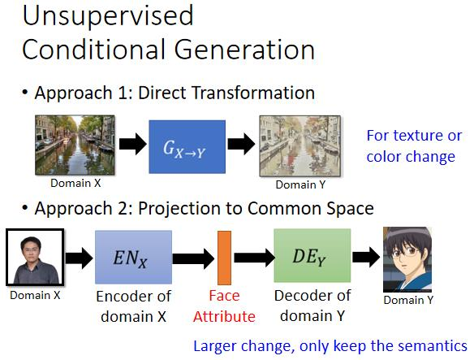

对于一些简单的任务，如纹理、颜色等的转换通常使用 Approach1；而对于一些变动较大的任务，例如将真人转为动漫人物，则通常用 Approach2.

## Approach 1：Direct Transformation

### 方法1
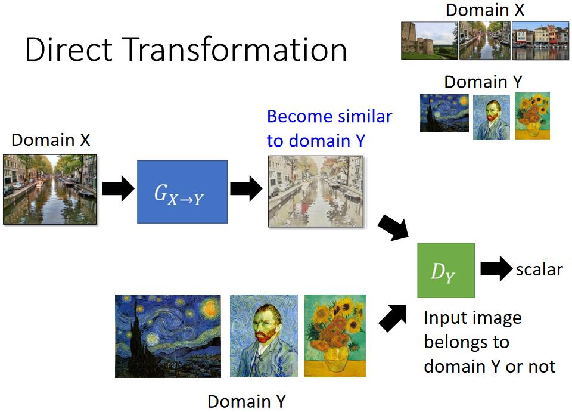

缺点：G 会以为只要产生梵高的画作就可以骗过 D 了，而忽略它本来的input，即生成一张和G的input没有关系的图片。

不过索性的是，只要 G 的网络不是很深，一般情况下，G 也不会产生和输入毫无关系的图片。所以在G的网络不是很深的情况下，也有直接使用这种方法训练的。

> Reference: \
> The issue can be avoided by network design. \
> Simpler generator makes the input and output more closely related. \
> -------  [Tomer Galanti, et al. ICLR, 2018]

### 方法2
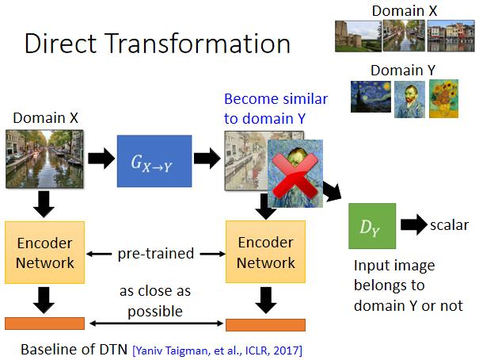

这个方法的思想是要让 G 的 input 和 output 都输入到一个预训练好的 Encoder-Network 中并得到各自的embedding，G 的目标是不仅要使生成的output骗过D，而且还要是这两个embedding尽可能近。

### 方法3（CycleGAN）

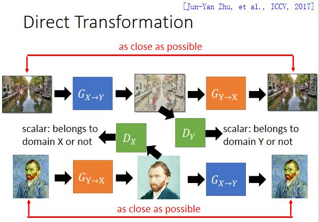

CycleGAN 还存在的问题，在说这个问题前，先来看看下面这篇 2017 年 NIPS 上发布的一篇文章：\
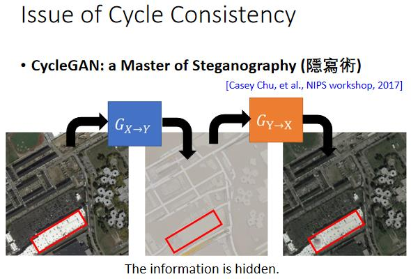

$G_{X→Y}$ 的输入图片中有一些细节在其输出中没有被体现出来，但却能够被 $G_{Y→X}$ 解出来，这说明 $G_{X→Y}$ 将一部分信息隐藏起来了，

虽然CycleGAN有 cycle-consistency-loss 来强迫Generator的输入和输出不要差太多，但是这篇paper说明Generator有能力将信息隐藏起来(可能是用很小的像素值将其隐藏在人看不见的地方)，从而避开cycle-consistency-loss 带来的constrain。**而如果CycleGAN有隐藏信息的能力，则这可能使得Generator生成和input有很大的差别的图片，这就失去了cycle-consistency-loss的意义了。** 这就是CycleGAN目前还存在的尚待解决的问题。

和 CycleGAN 同时期发表且idea类似的paper:\
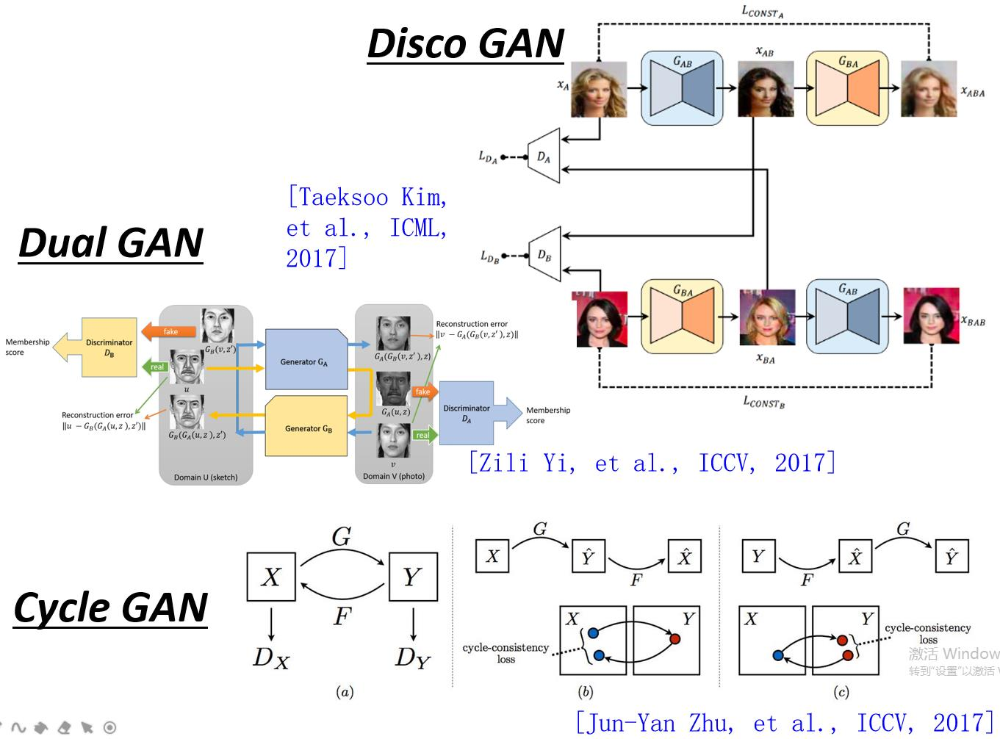

### 方法4（StarGAN）

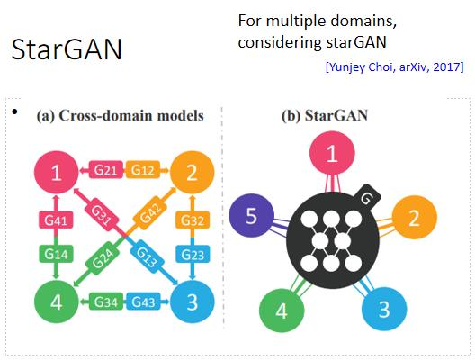

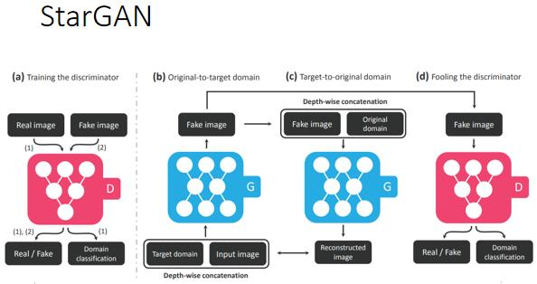

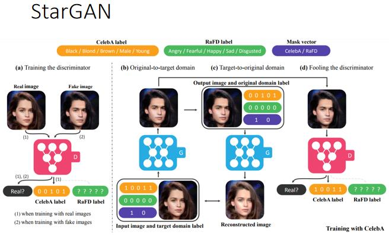

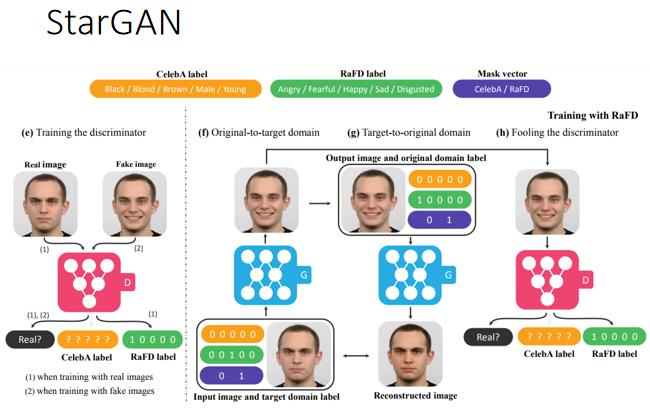

## Approach 2: Projection to Common Space

这种方法的目标是：\
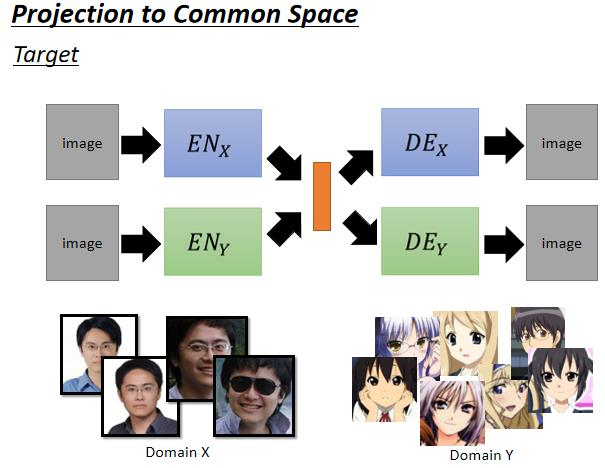

对于这个目标，如果我们在Domain-X和Domain-Y有相互配对的数据，则可以像下面这样训练：(如红线流向所示)\
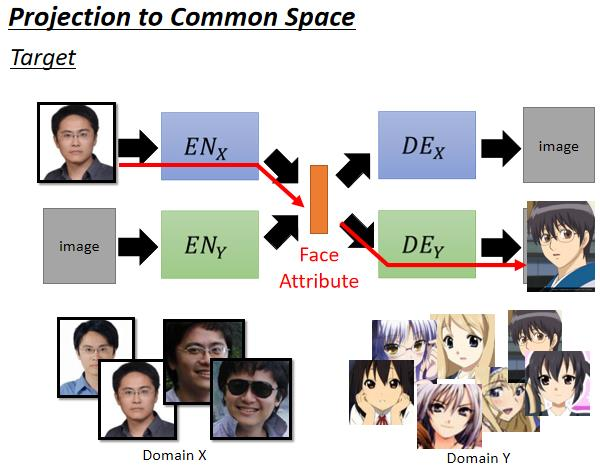

但如果通常情况下，在Domain-X和Domain-Y并没有相互配对的数据，所以像上面那种方法往往是行不通的。在 Unsupervised Conditional Generation 问题中 我们可以用下面的方法来训练：\
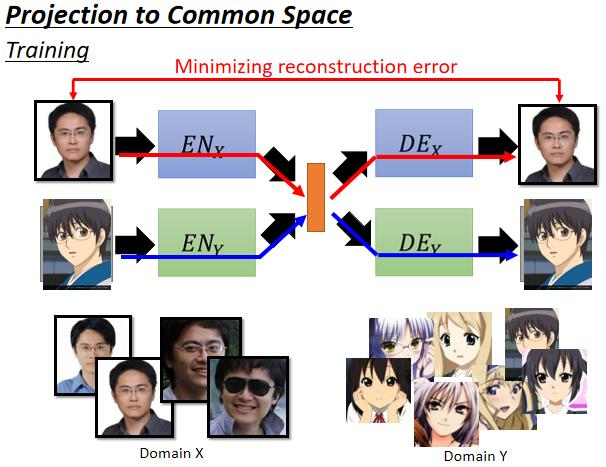 \
对于这种方法，如果只是使用 Minimizing-reconstruction-error 这种损失，则生成的图片可能会很糊，所以通常还可以在上图的基础上再加一组Discriminator: \
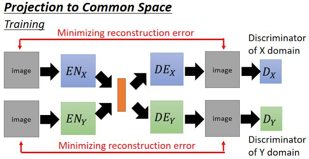

在上图中，$EN_X、DE_X、D_X$ 这三个加起来实际上就是一个 VAEGAN，同样的 $EN_Y、DE_Y、D_Y$ 加在一起也是一个 VAEGAN.

这种方法确实可以训练起来，但是训练出来的 $EN_X、DE_X、D_X$ 和 $EN_Y、DE_Y、D_Y$ 可能并没有相关性，举例来说，对于 $EN_X$ 产生的embedding，它可能第一维表示眼睛，第二维表示嘴巴；对于与 $EN_Y$ 产生的embedding，它可能第三维表示眼睛，第五维表示嘴巴, 也就是$EN_X$产生的embedding和$EN_Y$产生的embedding并没有什么关联，所以并不能完成将Domain-X的图片转换到Domain-Y中这个任务。\
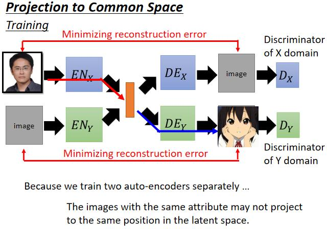

解法1: 共享参数

如下图所示，将其中的几个hidden-layer Concat在一起，使之成为共享layer：\
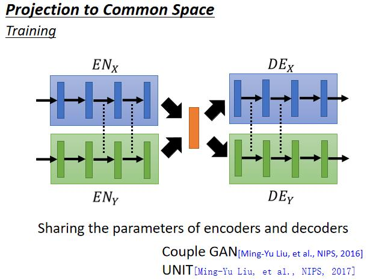

> 补充：对于共享参数(或者叫共享layer)的一个极端情况是当$EN_X$和$EB_Y$的全部参数都共享时，这时候需要在网络输入image的同时再给一个flag(me:可以看成是一种condition).

解法2：再增加一个 Domain Discriminator

如下图所示，Domain-Discriminator 的作用是判别 embedding 是来自哪个 Domain: \
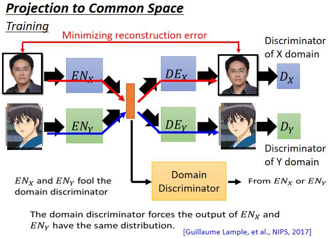 \
而此时 $EN_X$ 和 $EN_Y$ 又多了一个任务，那就是要骗过 Domain-Discriminator，让其无法辨认出 embedding 是来自哪个Domain。而当 Domain-Discriminator 无法辨别出 embeding 是来自哪个 Domain 时，则 $EN_X$ 和 $EN_Y$ 生成的embedding的distribution就都是一样的了。

# 参考文献
[1] [Hung-yi-Lee ML2020](http://speech.ee.ntu.edu.tw/~tlkagk/courses_ML20.html)
[2] [李宏毅2020机器学习深度学习(完整版)国语](https://www.bilibili.com/video/BV1JE411g7XF?p=1)