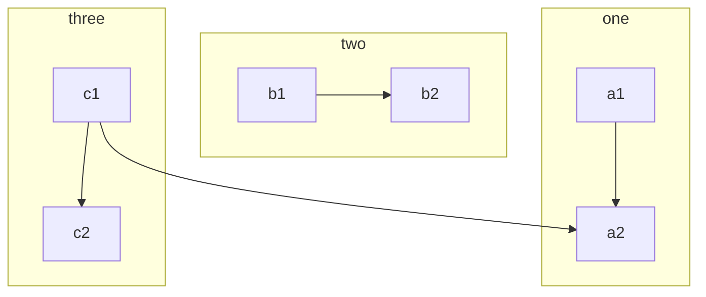
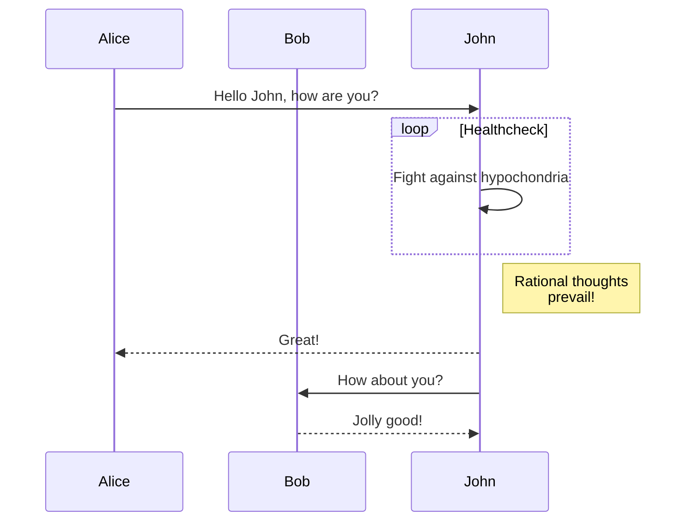
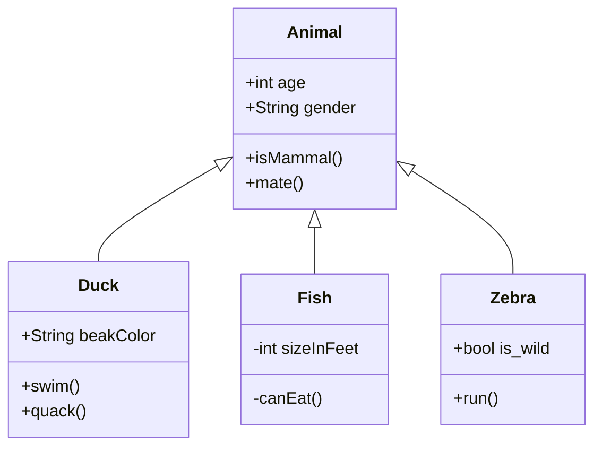
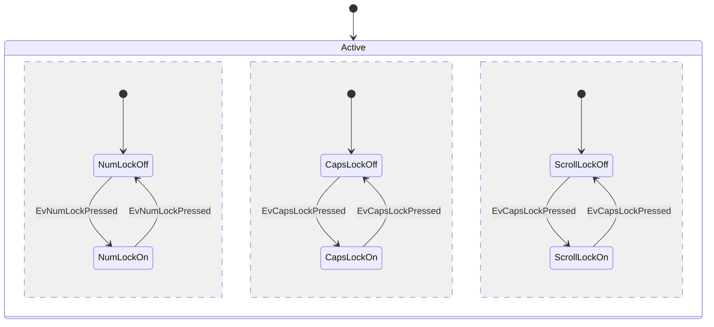
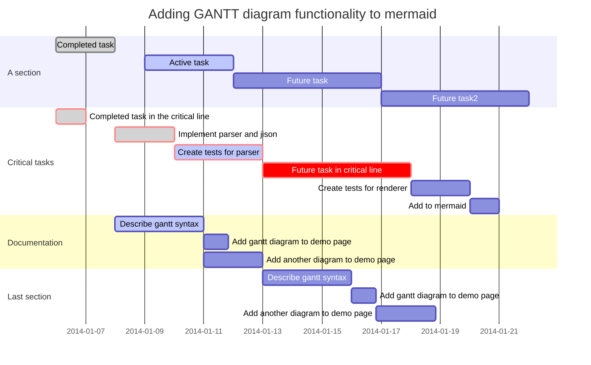
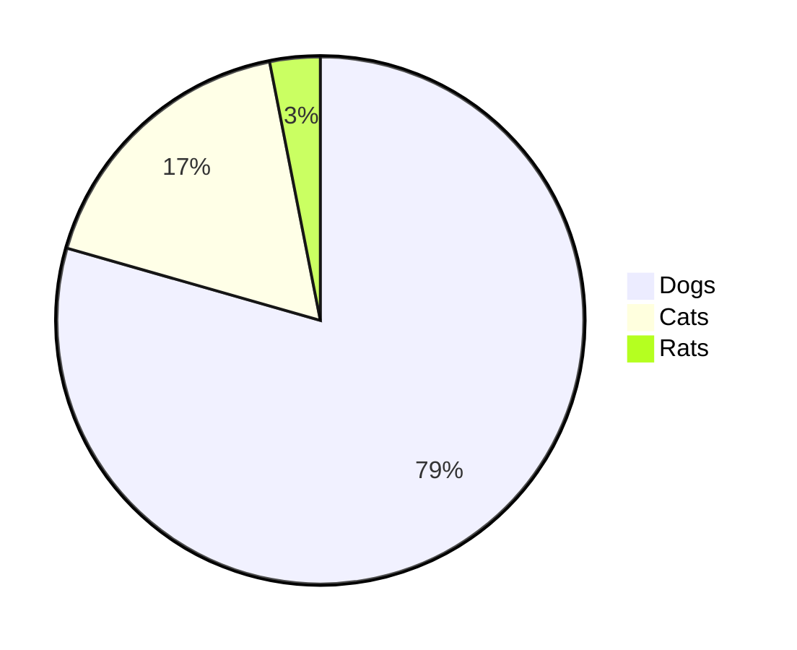

解决了在VS-Code中预览Markdown的mermaid图表的预览问题，那么发布到hexo后该怎么预览mermaid图表呢。
<!-- more -->

# 安装与配置
**注意：下回先不安装hexo-filter-mermaid-diagrams，直接将 hexo next _config.yml文件的mermaid设为true，然后发布试试看能不能成。**

step1: 安装hexo mermaid插件
```bash
npm install hexo-filter-mermaid-diagrams
```

step2: 使能 hexo next _config.yml文件mermaid
```
# Mermaid tag
mermaid:
  enable: true
  # Available themes: default | dark | forest | neutral
  theme: default
```


# 示例

1. flowchart





2. Sequence diagrams



3. Class diagrams



4. State diagrams



5. Gantt diagrams


6. Pie chart diagrams



# 参考文献
[1] [3-hexo支持mermaid图表](https://yelog.org/2019/11/12/3-hexo-support-mermaid/)