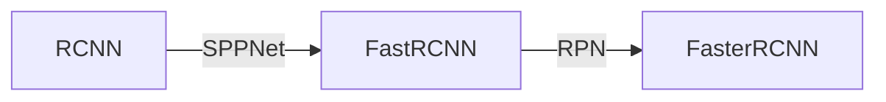

---
title: 
date: 2017-03-09
tags:
categories: ["开发环境与工具"]
mathjax: true
---
本篇主要记录一些Markdown基本语法方面的问题，个人笔记，本人已经熟知的语法，这里就不贴了。
<!-- more -->

# 图片显示问题

  

图1 &nbsp;  分类任务和人脸识别任务对Features的要求比较

# markdown功能相关
## 注释
我们在写作过程中，经常需要给一句话做一些注释，入出处或者解释之类的[^1]，这时候就需要用到markdown的注释功能了。(实测好像不行)

[^1]: 具体注释内容在这里

 

# graph

